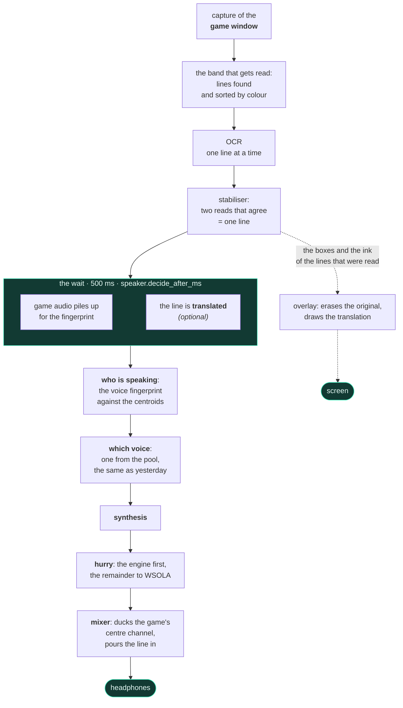

<div align="center">


# livedub

**Live dubbing for a video game's subtitles.**
It reads the text on screen while you play, works out who is speaking from the
game's audio, synthesises the line in that character's voice and mixes it over
the game. All on your own machine.

[](https://github.com/pigro141/livedub/actions/workflows/eseguibile.yml)
[](LICENSE)


**English** ·
[Italiano](docs/readme/README.it.md) ·
[Deutsch](docs/readme/README.de.md) ·
[Español](docs/readme/README.es.md) ·
[Français](docs/readme/README.fr.md) ·
[日本語](docs/readme/README.ja.md) ·
[中文](docs/readme/README.zh.md)

**[See it and hear it — the videos, with sound](https://pigro141.github.io/livedub/)**

</div>

> **There is no mandatory translation in this chain.** If the game's subtitles
> are already in your language, the program reads them and *says* them.
> Translating is a separate feature, **off by default**, for a game written in a
> language that is not yours.

---

## See it

Four silent clips below, because a README cannot play sound: GitHub animates a
GIF but gives it no audio, and this program **speaks** — hearing it is half of
what there is to see. Each clip links to the full video, with the voice:
**[the showcase](https://pigro141.github.io/livedub/#watch)**.

### The dubbing, on GTA V

The black band on top is the text **as the OCR read it**, with the voice that
was assigned to it. It is there to tell *misread* apart from *mispronounced*,
and it is why every listening test in this project is delivered that way. You
can hear the voice change between two characters: `[nicola]` and `[nicola-2_5]`
are the same voice at two pitches.

[](https://pigro141.github.io/livedub/#watch)

*Play it with sound: silent, you can see that it reads, not that it says.*

### Four languages, one scene

The same thirteen seconds of the GTA VI trailer, dubbed four times. The official
subtitles were **burned into the picture** the way GTA V writes them — font size
and position measured off a real frame of the game, not guessed — and the chain
read them back out of the pixels. Nothing is translated here: each pass reads
the subtitle already written in that language and speaks it with a Kokoro voice
**of that language**. A name in the black band — `[nicola-2_5]`, `[es_santa]` —
means the fingerprint has confirmed **who** is talking. The stretch is a phone
call on purpose: the fingerprint needs somebody who speaks for a while, and
where the lines last a second the honest answer stays `[neutra]`, *I do not know
yet who is talking*.

[](https://pigro141.github.io/livedub/#watch)

### Translation, drawn over the game

The original subtitle is **erased by rebuilding the background** behind it — not
covered with a rectangle — and the translated line takes its place, with the
size and colour copied from the game.

[](https://pigro141.github.io/livedub/#watch)

### The window, while it works

One colour per character in the log, and the measurement bar along the bottom:
reads per second, lines, latency, compression, underruns, reading area.

[](https://pigro141.github.io/livedub/#watch)

---

## What it does, in short

| | |
|---|---|
| **Reads** the subtitles | OCR on the game's window alone, not on the screen |
| **Works out who is speaking** | a voice fingerprint on the game's own audio, with no labels |
| **Gives each character a voice** | and remembers it from one session to the next |
| **Keeps up with the scene** | it speeds a line up just enough to fit the time it has |
| **Mixes** | it ducks **only the centre channel** of the game, where the dialogue sits: music and effects stay where they are |
| **Translates** *(off by default)* | several backends, most of them with no network at all |
| **Rewrites the subtitle on screen** *(off by default)* | erases the original and draws the translated line |
| **Says the line in 53 languages** | 50 with piper, 31 with supertonic, 8 with kokoro; pick the language and the engine follows it |
| **Speaks 42 languages** *(the interface)* | follows your Windows language, and changes without a restart |

---

## How you use it, in the order you meet it

There is nothing to configure first: you open it and follow along.

**1. You open it.** The window is already in the language you use Windows in —
42 languages, and every one of the 41 catalogs is complete: 258 strings out of
258. Arabic, Hebrew, Persian and Urdu also flip the window the other way round.

**2. A guide takes you through it**, 7 steps, and it comes back
with `?`. Wherever it can it **checks instead of telling**: it counts the audio
devices you actually have, it asks ONNX Runtime whether CUDA is really there
instead of assuming, and it measures the height of your reading area with the
real rule.

 

**3. A bench measures this PC and picks the engines.** It is not a convenience:
**a model that is missing does not raise an error**. Programs are installed
once, models are not — they are fetched on first use, and if they do not arrive
the chain *falls back to something lighter and carries on*. Without this step
you would be listening to the fallback without knowing. The bench measures,
picks, downloads what is missing, and **installs no programs**: if one is
missing it hands you the exact line to paste.


**4. You pick the game's window.** It captures **one window**, not the screen,
so nothing else can end up in the frame that goes to the OCR — not even our own
windows. The game has to run windowed or *borderless*, not in exclusive
fullscreen.

**5. You drag a box around the subtitle line.** Two seconds with the mouse. The
area is **relative to the window**: move the game and the area follows it.

**6. Start.** From there it reads, works out who is speaking, synthesises and
mixes.

The voice always arrives a little after the subtitle, and that is deliberate:
500 ms of game audio is what it takes to know who is talking
before choosing a voice.

---

## What happens inside



**Two domains, two threads, one meeting point.** The video domain decides
**what** will be said and **when**; the audio domain pours in what was
scheduled. **The mixer never calls the synthesiser**: if it did, the sample
stream would stop at every line — and a hole in the stream is not a slowdown, it
is a line you do not hear.

**Translation happens *inside* the wait, not after it.** They are two
independent waits: one needs the *text*, which is there as soon as the subtitle
is confirmed; the other needs *audio*, which has to pile up. In a row they cost
`wait + translation`; overlapped they cost `max(wait, translation)`.

The rest is in [`docs/architettura.md`](docs/architettura.md) *(in Italian, like
the code)*.

---

## The numbers, and which session they come from

**Live sessions only, with the game running.** There is also a bench that runs
the very same chain over a recording — real code, not a simulation — but **the
bench gives time away**: on a virtual clock synthesis costs nothing and no frame
is ever dropped. No latency comes from there, and none in this table does.

| | piper, on CPU | kokoro, on CUDA | kokoro on CUDA, translation on |
|---|---|---|---|
| lines dubbed | 44 | 146 | **589**, in one 44-minute session |
| **subtitle → voice**, median | **665 ms** | **1290 ms** | **1421 ms** |
| synthesis, median | 57 ms | 580 ms | 248 ms |
| speech compression, median | **1.00** — none at all | **1.00** — none at all | **1.00** — none at all |
| `underrun` — lines you did not hear | **0** | **0** | **0** |
| subtitle reads per second | not recorded | 15.3 | 18.8 |
| the session it comes from | `runs/2026-08-11_18-31-55` | `runs/2026-08-20_00-01-56` | `runs/2026-08-07_01-40-16` |

**The figure that is worth more than any latency: not one `underrun`, in any of
the 53 live sessions** in `runs/` that used one of the three current engines.
And the Piper column is not a lucky pass — four sibling sessions the same
evening gave 664, 669, 687 and 687 ms.

**Where the time actually goes, once the engine is fast.** Of Kokoro's latency,
about **500 ms is the wait to find out who is speaking** — more than the
synthesis itself. That is the number to attack if you want it quicker, and the
price of lowering it is getting the speaker wrong more often, which only your
ear can judge.

**How many cores an engine needs.** This one comes from the bench and is not a
latency: it is the **cost of synthesising one line** with everything else held
equal, timed on the wall clock while the process is restricted to fewer cores.
It is a **lower bound** on how much an older PC would slow down — it simulates
fewer cores, not slower ones.

| physical cores | one Piper line, median | p95 | against 8 cores |
|---|---|---|---|
| 8 | **78 ms** | 144 ms | 1.00× |
| 6 | **88 ms** | 236 ms | 1.12× |
| 4 | **302 ms** | 544 ms | **3.85×** |
| 2 | 363 ms | 1050 ms | 4.63× |

**The cliff is between 6 and 4 cores**, and that is why the table below asks for
6 rather than 8: the step from 8 to 6 costs 12%, the step from 6 to 4 costs
nearly four times. Only Piper was measured this way, so this README puts no
number on the heavier engines — the bench in the setup guide measures them on
*your* machine, which is the answer that matters anyway.

---

## Privacy: it all runs on your machine

That is not a slogan, it is the list of what leaves the computer.

| | does anything leave? |
|---|---|
| reading the subtitles (OCR) | **no** — on your machine |
| who is speaking (voice fingerprint) | **no** — on your machine |
| synthesising the voice | **no** — on your machine |
| translating with the offline backends | **no** |
| translating with the online backend | **yes**, and the program says so every time |
| downloading the models | **once**, on first use |

The only way to send text out is to pick the online translator on purpose. No
telemetry, no account, no connection to a server of ours — there is no server of
ours.

---

## Requirements

| | runs on | runs better on |
|---|---|---|
| CPU | 6 physical cores | 8 physical cores |
| GPU | **none** — nothing breaks without one | any NVIDIA with about 2 GB of free VRAM: the measured need is **1128 MB** |
| RAM | 8 GB | 16 GB |
| disk | **1.6 GB** — the environment without the CUDA libraries, plus 225 MB of models | **3.5 GB** — with the CUDA libraries and 543 MB of models. Offline translation adds **3.2 GB** on top of either |
| Windows | **10** — capture goes through `PrintWindow`, which lives in `user32.dll` and needs nothing installed | **11** — OneOCR only exists there, and it reads the outlined text of a game far better |
| Python | 3.11 | 3.11 |
| **what you get** | **Piper on CPU.** 665 ms from subtitle to voice, no underruns, no speeding the speech up. The recogniser is PP-OCR, and 50 of the 53 spoken languages are already here. | **Kokoro on CUDA**: better articulation, and its 54 voices across 8 languages. 1290 ms. |
| **what the step buys** | below 6 cores Piper's synthesis goes from 88 ms to **302 ms** — see the table above | the graphics card buys **3.5× on synthesis** (741 ms down to 213 ms), and it is the only thing that lets a language move the engine onto Kokoro: on the CPU that engine costs 741 ms a line, which is not liveable |

**A requirement cannot be read without the machine it was measured on**, so here
it is: an Intel Core i9-11900K (8 physical cores), an **RTX 4060 with 8 GB** —
*with GTA V running on it at the same time* — 31.8 GB of RAM, Windows 11 Pro
build 26200, Python 3.11.9. Every number in this README comes from that machine
unless it says otherwise, and the *runs better on* column is not a wish list: it
is that machine.

**You also need** a way to hear the game's audio without your own dubbing
looping back into it: the WASAPI loopback that ships with Windows is enough.
[Voicemeeter](https://vb-audio.com/Voicemeeter/) is **optional** — it only helps
if you want everything in a single pair of headphones.

## Download

**Install from source with PowerShell** — the block just below. It is the
recommended way and the one that works on every machine, and nothing about it has
changed.

**There is also an executable, and it has been launched.** Every push builds it on
GitHub Actions and then *runs* it: inside the package it reads a drawn subtitle,
synthesises a line and builds the window, and the artifact is uploaded only if all
of that passes. It is the `livedub-windows` artifact at the foot of the
[latest green run](https://github.com/pigro141/livedub/actions/workflows/eseguibile.yml).
Downloading an artifact needs a GitHub account, and each one is kept for 14 days.

**Two limits, stated rather than hidden.** With **Smart App Control** on — and it
is on by default on a clean Windows 11 install — the executable **does not
start**: every build is a new file, and a new file has no reputation by
construction. A signature lifts that; another test does not. And the build machine
has no sound card, no graphics card and no game running, so screen capture, the
audio loopback, mixing and synthesis on the GPU stay **unproven** — Smart App
Control is off there too, so *it starts on the runner* does not mean *it starts on
a freshly installed Windows 11*.

## Install from source

```powershell
git clone https://github.com/pigro141/livedub.git
cd livedub
powershell -ExecutionPolicy Bypass -File installa.ps1
```

The script **checks that it got what it asked for** instead of reporting
success: Python, the virtual environment, the dependencies, the OCR, the real
CUDA provider, the models — and it finishes by running the test suite. Whatever
is missing is listed with the reason and what it costs you.

Without an NVIDIA GPU:

```powershell
powershell -ExecutionPolicy Bypass -File installa.ps1 -SenzaGpu
```

What the script runs is two pip commands and not one, and the second is not
optional — the four packages in it depend on the CPU build of ONNX Runtime,
which next to `onnxruntime-gpu` switches CUDA off in silence, and `--no-deps` is
a global option that cannot live in the same file as the rest:

```powershell
.\.venv\Scripts\python.exe -m pip install -r requirements.txt
.\.venv\Scripts\python.exe -m pip install -r requirements-nodeps.txt --no-deps
```

**The install is deliberately light, and one thing is deliberately left out of
it.** Offline translation is **not installed**: it costs **3100 MB**, almost all
of it `torch` — which the translation never uses, but without which its sentence
splitter will not even import. Charging that to everyone who installs the
program, for a feature that is **off by default**, is the opposite of a choice.
It arrives **when you need it**: the bench in the guide looks at what is missing,
**says how much it weighs before you decide**, and hands you the line to paste.
It hands it over rather than running it, because those are *packages* and a
naïve `pip install` there is exactly what pulls the CPU wheel back in. If it
does not arrive, that is a **declared refusal**, not a mute fallback. The
language pair itself is a model, 98 MB, and that one the bench downloads on its
own.

### Run it

```powershell
.\.venv\Scripts\python.exe -m tools.ui_qt --profile live
```

In the window: **Pick window** → **Select area** → **Start**. On Windows you can
also just double-click `livedub.bat`.

> **If your Windows has Smart App Control switched on.** It ships in
> *evaluation* mode and Windows switches it off by itself as soon as it sees
> developer tools being run — and once off it cannot be switched back on without
> reinstalling Windows. So this is a minority of machines, not the normal case.
> On one where it is still on, and installing the pinned versions in this repo,
> it blocks exactly **two packages, and they are one capability**: Windows
> Graphics Capture. Capture then falls back to `PrintWindow`, which needs
> nothing installed. **Everything else keeps working** — reading the subtitles,
> working out who is speaking, all three synthesis engines, the mixer, the
> overlay, offline translation and the window itself. Any PyInstaller executable
> is blocked too, this project's included: every build is a new file, and a new
> file has no reputation by construction.
>
> **And where it does bite, the program says what fell and what to use instead.**
> A blocked library is not handed to you as a stack trace: one place answers
> *can this piece load on this machine?*, and it tells *you never installed it*
> apart from *it is here and Windows will not load it* — because the first is
> fixed with one `pip install` and the second is not. The menus mark the choices
> that would fail, on the closed box and not only in the list, since the value
> that does not work is usually the one already in your configuration. The
> choice is **marked, not removed**: removing it would hide that the program can
> do it and that the defect belongs to this machine.

---

## The window

Six tabs. **None of them has to be touched to hear the first line**:
they open when you need them.

| tab | what it is for |
|---|---|
| **Setup** | the steps in order — the only tab you need before Start |
| **Session** | who is speaking, right now, one colour per character |
| **Voice** | which engine, how many voices in the pool, how long to wait before deciding who is speaking |
| **Levels** | how far the game ducks and how far our voice comes up, **while you listen** |
| **Translation** | only for playing a game whose subtitles are not in your language |
| **All settings** | the 170 parameters, with a search box |

 

**The Session tab is not a log.** At the top, the line being spoken right now
with its voice and its hurry; then who has spoken, one card per character; the
log underneath. The question you ask yourself watching it is not *what did it
say* but **is it still the same person talking?** — and a colour answers that
long before a label does.

**The parameters.** 170 in total; **131 apply straight
away**, and the 39 that are only read at startup **say so** instead
of pretending. 127 carry a `?` that explains what they do, what
was measured and what you risk by changing them — and it is the same text that
sits beside the parameter inside [`core/config.py`](core/config.py), not a
second copy nobody updates.

**The two languages are two different things, and they sit two tabs apart on
purpose.** `ui.lingua`, in Setup, decides what is **written on the buttons**;
`translate.source` and `translate.target`, in Translation, decide what is
**said**. Mixing them up costs you a session.

---

## Will it work with my game?

Tested on two: **GTA V** and **Mafia: The Old Country**, both in Italian. Honestly, that is what is known.

**Always needed**, for any game: dragging the area around the subtitles, and
clearing the *ignore coloured subtitles* box if the game colours the speaker's
name.

**Good odds of working straight away** if the game writes **light text on a dark
background**, on a line near the bottom.

**Worth a try** if it writes dark text on a light background: on purpose-built
frames it reads, but it smudges. No one has ever tried it on a real game like
that.

**Not planned**: subtitles inside speech bubbles that follow the character, or
positions that move from one line to the next.

**And it does not translate the whole screen: it reads one subtitle line at a
time**, inside the box you drag around it. That is a choice, not a gap — the
whole chain is built on that shape.

**About the area, the thing people get backwards.** Drag it wide and the program
**still reads**: a large area is less precise, not mute. What actually gets
worse is the drawing — the translated line is drawn by rebuilding the background
around it, and the taller the area, the more unrelated scenery that rebuild
picks up. Past a certain height the program tells you so, while you are dragging
the rectangle and again when you start.

---

## Languages

Three different things get called *language* here, they are set in three
different places, and merging them is how a program ends up promising what it
does not have.

| | how many | where you set it |
|---|---|---|
| what the **buttons** are written in | **42** | `ui.lingua`, in the Setup tab |
| what it can **translate a subtitle into** | **133** with the online backend — the offline ones have no closed list | `translate.target`, in the Translation tab |
| what it can **say out loud** | **53** — but not with every engine: 50 with piper, 31 with supertonic, 8 with kokoro | you pick the language, and the engine follows it |

> **Three lists, three questions.** The interface speaks 42 languages, the
> translator reaches 133, and the mouth speaks 53. That last number is not one
> number: **the three engines have different catalogues**, and picking a language
> is really picking an engine. Before the change that made it 53, the mouth spoke **two** — and
> that was never a limit of the engines, it was the only thing the code declared:
> translating into Spanish and then reading it out with an Italian voice produced
> **no error at all**.

**Reading**: whatever the recogniser can read.

**Speaking**:

| engine | languages | voices | runs on | how the voices work |
|---|---|---|---|---|
| **piper** *(default)* | **50** | 175 models in the official index | CPU | one model per voice, one download each (28–114 MB) |
| **supertonic** | **31** | 10 speaker styles, valid in *every* language | CPU | one multilingual model; the language selects the phonemiser |
| **kokoro** | **8** | 54, language and gender encoded in the name | CUDA | one model, one 510 KB style file per voice |
| `tone`, `silent` | — | a beep has no language | — | — |
| **union** | **53** | | | |

**Which engine speaks which is the list below**, and it is not written by hand:
it is regenerated from the engines' own catalogues by
[`tools/tabella_lingue.py`](tools/tabella_lingue.py), and the test suite fails if
it ever stops matching them. Beyond the number of native voices, characters are
told apart by shifting the pitch — that is what you hear in the first GIF:
`[nicola]` and `[nicola-2_5]` are one voice at two pitches.

<!-- lingue: inizio -->
<!-- generato da `tools/tabella_lingue.py`, non si scrive a mano -->

<details>
<summary><b>All 53 languages, engine by engine</b> — ✓ means that engine has at least one voice of its own in that language.</summary>

| code | language | piper | supertonic | kokoro |
|---|---|:---:|:---:|:---:|
| `sq` | Albanian | ✓ |  |  |
| `ar` | Arabic | ✓ | ✓ |  |
| `hy` | Armenian | ✓ |  |  |
| `eu` | Basque | ✓ |  |  |
| `bn` | Bengali | ✓ |  |  |
| `bg` | Bulgarian | ✓ | ✓ |  |
| `ca` | Catalan | ✓ |  |  |
| `zh` | Chinese (Simplified) | ✓ |  | ✓ |
| `hr` | Croatian |  | ✓ |  |
| `cs` | Czech | ✓ | ✓ |  |
| `da` | Danish | ✓ | ✓ |  |
| `nl` | Dutch | ✓ | ✓ |  |
| `en` | English | ✓ | ✓ | ✓ |
| `et` | Estonian | ✓ | ✓ |  |
| `fi` | Finnish | ✓ | ✓ |  |
| `fr` | French | ✓ | ✓ | ✓ |
| `ka` | Georgian | ✓ |  |  |
| `de` | German | ✓ | ✓ |  |
| `el` | Greek | ✓ | ✓ |  |
| `he` | Hebrew | ✓ |  |  |
| `hi` | Hindi | ✓ | ✓ | ✓ |
| `hu` | Hungarian | ✓ | ✓ |  |
| `is` | Icelandic | ✓ |  |  |
| `id` | Indonesian | ✓ | ✓ |  |
| `it` | Italian | ✓ | ✓ | ✓ |
| `ja` | Japanese |  | ✓ | ✓ |
| `kk` | Kazakh | ✓ |  |  |
| `ko` | Korean | ✓ | ✓ |  |
| `ku` | Kurdish (Kurmanji) | ✓ |  |  |
| `lv` | Latvian | ✓ | ✓ |  |
| `lt` | Lithuanian |  | ✓ |  |
| `lb` | Luxembourgish | ✓ |  |  |
| `ml` | Malayalam | ✓ |  |  |
| `mr` | Marathi | ✓ |  |  |
| `ne` | Nepali | ✓ |  |  |
| `no` | Norwegian | ✓ |  |  |
| `fa` | Persian | ✓ |  |  |
| `pl` | Polish | ✓ | ✓ |  |
| `pt` | Portuguese | ✓ | ✓ | ✓ |
| `ro` | Romanian | ✓ | ✓ |  |
| `ru` | Russian | ✓ | ✓ |  |
| `sr` | Serbian | ✓ |  |  |
| `sk` | Slovak | ✓ | ✓ |  |
| `sl` | Slovenian | ✓ | ✓ |  |
| `es` | Spanish | ✓ | ✓ | ✓ |
| `sw` | Swahili | ✓ |  |  |
| `sv` | Swedish | ✓ | ✓ |  |
| `te` | Telugu | ✓ |  |  |
| `tr` | Turkish | ✓ | ✓ |  |
| `uk` | Ukrainian | ✓ | ✓ |  |
| `ur` | Urdu | ✓ |  |  |
| `vi` | Vietnamese | ✓ | ✓ |  |
| `cy` | Welsh | ✓ |  |  |

Reading down a column gives that engine's catalogue. Spoken by one engine only: `piper` 21 · `supertonic` 2 (Croatian, Lithuanian) · `kokoro` 0. Spoken by all three: 6 — English, French, Hindi, Italian, Portuguese, Spanish.

</details>
<!-- lingue: fine -->

*The names in that list stay in English in every language of this repository:
they are data read from the code, like a device name or a model key. A language
name run through a machine translator is how `uk — Ucraino` once became «Regno
Unito — ucraino» inside the window.*

### What is claimed, and what was actually tested

This matters more than the numbers.

**Claimed, and verifiable from the catalogue**: that a voice *exists* and that it
*belongs to that language*. Each engine publishes it — piper in
`rhasspy/piper-voices/voices.json`, kokoro in the first letter of every voice
name, supertonic in its list of supported languages. Nothing there is guessed.

> **Not claimed: that the pronunciation is good.** Nobody has listened to 53
> languages, and saying otherwise would be a promise no measurement backs.

**Checked mechanically instead**: for a sample of languages, one sentence is
synthesised *in that language's own script* and the result is checked for a
plausible **speaking rate** — characters of speech per second. A wrong
phonemisation does not raise: the model answers, audio comes out, every counter
stays green, and an out-of-scale rate is the only trace it leaves.

| engine | languages measured | outcome |
|---|---|---|
| **supertonic** | **31 of 31** | all plausible: 6.6–17.8 characters per second, the low end being Japanese, Korean, Chinese and Hindi, as their scripts lead you to expect |
| **piper** | **1 of 50** | Hebrew, 9.14 char/s. The rest could not be measured *on this machine*: Smart App Control blocks `espeakbridge.pyd`, and every other piper language phonemises through espeak |
| **kokoro** | **0 of 8** | `kokoro-onnx` does not import here at all — Smart App Control blocks the native module of one of its dependencies |

The two engines that could not be measured are blocked by a **property of this
machine**, not of the code. Their language lists are declared from the catalogue
and **marked as unmeasured**, rather than presented as tested.

> **One claim the check took away.** The piper index lists **51** languages and
> this program offers **50**. Japanese is the difference: that voice needs a
> phonemiser the installed `piper-tts` does not have, so the model downloads
> happily and the *first synthesis* raises. Declaring 51 would have been true of
> the index and false of this program. Japanese is still spoken — by kokoro, or
> by supertonic.

### Pick a language, and the engine follows it

There are exactly three outcomes, and the difference between them is the whole
design.

| | what happens | what it says |
|---|---|---|
| **the engine you picked already speaks it** | nothing changes | **nothing** — and it has to stay silent: a notice that fires on every language change is one that stops being read |
| **it does not, but another engine does** | the engine is switched | it says so, because your own choice has just been overridden — *«piper» has no voices in this language: switching to «supertonic», which speaks 31* |
| **no usable engine speaks it** | nothing is switched, because switching would not help | the fact is stated instead of being resolved silently — *no engine has voices in this language (and «kokoro» will not run here): the line would come out in a voice that pronounces a different one* |

The parenthesis in the last one is the point: **the answer depends on the
machine**, and the message says which engines were ruled out. The replacement has
to be one this machine can actually run — kokoro costs 741 ms a line on the CPU
against 213 on CUDA, so a machine without CUDA is never switched onto it:
following a language must not cost double the latency. Japanese shows the whole
mechanism in one line: piper has the voice and cannot pronounce it, kokoro has
five and wants CUDA, supertonic does it on the CPU.

**Two structural facts worth knowing.** Supertonic's ten voices are *speakers,
not languages*: the same ten styles speak all 31, and the language only selects
the phonemiser — which is why it is the cheapest way to add one. Piper is the
opposite, one model and one download per voice — and its index has **no field
for gender**, so outside Italian the pool marks piper voices `?` and falls back
to plain ordering instead of alternating male and female. A declared regression,
not a hidden one.

**Translation** *(off by default)*:

| backend | network | how many languages | worth knowing |
|---|---|---|---|
| **`locale`**, Argos *(default)* | **no** | no closed list: whichever pairs Argos publishes, downloaded when you press Start | does not understand `auto` — it quietly becomes *from English* |
| `llm`, Gemma 3 1B in this same process | **no** | depends on the model you point it at | same `auto` caveat |
| `ollama`, TranslateGemma outside the environment | **no**, but a local server has to be running | depends on the model | the slowest in practice: the live sessions using it sit at 1592–1805 ms end to end |
| `google` | **yes**, and the program says so every time | **133** — the only closed list of the four | the only one that understands `auto` |

The menu **shows all four and declares** rather than filtering: three of them
have no closed list, so a filter would hide choices that work and let through
choices that do not, with the air of knowing.

> **Something no counter shows.** On coarse language, local models **rewrite it
> in silence**. The translation succeeds beautifully: it says something else.
> Before asking whether a translator is good, ask whether it says what is
> written.

**The interface language** is a third thing again: **42** — 41 catalogs plus
Italian, which is the language the source is written in. All 41 are **complete,
258 strings out of 258**, with none half-translated; four of them run right to
left and turn the whole window round (Arabic, Hebrew, Persian, Urdu). They are
generated once and committed into the repo — not asked from the network while
the window opens, because a window that asks the network for its own text is a
blank window when the network is not there, *and blank without an error*.

What is **not** translated, on purpose: the explanations behind the `?` on each
parameter. They come from the comments in
[`core/config.py`](core/config.py) with the measurements inside them, and
running a measurement through a machine translator is how a measurement quietly
stops being one. The log and the measurement bar stay in Italian for the same
reason — they are numbers and device names.

---

## What it does not do

The quickest way to be disappointed by a program is to find this list out by
using it. So here it is before you install.

| | |
|---|---|
| **Nobody has listened to the 53 languages** | what is verified is that a voice exists, that it belongs to that language and — where it could be measured — that its speaking rate is plausible. The pronunciation is not verified, and Italian is the language this program was built in and listened to in. |
| **A language your engine does not speak is a switch, not an error** | the engine moves to one that speaks it and says so. If none of the engines this machine can run speaks it, that is stated too — instead of handing you a voice that pronounces a different language. |
| **The first session in a new piper language downloads its voices** | one model per voice, 28–114 MB each, up to six of them, and the guide's bench does not yet declare that weight in advance the way it declares the others. Start can sit there for a few minutes without saying why. |
| **One subtitle line at a time** | inside the box you drag: not the whole screen, not several areas at once. An earlier version promised several reading areas and it was removed, because the overlay draws one line at a time and the promise could not be kept live. |
| **The game must be windowed or borderless** | exclusive fullscreen is not captured. |
| **Windows only** | and the recogniser that reads a game's outlined text best, OneOCR, exists only on Windows 11. On Windows 10 you get PP-OCR. |
| **The voice arrives after the subtitle** | about half a second of it is the wait for enough game audio to say who is speaking — and that wait, not the synthesis, is the largest single piece of the delay. |
| **More characters than voices share one** | past the number of native voices they are told apart by shifting the pitch, and you can hear it. |
| **One player, one window** | it is not a streaming tool, not a localisation pipeline and not multiplayer. |

**Where the capture can fail.** It grabs the game's window through Windows
Graphics Capture where that is available, and falls back to `PrintWindow` —
**saying so in the log** — where it is not. The fallback needs nothing
installed, but it is synchronous and costs more: **17.5 ms** for a 1191×958
window, measured. And on a game drawing through a Direct3D flip-model swap
chain, `PrintWindow` can **succeed and hand back a black frame**; the program
inspects the first eight frames and declares it instead of quietly reading
black. **Nobody has yet tried that fallback on GTA V itself.**

> **And the honest frame around every number here.** They were measured on one
> machine, on two games, by one person. Where a figure has not been measured,
> this README leaves the gap visible instead of filling it.

---

## How it is built, and why the numbers can be trusted

There is no pytest: the suite is a runnable module, **2195
checks** in 81 groups.

```powershell
.\.venv\Scripts\python.exe -m tools.selftest
```

And there is the bench, which runs **the very same chain** over a recording,
without the game: same code, real OCR, real audio, real fingerprint, real
synthesis, and causality respected — the chain never sees the future.

```powershell
.\.venv\Scripts\python.exe -m tools.dub recording.mp4 --profile gtav --mp4
```

**But the bench is not enough, by construction**, and here that is a rule
written in blood: on a virtual clock synthesis costs nothing and no frame is
ever dropped, so from there you can show *everything* except how fast it is.
Every serious defect in this project came out by running the chain for real.

The measurements that changed a decision are written **next to the parameter
they decided**, inside [`core/config.py`](core/config.py) — the same text the
window shows when you press `?`.

*The code, its comments and the documents under `docs/` are in Italian. This
README and the [showcase](https://pigro141.github.io/livedub/) are in English.*

---

## Support the project

livedub is free, runs entirely on your own machine and has neither accounts nor
servers: there is nothing to sell and no data to collect. If you find it useful:

**[☕ Buy me a token!](https://ko-fi.com/filippodebenedittis)**

It unlocks no features and lifts no limits — there are none.

---

## Licence

**GPL-3.0-or-later**, and not out of taste: the default speech synthesiser and
the grapheme-to-phoneme engine behind one of the others are GPL-3, so anything
distributed here is too. The full accounting, library by library, is in
[`docs/LICENZE.md`](docs/LICENZE.md) — including why the OCR and the model
weights are **not** redistributed.
