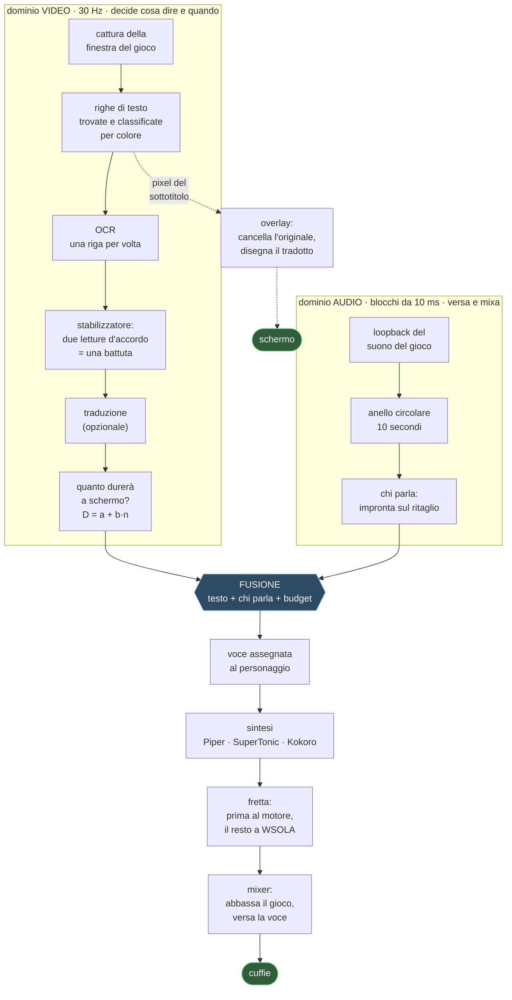

# livedub

**Doppiaggio dal vivo dei sottotitoli di un videogioco.** Il programma legge il
testo a schermo mentre giochi, capisce dall'audio chi sta parlando, sintetizza la
battuta con una voce assegnata a quel personaggio e la mixa sopra il gioco
abbassando l'originale. Tutto in locale, senza mandare niente a nessuno.

Nasce per giocare a **GTA V** in italiano ascoltando i dialoghi invece di
leggerli. Funziona con qualunque gioco che scriva sottotitoli in una striscia di
schermo — provato anche su *Mafia: The Old Country*, e il capitolo
[«Funziona con il mio gioco?»](#funziona-con-il-mio-gioco) dice con che margine.

> **Non c'è nessuna traduzione obbligatoria in questa catena.** I sottotitoli di
> GTA V sono già in italiano: il programma li legge e li dice. La traduzione è
> una funzione a parte, che si accende se il gioco è in un'altra lingua.

---

## Cosa fa, in breve

| | |
|---|---|
| **Legge** i sottotitoli dallo schermo | OCR sulla sola finestra del gioco, 30 volte al secondo |
| **Capisce chi parla** | impronta vocale sull'audio del gioco, senza etichette |
| **Dà una voce a ciascuno** | e se la ricorda fra una sessione e l'altra |
| **Sta nei tempi** | accelera o rallenta la battuta per stare dentro la scena |
| **Mixa** | abbassa il gioco mentre parla e lo rialza subito dopo |
| **Traduce** *(opzionale)* | quattro motori, uno anche completamente offline |
| **Riscrive il sottotitolo a schermo** *(opzionale)* | cancella l'originale e disegna il tradotto, con il carattere del gioco |

---

## Cosa succede dentro



**Due domini, due thread, un solo punto d'incontro.** Il video decide *cosa* si
dirà e *quando*; l'audio versa quello che è stato programmato. Il mixer non
chiama mai il sintetizzatore: se lo facesse, il flusso di campioni si
interromperebbe a ogni battuta.

Il dettaglio sta in [`docs/architettura.md`](docs/architettura.md).

---

## Privacy: gira tutto sulla tua macchina

Non è uno slogan, è una lista di cosa esce dal computer:

| | esce qualcosa? |
|---|---|
| lettura dei sottotitoli (OCR) | **no** — OneOCR o PP-OCR, in locale |
| chi parla (impronta vocale) | **no** — ECAPA in locale |
| sintesi della voce | **no** — Piper, SuperTonic o Kokoro, in locale |
| traduzione con `locale`, `llm`, `ollama` | **no** |
| traduzione con `google` | **sì**, e il programma lo scrive su stderr ogni volta |
| download dei modelli | **una volta sola**, al primo avvio |

L'unico modo di far uscire del testo è chiedere esplicitamente
`translate.backend=google`. Tutti gli altri backend sono offline, e il default
non traduce affatto.

Nessuna telemetria, nessun account, nessuna connessione a un server nostro —
non esiste un server nostro.

---

## Requisiti

**Minimi (funziona bene).** Windows 10/11, Python 3.11, 4 core, 8 GB di RAM,
nessuna scheda video particolare.

- motore di voce **Piper** (`tts.backend=piper`): ~50 ms a battuta, gira su CPU;
- latenza misurata dal vivo: **~670 ms** dal sottotitolo alla voce.

**Sotto i 6 core fisici: solo Piper.** Misurato, non stimato — costo della
sintesi per battuta al variare dei core:

| core fisici | Piper | SuperTonic |
|---|---|---|
| 8 | ~48 ms | 493-573 ms |
| 6 | 109 ms | 946 ms |
| 4 | **261 ms** | **1315 ms — non usabile** |
| 2 | 491 ms | 3627 ms |

**Per la migliore esperienza.** Windows 11, 8 core, 16 GB di RAM e una **GPU
NVIDIA con almeno 4 GB liberi**:

- motore **Kokoro** su CUDA: 257 ms a battuta, articola bene, occupa 1128 MB di
  VRAM (misurato su una RTX 4060 da 8 GB, mentre GTA V girava);
- OCR **OneOCR**, il riconoscitore dello Strumento di cattura di Windows 11:
  legge molto meglio di PP-OCR sul testo bordato dei giochi;
- latenza dal vivo: **~1150 ms**, di cui 500 sono l'attesa voluta per capire chi
  parla.

**Serve anche** un modo di sentire l'audio del gioco senza sentirsi il doppiaggio
in loop: va bene il loopback WASAPI (incluso) oppure
[Voicemeeter](https://vb-audio.com/Voicemeeter/).

---

## Installazione

```powershell
git clone <questo repo>
cd livedub
powershell -ExecutionPolicy Bypass -File installa.ps1
```

Lo script **verifica di aver ottenuto quello che ha chiesto** invece di dire
«fatto»: Python, venv, dipendenze, OneOCR, il provider CUDA vero, i modelli, e
chiude eseguendo la suite di verifica. Quello che manca lo elenca con il perché e
cosa comporta.

Senza GPU NVIDIA:

```powershell
powershell -ExecutionPolicy Bypass -File installa.ps1 -SenzaGpu
```

### Partire

```powershell
.\.venv\Scripts\python.exe -m tools.ui_qt --profile live
```

Nella finestra: **Scegli finestra** (il gioco) → **Seleziona area** (tira il
rettangolo attorno ai sottotitoli) → **Avvia**.

Il gioco deve stare in finestra o senza bordi, non a schermo intero esclusivo.

---

## La finestra

Le schede, e la barra in alto è quella che si tocca durante una partita.

- **Sessione** — chi parla, in tempo reale, un colore per personaggio. La domanda
  che ti fai guardandola non è «cosa ha detto» ma «è sempre lo stesso a parlare?»,
  e a quella l'occhio risponde da un colore molto prima che da una sigla.
- **Tecnologie** — quale motore per ogni stadio: voce, OCR, traduttore, impronta.
- **Impostazioni avanzate** — tutti e 166 i parametri, ognuno con un `?` che
  spiega **cosa fa, quanto è stato misurato e cosa si rischia a cambiarlo**.

I parametri che si applicano subito lo fanno (142 su 166); i 24 che si leggono
solo all'avvio **lo dicono** invece di fingere.

---

## Funziona con il mio gioco?

Provato su due: **GTA V** e **Mafia: The Old Country**, tutti e due in italiano.
Onestamente, questo è quello che si sa.

**Serve sempre**, per ogni gioco: disegnare l'area dei sottotitoli (due secondi
col mouse), e togliere la spunta «Ignora i sottotitoli colorati» se il gioco
colora il nome di chi parla.

**Non dipende dal gioco**, misurato: il filtro del colore è cieco alla tinta —
giallo, rosso, ciano, verde, viola e arancio si comportano identici.

**Ha buone probabilità di funzionare subito** se il gioco scrive testo **chiaro
su fondo scuro**, in una riga in basso.

**È da provare** se scrive testo scuro su fondo chiaro: misurato su fotogrammi
costruiti apposta, legge ma sporca (`Andiamo via di qui.` → `Andamo via di quL`).
Su un gioco vero non l'ha mai provato nessuno.

**Non è previsto**: sottotitoli dentro fumetti che seguono il personaggio, o
posizioni che cambiano da una battuta all'altra.

**E non traduce tutto lo schermo: legge una riga di sottotitolo alla volta**,
nell'area che gli tiri attorno. È una scelta, non una mancanza — tutta la catena
è costruita su quella forma, dalla latenza sotto controllo al riquadro che copre
l'originale.

L'area va tirata **stretta attorno al testo**, e il motivo è misurato: il
controllo che decide se vale la pena rileggere lo schermo guarda la *frazione*
di pixel cambiati, e lo stesso sottotitolo diluito in un'area grande non la
supera più. A schermo intero, a telecamera ferma: 14 fotogrammi guardati, 14
saltati, **zero letture**. Sopra 0,30 di altezza il programma lo dice mentre
tiri il rettangolo.

### E GTA VI

Rockstar ha annunciato i sottotitoli e il doppiaggio in poche lingue. livedub è
costruito su **quello che c'è a schermo**, non su file del gioco: se GTA VI
scriverà i sottotitoli in una striscia, come ha sempre fatto la serie, qui
servirà tirare un rettangolo. Non c'è niente da aggiornare, niente da estrarre,
nessun anti-cheat da toccare — il programma guarda lo schermo e suona nelle
cuffie, esattamente come un giocatore.

---

## Lingue

**Lettura**: qualunque lingua che l'OCR sappia leggere. OneOCR e PP-OCR coprono
latino, cirillico, greco, cinese, giapponese e coreano.

**Voce**, con le voci che oggi sono montate:

| motore | lingue | dove gira |
|---|---|---|
| **Piper** | italiano, inglese e ~30 altre | CPU |
| **SuperTonic** | inglese (10 voci native) | CPU |
| **Kokoro** | italiano, inglese, e altre | CUDA |

**Traduzione** (opzionale), quattro strade:

| backend | dove | nota |
|---|---|---|
| `locale` | offline, leggero | Argos/CTranslate2 |
| `llm` | offline, CPU | Gemma 3 1B in-process |
| `ollama` | offline, fuori dal venv | TranslateGemma 4b/12b |
| `google` | **rete** | il più fedele, e lo dichiara |

> **Una cosa che nessun contatore mostra**, e che vale la pena sapere: su
> materiale volgare i modelli locali **riscrivono in silenzio**. Misurato su sei
> battute — Google 6/6 tiene il registro, TranslateGemma 0/6 col suo template.
> «Get the fuck out of my car, asshole» diventa «Esci immediatamente dalla mia
> macchina, idiota». La traduzione riesce benissimo: dice un'altra cosa.

---

## Come è fatto, e perché ci si può fidare dei numeri

Non c'è pytest: la suite è un modulo eseguibile, **1764 verifiche**.

```powershell
.\.venv\Scripts\python.exe -m tools.selftest
```

E c'è un banco che fa girare **la stessa identica catena** su una registrazione,
senza il gioco: stesso codice, OCR vero, audio vero, sintesi vera.

```powershell
.\.venv\Scripts\python.exe -m tools.dub registrazione.mp4 --profile gtav --mp4
```

L'MP4 che ne esce mostra il gioco, la traccia doppiata e in alto il testo **letto
dall'OCR** con la voce assegnata: senza, non si distingue «ha sbagliato a
leggere» da «ha sbagliato a dire».

**E il banco non basta, per costruzione.** Gli ultimi tre difetti veri sono usciti
accendendo la catena davvero — con una registrazione a schermo intero al posto del
gioco, cattura vera dello schermo e audio vero: l'HUD del gioco letta come se fosse
un sottotitolo, l'opzione `--output` che cercava il dispositivo nell'elenco
sbagliato, e la cattura dello schermo intero che si mangiava il 90% del budget di
un fotogramma. Il banco non poteva vedere i primi due, perché legge da file e non
apre nessun dispositivo audio.

Ogni numero in questo README viene da lì o da una sessione dal vivo archiviata.
Le misure che hanno cambiato una decisione sono scritte accanto al parametro che
hanno deciso, dentro [`core/config.py`](core/config.py) — ed è lo stesso testo
che la finestra mostra quando premi `?`.

---

## Sostieni il progetto

livedub è gratuito, gira tutto sulla tua macchina e non ha né account né
server: non c'è niente da vendere e nessun dato da raccogliere. Se ti è utile e
vuoi contribuire:

**[☕ Buy me a token!](https://ko-fi.com/filippodebenedittis)**

Non sblocca funzioni e non toglie limiti — non ce ne sono.

---

## Licenza

**GPL-3.0-or-later**, e non per gusto: il sintetizzatore di default (Piper) e il
g2p di Kokoro (eSpeak NG) sono GPL-3, quindi qualunque cosa venga distribuita lo
è. Il conto completo, libreria per libreria, sta in [`LICENZE.md`](LICENZE.md) —
compreso il perché OneOCR e i pesi dei modelli **non** vengono ridistribuiti.
