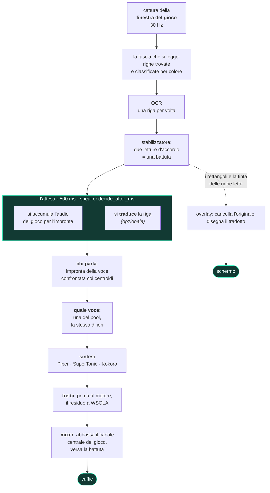
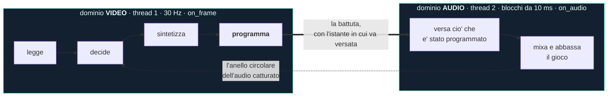
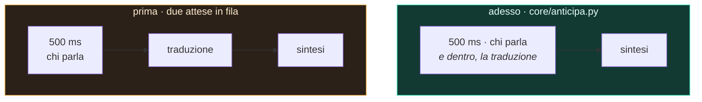

<div align="center">


# livedub

**Doppiaggio italiano dal vivo dei sottotitoli di un videogioco.**
Legge il testo a schermo mentre giochi, capisce dall'audio chi sta parlando,
sintetizza la battuta con la voce di quel personaggio e la mixa sopra il gioco.
Tutto in locale.


</div>

> **In questa catena non c'è nessuna traduzione obbligatoria.** I sottotitoli di
> GTA V sono già in italiano: il programma li legge e li *dice*. Tradurre è una
> funzione a parte, **spenta di serie**, che si accende se il gioco è in una
> lingua che non è la tua.

---

## Guarda com'è

Qui sotto tre spezzoni **muti**, perché un README non suona: GitHub anima una GIF
ma non le dà audio, e questo programma **parla** — sentirlo è metà di quello che
c'è da vedere. Ogni spezzone è cliccabile e porta al video intero, con la voce:
**[la vetrina](https://filde.github.io/livedub/#video)**.

### Il doppiaggio, su GTA V

La banda nera in alto è il testo **letto dall'OCR** con la voce che gli è stata
assegnata. Serve a distinguere «ha sbagliato a leggere» da «ha sbagliato a dire»,
ed è il motivo per cui ogni prova d'ascolto di questo progetto si consegna così.
Qui si vede il cambio di voce fra due personaggi: `[nicola]` e `[nicola-2_5]`.

[](https://filde.github.io/livedub/#video)

*Cliccalo per sentirlo: senza audio si vede che legge, non che dice.*

### La traduzione, disegnata sopra il gioco

Il sottotitolo italiano viene **cancellato ricostruendo lo sfondo** — non coperto
da un rettangolo — e al suo posto viene disegnato il tradotto, con il carattere e
il colore copiati dal gioco.

[](https://filde.github.io/livedub/#video)

### La finestra, mentre lavora

Un colore per personaggio nel registro, e in fondo la barra della misura:
letture al secondo, battute, latenza, compressione, underrun, area.

[](https://filde.github.io/livedub/#video)

---

## Cosa fa, in breve

| | |
|---|---|
| **Legge** i sottotitoli | OCR sulla sola finestra del gioco, non sullo schermo |
| **Capisce chi parla** | impronta vocale sull'audio del gioco, senza etichette |
| **Dà una voce a ciascuno** | e se la ricorda fra una sessione e l'altra |
| **Sta nei tempi** | accelera la battuta quanto basta per stare dentro la scena |
| **Mixa** | abbassa **il solo canale centrale** del gioco, dove sta il parlato: musica ed effetti restano dove sono |
| **Traduce** *(spento di serie)* | quattro motori, tre dei quali senza rete |
| **Riscrive il sottotitolo a schermo** *(spento di serie)* | cancella l'originale e disegna il tradotto |
| **Parla 42 lingue** *(la finestra)* | segue la lingua di Windows, e cambia senza riavviare |

---

## Come si usa, nell'ordine in cui lo incontri

Non c'è niente da configurare prima: si apre e si segue.

**1. Si apre.** La finestra è già nella lingua in cui usi Windows — 41 cataloghi
più l'italiano del sorgente. Arabo, ebraico, persiano e urdu ribaltano anche il
verso della finestra.

**2. La guida ti prende per mano**, sette passi, e si riapre col `?`. Dove può,
**controlla invece di raccontare**: conta le schede audio che ci sono, chiede a
ONNX Runtime se la CUDA c'è davvero invece di dedurlo, misura l'altezza dell'area
con la regola vera.

 

**3. Il banco misura questo PC e sceglie i motori.** È il sesto passo, e non è
una comodità: **un modello che manca non dà errore**. I programmi si installano
una volta, i modelli no — si scaricano alla prima richiesta, e se non arrivano la
catena *ripiega su qualcosa di più leggero e va avanti*. Senza questo passo
staresti ascoltando il ripiego senza saperlo. Il banco misura, sceglie, scarica
quello che manca, e **non installa nessun programma**: se ne manca uno ti dà la
riga esatta da incollare.


**4. Scegli la finestra del gioco.** Si cattura **una finestra sola**, non lo
schermo: così nel fotogramma che va all'OCR non entra nient'altro — nemmeno le
nostre finestre. Il gioco deve stare in finestra o *senza bordi*, non a schermo
intero esclusivo.

**5. Tira l'area attorno alla riga dei sottotitoli.** Due secondi col mouse.
L'area è **relativa alla finestra**: se sposti il gioco, l'area lo segue.

**6. Avvia.** Da lì il programma legge, capisce chi parla, sintetizza e mixa.

La voce arriva sempre un po' dopo il sottotitolo, ed è voluto: mezzo secondo
serve a capire chi sta parlando prima di scegliere la voce.

---

## Cosa succede dentro

### La catena, dal pixel alle cuffie



### Due domini, due thread, un solo punto d'incontro

Non è un dettaglio di implementazione: è **la** scelta di architettura, e sta
tutta in `core/pipeline.py`.



Il video decide **cosa** si dirà e **quando**; l'audio versa quello che è stato
programmato. **Il mixer non chiama mai il sintetizzatore**: se lo facesse, il
flusso di campioni si interromperebbe a ogni battuta — e un buco nel flusso non
è un rallentamento, è una battuta che non si sente.

### La traduzione sta **dentro** l'attesa, non dopo

È il pezzo di architettura più recente, ed è quello che ha tolto un secondo di
ritardo. Prima erano due attese in fila; sono due attese **indipendenti** — una
vuole il *testo*, che c'è subito, l'altra vuole l'*audio*, che va accumulato.



Misurato dal vivo (`runs/2026-08-19_16-08-44`): tradurre una riga costa **44,5 ms
al p50**, e l'attesa che la catena ci mette sopra è **0,01 ms** — cioè zero.
Quando serve, è già pronta. Ciò che sta sotto i 500 ms è gratis; ciò che li
supera si paga intero, ed è per questo che il numero che sceglie il traduttore è
il **p95** e non il p50.

Il resto è in [`docs/architettura.md`](docs/architettura.md).

---

## I numeri, e da quale sessione vengono

**Solo sessioni dal vivo, col gioco acceso.** C'è anche un banco che fa girare la
stessa identica catena su una registrazione — è vero codice, non una simulazione
— ma **il banco regala il tempo**: con l'orologio virtuale la sintesi costa zero e
nessun fotogramma viene saltato. Da lì non esce nessuna latenza, e in questa
tabella non ce n'è nessuna che venga da lì.

| | Piper (CPU) | Kokoro (CUDA) |
|---|---|---|
| sessione | `runs/2026-08-11_18-31-55` | `runs/2026-08-20_00-01-56` |
| battute doppiate | 44 | **146** |
| **latenza p50**, dal sottotitolo alla voce | **665 ms** | **1290 ms** |
| costo della sintesi, p50 *(già dentro la latenza qui sopra, non in aggiunta)* | 57 ms | 580 ms |
| compressione del parlato, p50 | 1,00 *(nessuna)* | 1,00 *(nessuna)* |
| `mix.underrun` — battute non sentite | **0** | **0** |

Dalla stessa sessione da 146 battute: l'OCR gira a **15,9 letture al secondo**
(10 724 letture in 675 s di partita), e il ritaglio che l'overlay porta a schermo
è vecchio di **9,7 ms al p50**, 19,2 nel caso peggiore.

Piper è più veloce e Kokoro articola meglio: sono due scelte, non una scala di
qualità, ed è il banco del passo 6 a dire quale delle due regge su una macchina.

**Su quanti core serve un motore, e cosa succede sotto.** Questa riga viene dal
banco (`tools/bench_cpu`) e non è una latenza: è il **costo della sintesi per
battuta** a parità di tutto il resto, cronometrato al muro restringendo
l'affinità del processo. È un **limite inferiore** al rallentamento di un PC
vecchio — simula meno core, non core più lenti.

| core fisici | Piper | SuperTonic |
|---|---|---|
| 8 | ~48 ms | 493–573 ms |
| 6 | 109 ms | 946 ms |
| 4 | **261 ms** | **1315 ms — non usabile** |
| 2 | 491 ms | 3627 ms |

Cioè: **sotto i 6 core fisici, Piper.**

---

## Privacy: gira tutto sulla tua macchina

Non è uno slogan, è la lista di cosa esce dal computer.

| | esce qualcosa? |
|---|---|
| lettura dei sottotitoli (OCR) | **no** — OneOCR o PP-OCR, in locale |
| chi parla (impronta vocale) | **no** — ECAPA, in locale |
| sintesi della voce | **no** — Piper, SuperTonic o Kokoro, in locale |
| traduzione con `locale`, `llm`, `ollama` | **no** |
| traduzione con `google` | **sì**, e il programma lo scrive ogni volta |
| scaricamento dei modelli | **una volta sola**, al primo uso |

L'unico modo di far uscire del testo è scegliere esplicitamente il traduttore
`google`. Nessuna telemetria, nessun account, nessuna connessione a un server
nostro — non esiste un server nostro.

---

## Requisiti

**Funziona bene con**: Windows 10 o 11, Python 3.11, 4 core, 8 GB di RAM,
nessuna scheda video particolare, motore di voce **Piper**.

**Meglio con**: Windows 11, 8 core, 16 GB di RAM e una **GPU NVIDIA** con almeno
4 GB liberi — motore **Kokoro** su CUDA (1128 MB di VRAM occupati su una RTX 4060
da 8 GB, mentre GTA V girava) e OCR **OneOCR**, il riconoscitore dello Strumento
di cattura di Windows 11, che sul testo bordato dei giochi legge molto meglio di
PP-OCR.

**Serve anche** un modo di sentire l'audio del gioco senza risentire il proprio
doppiaggio in circolo: basta il loopback WASAPI di Windows, già incluso.
[Voicemeeter](https://vb-audio.com/Voicemeeter/) **non è obbligatorio** — serve
solo se vuoi tutto in un paio di cuffie sole.

---

## Installazione

```powershell
git clone https://github.com/filde/livedub.git
cd livedub
powershell -ExecutionPolicy Bypass -File installa.ps1
```

Lo script **verifica di aver ottenuto quello che ha chiesto** invece di dire
«fatto»: Python, venv, dipendenze, OneOCR, il provider CUDA vero, i modelli, e
chiude eseguendo la suite di verifica. Quello che manca lo elenca con il perché e
cosa comporta.

Senza GPU NVIDIA:

```powershell
powershell -ExecutionPolicy Bypass -File installa.ps1 -SenzaGpu
```

### Partire

```powershell
.\.venv\Scripts\python.exe -m tools.ui_qt --profile live
```

Nella finestra: **Scegli finestra** → **Seleziona area** → **Avvia**.

---

## La finestra

Sei schede. **Nessuna va toccata per sentire la prima battuta**: si aprono quando
servono.

| scheda | a cosa serve |
|---|---|
| **Preparazione** | i quattro passi in ordine — è l'unica che serve prima di Avvia |
| **Sessione** | chi parla, adesso, un colore per personaggio |
| **Voce** | quale motore, quante voci nel pool, quanto aspettare prima di decidere chi parla |
| **Volumi** | quanto si abbassa il gioco e quanto si alza la nostra voce, **mentre ascolti** |
| **Traduzione** | solo per giocare in una lingua diversa da quella dei sottotitoli |
| **Tutte le impostazioni** | i 170 parametri, con la ricerca |

 

**La scheda Sessione non è un log.** In cima la battuta di adesso con la sua voce
e la sua fretta, poi chi ha parlato con una tessera per personaggio, il registro
sotto. La domanda che ti fai guardandola non è «cosa ha detto» ma **«è sempre lo
stesso a parlare?»**, e a quella l'occhio risponde da un colore molto prima che da
una sigla.

**La barra in fondo** dice a 2 Hz letture al secondo, battute, latenza p50,
compressione, underrun e area. L'unico rosso è `underrun`, e non è un numero
fuori norma: è una battuta che non si è sentita.

**I parametri.** 170 in tutto; **131 si applicano subito**, i 39 che si leggono
solo all'avvio **lo dicono** invece di fingere. Centoventisette hanno un `?` che
spiega cosa fanno, quanto è stato misurato e cosa si rischia a cambiarli — ed è
lo stesso testo che sta accanto al parametro dentro
[`core/config.py`](core/config.py), non una seconda copia che nessuno aggiorna.

**Le due lingue sono due cose diverse, e stanno a due schede di distanza
apposta.** `ui.lingua`, nella Preparazione, decide cosa c'è **scritto sui
bottoni**; `translate.source` e `translate.target`, nella Traduzione, decidono
cosa viene **detto**. Confonderle costa una sessione: si mette `en` nel posto
sbagliato credendo di aver acceso la traduzione, e la catena continua a doppiare
in italiano.

---

## Funziona con il mio gioco?

Provato su due: **GTA V** e **Mafia: The Old Country**, tutti e due in italiano.
Onestamente, questo è quello che si sa.

**Serve sempre**, per ogni gioco: tirare l'area attorno ai sottotitoli, e togliere
la spunta «Ignora i sottotitoli colorati» se il gioco colora il nome di chi parla.

**Non dipende dal gioco**, misurato: il filtro del colore è cieco alla tinta —
giallo, rosso, ciano, verde, viola e arancio si comportano identici.

**Ha buone probabilità di funzionare subito** se il gioco scrive testo **chiaro su
fondo scuro**, in una riga in basso.

**È da provare** se scrive testo scuro su fondo chiaro: su fotogrammi costruiti
apposta legge ma sporca (`Andiamo via di qui.` → `Andamo via di quL`). Su un gioco
vero non l'ha mai provato nessuno.

**Non è previsto**: sottotitoli dentro fumetti che seguono il personaggio, o
posizioni che cambiano da una battuta all'altra.

**E non traduce tutto lo schermo: legge una riga di sottotitolo alla volta**,
nell'area che gli tiri attorno. È una scelta, non una mancanza — tutta la catena è
costruita su quella forma. *(Una versione precedente prometteva più aree di
lettura insieme: è stata tolta, perché l'overlay disegna una scritta per volta e
la promessa non era mantenibile dal vivo.)*

**Sull'area, la cosa che si sente dire al contrario.** Se la tiri larga il
programma **legge lo stesso**: un'area grande è meno precisa, non muta. Quello che
peggiora davvero è la grafica — il tradotto viene disegnato ricostruendo lo sfondo
attorno alla riga, e più l'area è alta più quella ricostruzione prende roba che
non c'entra. Sopra 0,12 di altezza il programma te lo dice, mentre tiri il
rettangolo e quando avvii.

### E GTA VI

Rockstar ha annunciato sottotitoli e doppiaggio in poche lingue. livedub è
costruito su **quello che c'è a schermo**, non su file del gioco: se GTA VI
scriverà i sottotitoli in una striscia, come ha sempre fatto la serie, qui
servirà tirare un rettangolo. Niente da estrarre, niente da aggiornare, nessun
anti-cheat da toccare — il programma guarda lo schermo e suona nelle cuffie,
esattamente come un giocatore.

---

## Lingue

**Lettura**: quello che il riconoscitore sa leggere. Misurato sull'italiano; le
altre scritture non le ha provate nessuno su un gioco vero.

**Voce**, con le voci che oggi sono montate — ed è poco, e va detto:

| motore | voci | dove gira |
|---|---|---|
| **Piper** *(default)* | 2, italiane | CPU |
| **SuperTonic** | 10, italiane | CPU |
| **Kokoro** | 2 italiane + 6 inglesi | CUDA |

Oltre il numero di voci native i personaggi si distinguono spostando i semitoni,
che è quello che si vede nella GIF: `nicola` e `nicola-2_5` sono la stessa voce a
due altezze. **E il menu lo dichiara quando la voce manca**: tradurre verso il
giapponese senza una voce giapponese non darebbe errore — uscirebbe una voce
italiana che pronuncia il giapponese, cioè un modello fonemizzato con le regole
sbagliate, con l'audio che esce e i log verdi.

**Traduzione** *(spenta di serie)*, quattro strade:

| backend | dove | nota |
|---|---|---|
| `locale` *(default)* | offline, leggero | Argos/CTranslate2 — p95 67 ms |
| `llm` | offline, CPU | Gemma 3 1B in processo |
| `ollama` | offline, fuori dal venv | TranslateGemma 4b/12b |
| `google` | **rete** | 133 lingue, il più fedele, e lo dichiara |

> **Una cosa che nessun contatore mostra.** Su materiale volgare i modelli locali
> **riscrivono in silenzio**. Misurato su sei battute: Google 6/6 tiene il
> registro, TranslateGemma **0/6** col suo template. «Get the fuck out of my car,
> asshole» diventa «Esci immediatamente dalla mia macchina, idiota». La traduzione
> riesce benissimo: dice un'altra cosa.

**La lingua della finestra** è un'altra cosa ancora: 41 cataloghi più l'italiano
del sorgente, generati una volta e scritti nel repo — non chiesti alla rete
mentre la finestra si apre, perché una finestra che chiede la traduzione alla
rete è una finestra in bianco quando la rete non c'è, *e in bianco senza errore*.
Nessuna lingua fa sforare le schede: la più larga è il tamil, a 872 px sul minimo
di 960.

---

## Come è fatto, e perché ci si può fidare dei numeri

Non c'è pytest: la suite è un modulo eseguibile, **1813 verifiche** in 73 gruppi.

```powershell
.\.venv\Scripts\python.exe -m tools.selftest
```

E c'è il banco, che fa girare **la stessa identica catena** su una registrazione,
senza il gioco: stesso codice, OCR vero, audio vero, impronta vera, sintesi vera,
e la causalità rispettata — la catena non vede mai il futuro.

```powershell
.\.venv\Scripts\python.exe -m tools.dub registrazione.mp4 --profile gtav --mp4
```

**Ma il banco non basta, per costruzione**, e in questo progetto è una regola
scritta col sangue: con l'orologio virtuale la sintesi costa zero e nessun
fotogramma viene saltato, quindi da lì si può mostrare *tutto* tranne quanto è
veloce. Ogni difetto serio è uscito accendendo la catena davvero.

Le misure che hanno cambiato una decisione stanno scritte **accanto al parametro
che hanno deciso**, dentro [`core/config.py`](core/config.py) — ed è lo stesso
testo che la finestra mostra quando premi `?`.

---

## Sostieni il progetto

livedub è gratuito, gira tutto sulla tua macchina e non ha né account né server:
non c'è niente da vendere e nessun dato da raccogliere. Se ti è utile:

**[☕ Buy me a token!](https://ko-fi.com/filippodebenedittis)**

Non sblocca funzioni e non toglie limiti — non ce ne sono.

---

## Licenza

**GPL-3.0-or-later**, e non per gusto: il sintetizzatore di default (Piper) e il
g2p di Kokoro (eSpeak NG) sono GPL-3, quindi qualunque cosa venga distribuita lo
è. Il conto completo, libreria per libreria, sta in [`LICENZE.md`](LICENZE.md) —
compreso il perché OneOCR e i pesi dei modelli **non** vengono ridistribuiti.

---

<details>
<summary><b>In English</b> — what this is, in ten lines</summary>

<br>

**livedub** dubs a video game's on-screen subtitles out loud, live and entirely
on your own machine. It captures the game **window** (not the screen), reads the
subtitle line with OCR, works out **who is speaking** from the game's audio using
a voice fingerprint, synthesises the line with a voice assigned to that character,
and mixes it in while ducking the game's **centre channel** — so music and effects
stay where they are.

It was built to play **GTA V** in Italian by listening to the dialogue instead of
reading it. There is **no mandatory translation** in the chain: GTA V's subtitles
are already in Italian, so the program reads them and says them. Translating is a
separate feature, **off by default**, for games written in another language; when
it is on, the translated line is also drawn over the game, replacing the original.

The interface speaks **42 languages** and follows your Windows locale. A seven-step
guide opens the first time and, wherever it can, **checks instead of telling** —
it counts your audio devices, asks ONNX Runtime whether CUDA is really there, and
a built-in bench measures this PC, picks the engines it can actually run, and
downloads what is missing.

Measured live, with the game running: **665 ms** from subtitle to voice with Piper
on CPU (`runs/2026-08-11_18-31-55`), **1290 ms** with Kokoro on CUDA over 146 lines
(`runs/2026-08-20_00-01-56`), zero underruns and no speech compression in either.

Windows 10/11, Python 3.11, GPL-3.0-or-later. Nothing leaves the machine unless you
explicitly pick the Google translator.

</details>
