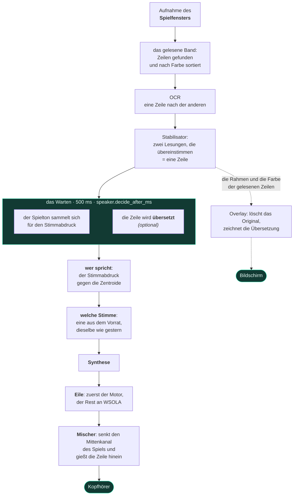

<div align="center">


# livedub

**Live-Synchronisation der Untertitel eines Videospiels.**
Es liest den Text auf dem Bildschirm, während du spielst, erkennt am Ton des
Spiels, wer gerade spricht, synthetisiert die Zeile mit der Stimme dieser Figur
und mischt sie über das Spiel. Alles auf deinem eigenen Rechner.

[](https://github.com/pigro141/livedub/actions/workflows/eseguibile.yml)
[](../../LICENSE)


[English](../../README.md) ·
[Italiano](README.it.md) ·
**Deutsch** ·
[Español](README.es.md) ·
[Français](README.fr.md) ·
[日本語](README.ja.md) ·
[中文](README.zh.md)

**[Ansehen und anhören — die Videos, mit Ton](https://pigro141.github.io/livedub/?lang=de)**

</div>

> **In dieser Kette gibt es keine zwingende Übersetzung.** Sind die Untertitel des
> Spiels schon in deiner Sprache, liest das Programm sie und *sagt* sie.
> Übersetzen ist eine eigene Funktion, **standardmäßig aus**, für ein Spiel, das
> in einer Sprache geschrieben ist, die nicht deine ist.

---

## Ansehen

Unten drei stumme Clips, denn eine README kann keinen Ton abspielen: GitHub
animiert ein GIF, gibt ihm aber keinen Ton, und dieses Programm **spricht** — es
zu hören ist die Hälfte von dem, was es zu sehen gibt. Jeder Clip führt zum
vollständigen Video, mit Stimme:
**[die Vitrine](https://pigro141.github.io/livedub/?lang=de#watch)**.

### Die Synchronisation, in GTA V

Der schwarze Balken oben ist der Text **so, wie ihn die OCR gelesen hat**, mit
der Stimme, die ihm zugeteilt wurde. Er dient dazu, *falsch gelesen* von *falsch
ausgesprochen* zu unterscheiden, und darum wird jede Hörprobe dieses Projekts so
geliefert. Man hört die Stimme zwischen zwei Figuren wechseln: `[nicola]` und
`[nicola-2_5]` sind dieselbe Stimme in zwei Tonhöhen.

[](https://pigro141.github.io/livedub/?lang=de#watch)

*Spiel es mit Ton ab: stumm sieht man, dass es liest, nicht dass es spricht.*

### Die Übersetzung, über das Spiel gezeichnet

Der ursprüngliche Untertitel wird **durch Rekonstruktion des Hintergrunds
gelöscht** — nicht mit einem Rechteck zugedeckt — und die übersetzte Zeile nimmt
seinen Platz ein, mit Größe und Farbe vom Spiel abgeschaut.

[](https://pigro141.github.io/livedub/?lang=de#watch)

### Das Fenster bei der Arbeit

Eine Farbe je Figur im Protokoll, und unten die Messleiste: Lesungen pro
Sekunde, Zeilen, Latenz, Stauchung, Aussetzer, Lesebereich.

[](https://pigro141.github.io/livedub/?lang=de#watch)

---

## Was es tut, kurz gefasst

| | |
|---|---|
| **Liest** die Untertitel | OCR allein auf dem Fenster des Spiels, nicht auf dem Bildschirm |
| **Erkennt, wer spricht** | ein Stimmabdruck auf dem Ton des Spiels, ganz ohne Beschriftungen |
| **Gibt jeder Figur eine Stimme** | und merkt sie sich von einer Sitzung zur nächsten |
| **Hält mit der Szene Schritt** | es beschleunigt eine Zeile gerade so weit, dass sie in ihre Zeit passt |
| **Mischt** | es senkt **nur den Mittenkanal** des Spiels, wo der Dialog sitzt: Musik und Effekte bleiben, wo sie sind |
| **Übersetzt** *(standardmäßig aus)* | mehrere Backends, die meisten ganz ohne Netz |
| **Schreibt den Untertitel auf dem Bildschirm neu** *(standardmäßig aus)* | löscht das Original und zeichnet die übersetzte Zeile |
| **Sagt die Zeile in 53 Sprachen** | 50 mit piper, 31 mit supertonic, 8 mit kokoro; du wählst die Sprache, und der Motor folgt ihr |
| **Spricht 42 Sprachen** *(die Oberfläche)* | folgt deiner Windows-Sprache und wechselt ohne Neustart |

---

## Wie man es benutzt, in der Reihenfolge, in der es dir begegnet

Vorher ist nichts einzustellen: du öffnest es und folgst mit.

**1. Du öffnest es.** Das Fenster ist schon in der Sprache, in der du Windows
benutzt — 42 Sprachen, und alle 41 Kataloge sind vollständig: 258 von 258
Zeichenketten. Arabisch, Hebräisch, Persisch und Urdu drehen das Fenster
außerdem herum.

**2. Eine Anleitung führt dich hindurch**, 7 Schritte, und sie kommt mit `?`
zurück. Wo sie kann, **prüft sie, statt zu erzählen**: sie zählt die Audiogeräte,
die du wirklich hast, sie fragt die ONNX Runtime, ob CUDA tatsächlich da ist,
statt es anzunehmen, und sie misst die Höhe deines Lesebereichs mit der echten
Regel.

 

**3. Ein Prüfstand misst diesen PC und wählt die Motoren.** Das ist keine
Bequemlichkeit: **ein fehlendes Modell wirft keinen Fehler**. Programme werden
einmal installiert, Modelle nicht — sie werden bei der ersten Nutzung geholt, und
wenn sie nicht ankommen, *weicht die Kette auf etwas Leichteres aus und macht
weiter*. Ohne diesen Schritt würdest du dem Notbehelf zuhören, ohne es zu wissen.
Der Prüfstand misst, wählt, lädt herunter, was fehlt, und **installiert kein
einziges Programm**: fehlt eines, bekommst du die genaue Zeile zum Einfügen.


**4. Du wählst das Fenster des Spiels.** Es nimmt **ein Fenster** auf, nicht den
Bildschirm, deshalb kann in dem Bild, das zur OCR geht, nichts anderes landen —
auch keines unserer eigenen Fenster. Das Spiel muss im Fenster oder *randlos*
laufen, nicht im exklusiven Vollbild.

**5. Du ziehst einen Rahmen um die Untertitelzeile.** Zwei Sekunden mit der Maus.
Der Bereich ist **relativ zum Fenster**: verschiebst du das Spiel, folgt ihm der
Bereich.

**6. Start.** Von da an liest es, erkennt, wer spricht, synthetisiert und mischt.

Die Stimme kommt immer etwas nach dem Untertitel, und das ist Absicht: 500 ms
Spielton braucht es, um zu wissen, wer spricht, bevor eine Stimme gewählt wird.

---

## Was drinnen passiert



**Zwei Bereiche, zwei Threads, ein einziger Treffpunkt.** Der Videobereich
entscheidet, **was** gesagt wird und **wann**; der Audiobereich gießt ein, was
eingeplant wurde. **Der Mischer ruft nie den Synthesizer auf**: täte er es,
stünde der Strom der Abtastwerte bei jeder Zeile still — und ein Loch im Strom
ist keine Verlangsamung, es ist eine Zeile, die du nicht hörst.

**Die Übersetzung geschieht *innerhalb* des Wartens, nicht danach.** Es sind zwei
unabhängige Wartezeiten: die eine braucht den *Text*, der da ist, sobald der
Untertitel bestätigt ist; die andere braucht *Ton*, der sich erst sammeln muss.
Nacheinander kosten sie `Warten + Übersetzung`; überlappt kosten sie
`max(Warten, Übersetzung)`.

Der Rest steht in [`docs/architettura.md`](../architettura.md) *(auf Italienisch,
wie der Code)*.

---

## Die Zahlen, und aus welcher Sitzung sie kommen

**Nur echte Sitzungen, mit laufendem Spiel.** Es gibt auch einen Prüfstand, der
genau dieselbe Kette über eine Aufnahme laufen lässt — echter Code, keine
Simulation — aber **der Prüfstand verschenkt Zeit**: auf einer virtuellen Uhr
kostet die Synthese nichts und es geht nie ein Bild verloren. Von dort kommt
keine Latenz, und keine in dieser Tabelle.

| | piper, auf der CPU | kokoro, auf CUDA | kokoro auf CUDA, Übersetzung an |
|---|---|---|---|
| synchronisierte Zeilen | 44 | 146 | **589**, in einer einzigen Sitzung von 44 Minuten |
| **Untertitel → Stimme**, Median | **665 ms** | **1290 ms** | **1421 ms** |
| Synthese, Median | 57 ms | 580 ms | 248 ms |
| Stauchung des Gesprochenen, Median | **1,00** — gar keine | **1,00** — gar keine | **1,00** — gar keine |
| `underrun` — Zeilen, die du nicht gehört hast | **0** | **0** | **0** |
| Untertitel-Lesungen pro Sekunde | nicht aufgezeichnet | 15,3 | 18,8 |
| die Sitzung, aus der es kommt | `runs/2026-08-11_18-31-55` | `runs/2026-08-20_00-01-56` | `runs/2026-08-07_01-40-16` |

**Die Zahl, die mehr wert ist als jede Latenz: nicht ein einziger `underrun`, in
keiner der 53 echten Sitzungen** in `runs/`, die einen der drei heutigen Motoren
benutzt haben. Und die Piper-Spalte ist kein Glückstreffer — vier
Schwestersitzungen desselben Abends ergaben 664, 669, 687 und 687 ms.

**Wohin die Zeit wirklich geht, sobald der Motor schnell ist.** Von der Latenz
von Kokoro sind rund **500 ms das Warten darauf, zu erfahren, wer spricht** —
mehr als die Synthese selbst. Das ist die Zahl, die man angreifen muss, wenn man
es schneller haben will, und der Preis dafür ist, öfter den falschen Sprecher zu
nennen; das kann nur dein Ohr beurteilen.

**Wie viele Kerne ein Motor braucht.** Diese Zahl kommt vom Prüfstand und ist
keine Latenz: sie ist der **Aufwand, eine Zeile zu synthetisieren**, alles andere
gleich gehalten, auf der Wanduhr gemessen, während der Prozess auf weniger Kerne
beschränkt ist. Sie ist eine **untere Schranke** dafür, wie stark ein älterer PC
einbrechen würde — sie simuliert weniger Kerne, nicht langsamere.

| physische Kerne | eine Piper-Zeile, Median | p95 | gegenüber 8 Kernen |
|---|---|---|---|
| 8 | **78 ms** | 144 ms | 1,00× |
| 6 | **88 ms** | 236 ms | 1,12× |
| 4 | **302 ms** | 544 ms | **3,85×** |
| 2 | 363 ms | 1050 ms | 4,63× |

**Die Klippe liegt zwischen 6 und 4 Kernen**, und deshalb verlangt die Tabelle
weiter unten 6 und nicht 8: der Schritt von 8 auf 6 kostet 12 %, der Schritt von
6 auf 4 fast das Vierfache. So gemessen wurde nur Piper, deshalb nennt diese
README für die schwereren Motoren keine Zahl — der Prüfstand in der Anleitung
misst sie auf *deinem* Rechner, und das ist ohnehin die Antwort, auf die es
ankommt.

---

## Privatsphäre: alles läuft auf deinem Rechner

Das ist kein Slogan, das ist die Liste dessen, was den Rechner verlässt.

| | verlässt irgendetwas den Rechner? |
|---|---|
| die Untertitel lesen (OCR) | **nein** — auf deinem Rechner |
| wer spricht (Stimmabdruck) | **nein** — auf deinem Rechner |
| die Stimme synthetisieren | **nein** — auf deinem Rechner |
| mit den Offline-Backends übersetzen | **nein** |
| mit dem Online-Backend übersetzen | **ja**, und das Programm sagt es jedes Mal |
| die Modelle herunterladen | **einmal**, bei der ersten Nutzung |

Text verlässt den Rechner nur, wenn du den Online-Übersetzer absichtlich wählst.
Keine Telemetrie, kein Konto, keine Verbindung zu einem Server von uns — es gibt
keinen Server von uns.

---

## Voraussetzungen

| | läuft mit | läuft besser mit |
|---|---|---|
| CPU | 6 physische Kerne | 8 physische Kerne |
| GPU | **keine** — ohne geht nichts kaputt | irgendeine NVIDIA mit etwa 2 GB freiem VRAM: gemessen gebraucht werden **1128 MB** |
| RAM | 8 GB | 16 GB |
| Festplatte | **1,6 GB** — die Umgebung ohne die CUDA-Bibliotheken, plus 225 MB Modelle | **3,5 GB** — mit den CUDA-Bibliotheken und 543 MB Modellen. Die Offline-Übersetzung kommt in beiden Fällen mit **3,2 GB** obendrauf |
| Windows | **10** — die Aufnahme läuft über `PrintWindow`, das in `user32.dll` steckt und nichts zu installieren verlangt | **11** — OneOCR gibt es nur dort, und es liest den umrandeten Text eines Spiels weit besser |
| Python | 3.11 | 3.11 |
| **was du bekommst** | **Piper auf der CPU.** 665 ms vom Untertitel zur Stimme, keine Aussetzer, kein Beschleunigen des Gesprochenen. Der Leser ist PP-OCR, und 50 der 53 gesprochenen Sprachen sind schon hier. | **Kokoro auf CUDA**: bessere Artikulation, und seine 54 Stimmen in 8 Sprachen. 1290 ms. |
| **was der Schritt bringt** | unter 6 Kernen geht die Synthese von Piper von 88 ms auf **302 ms** — siehe die Tabelle oben | die Grafikkarte bringt **3,5× bei der Synthese** (von 741 ms auf 213 ms), und sie ist das Einzige, was eine Sprache den Motor auf Kokoro umstellen lässt: auf der CPU kostet dieser Motor 741 ms je Zeile, und das ist nicht lebbar |

**Eine Voraussetzung lässt sich nicht lesen ohne den Rechner, auf dem sie
gemessen wurde**, also hier ist er: ein Intel Core i9-11900K (8 physische Kerne),
eine **RTX 4060 mit 8 GB** — *auf der gleichzeitig GTA V läuft* — 31,8 GB RAM,
Windows 11 Pro Build 26200, Python 3.11.9. Jede Zahl in dieser README stammt von
diesem Rechner, sofern nichts anderes dabeisteht, und die Spalte *läuft besser
mit* ist keine Wunschliste: sie ist genau dieser Rechner.

**Außerdem brauchst du** einen Weg, den Ton des Spiels zu hören, ohne dass deine
eigene Synchronisation wieder hineinläuft: der WASAPI-Loopback, der bei Windows
dabei ist, reicht. [Voicemeeter](https://vb-audio.com/Voicemeeter/) ist
**optional** — es hilft nur, wenn du alles in einem einzigen Paar Kopfhörer haben
willst.

## Herunterladen

**Installation aus dem Quelltext mit PowerShell** — der Block gleich darunter.
Das ist der empfohlene Weg und der, der auf jedem Rechner funktioniert, und er
ist unverändert geblieben.

**Es gibt auch eine ausführbare Datei, und sie ist wirklich gestartet worden.**
Jeder Push baut sie auf GitHub Actions und *führt sie dann aus*: im Paket liest
sie einen gezeichneten Untertitel, synthetisiert eine Zeile und baut das Fenster,
und das Artefakt geht nur hoch, wenn all das durchgeht. Es ist das Artefakt
`livedub-windows` am Fuß des
[jüngsten grünen Laufs](https://github.com/pigro141/livedub/actions/workflows/eseguibile.yml).
Zum Herunterladen eines Artefakts braucht es ein GitHub-Konto, und jedes bleibt
14 Tage liegen.

**Zwei Grenzen, erklärt statt versteckt.** Mit eingeschaltetem **Smart App
Control** — und auf einem frisch installierten Windows 11 ist es standardmäßig
an — **startet die Datei nicht**: jeder Bau ist eine neue Datei, und eine neue
Datei hat von Bauart wegen keinen Ruf. Das hebt eine Signatur auf, keine weitere
Prüfung. Und der Build-Rechner hat keine Soundkarte, keine Grafikkarte und kein
laufendes Spiel, also bleiben Bildschirmaufnahme, Audio-Loopback, Mischung und
Synthese auf der GPU **ungeprüft** — dort ist Smart App Control ebenfalls aus,
„es startet auf dem Runner“ heißt also nicht „es startet auf einem frisch
installierten Windows 11“.

## Aus dem Quelltext installieren

```powershell
git clone https://github.com/pigro141/livedub.git
cd livedub
powershell -ExecutionPolicy Bypass -File installa.ps1
```

Das Skript **prüft, ob es bekommen hat, worum es gebeten hat**, statt Erfolg zu
melden: Python, die virtuelle Umgebung, die Abhängigkeiten, die OCR, den echten
CUDA-Provider, die Modelle — und zum Schluss lässt es die Testreihe laufen. Was
fehlt, wird mit Grund aufgeführt und damit, was es dich kostet.

Ohne NVIDIA-GPU:

```powershell
powershell -ExecutionPolicy Bypass -File installa.ps1 -SenzaGpu
```

Was das Skript ausführt, sind zwei pip-Befehle und nicht einer, und der zweite
ist nicht optional: die vier Pakete darin hängen von der CPU-Fassung der ONNX
Runtime ab, die neben `onnxruntime-gpu` CUDA still abschaltet, und `--no-deps`
ist eine globale Option, die nicht in derselben Datei wie der Rest stehen kann:

```powershell
.\.venv\Scripts\python.exe -m pip install -r requirements.txt
.\.venv\Scripts\python.exe -m pip install -r requirements-nodeps.txt --no-deps
```

**Die Installation ist mit Absicht leicht, und eine Sache bleibt mit Absicht
draußen.** Die Offline-Übersetzung wird **nicht installiert**: sie kostet **3100
MB**, fast alles davon `torch` — das die Übersetzung nie benutzt, ohne das ihr
Satztrenner aber nicht einmal importiert. Das jedem aufzubürden, der das Programm
installiert, für eine Funktion, die **standardmäßig aus** ist, ist das Gegenteil
einer Entscheidung. Sie kommt, **wenn du sie brauchst**: der Prüfstand in der
Anleitung schaut, was fehlt, **sagt, wie schwer es wiegt, bevor du entscheidest**,
und reicht dir die Zeile zum Einfügen. Er reicht sie, statt sie auszuführen, denn
das sind *Pakete*, und ein naives `pip install` ist dort genau das, was das
CPU-Rad wieder hereinholt. Kommt sie nicht an, ist das ein **erklärter Verzicht**,
kein stummer Notbehelf. Das Sprachpaar selbst ist ein Modell, 98 MB, und das lädt
der Prüfstand von allein.

### Starten

```powershell
.\.venv\Scripts\python.exe -m tools.ui_qt --profile live
```

Im Fenster: **Fenster wählen** → **Bereich wählen** → **Start**. Unter Windows
genügt auch ein Doppelklick auf `livedub.bat`.

> **Falls in deinem Windows Smart App Control eingeschaltet ist.** Es kommt im
> Modus *Bewertung* und Windows schaltet es von selbst ab, sobald es
> Entwicklerwerkzeuge laufen sieht — und einmal aus, lässt es sich ohne
> Neuinstallation von Windows nicht wieder einschalten. Das betrifft also eine
> Minderheit der Rechner, nicht den Normalfall. Auf einem, auf dem es noch an
> ist, und mit den in diesem Repo festgelegten Versionen, sind genau **zwei
> Pakete blockiert, und sie sind eine einzige Fähigkeit**: Windows Graphics
> Capture. Die Aufnahme weicht dann auf `PrintWindow` aus, das nichts zu
> installieren verlangt. **Alles andere läuft weiter** — die Untertitel lesen,
> erkennen, wer spricht, alle drei Synthesemotoren, der Mischer, das Overlay, die
> Offline-Übersetzung und das Fenster selbst. Auch jede mit PyInstaller gebaute
> ausführbare Datei ist blockiert, die dieses Projekts eingeschlossen: jeder Bau
> ist eine neue Datei, und eine neue Datei hat bauartbedingt keinen Ruf.
>
> **Und wo es zubeißt, sagt das Programm, was ausgefallen ist und was man
> stattdessen nimmt.** Eine blockierte Bibliothek wird dir nicht als Fehlerausgabe
> hingelegt: es gibt eine Stelle, die die Frage *lässt sich dieses Stück auf
> diesem Rechner laden?* beantwortet, und sie unterscheidet *du hast es nie
> installiert* von *es ist da und Windows lädt es nicht* — denn das Erste heilt
> ein `pip install` und das Zweite nicht. Die Menüs markieren die Auswahlen, die
> scheitern würden, auf dem geschlossenen Feld und nicht nur in der Liste, denn
> der Wert, der nicht funktioniert, ist meist der, der schon in deiner
> Konfiguration steht. Die Auswahl wird **markiert, nicht entfernt**: sie zu
> entfernen würde verbergen, dass das Programm es kann und dass der Mangel diesem
> Rechner gehört.

---

## Das Fenster

Sechs Reiter. **Keinen davon muss man anfassen, um die erste Zeile zu hören**:
sie gehen auf, wenn du sie brauchst.

| Reiter | wofür er da ist |
|---|---|
| **Vorbereitung** | die Schritte der Reihe nach — der einzige Reiter, den du vor dem Start brauchst |
| **Sitzung** | wer gerade spricht, eine Farbe je Figur |
| **Stimme** | welcher Motor, wie viele Stimmen im Vorrat, wie lange gewartet wird, bevor entschieden wird, wer spricht |
| **Pegel** | wie weit das Spiel abgesenkt wird und wie weit unsere Stimme heraufkommt, **während du zuhörst** |
| **Übersetzung** | nur für ein Spiel, dessen Untertitel nicht in deiner Sprache sind |
| **Alle Einstellungen** | die 170 Parameter, mit einem Suchfeld |

 

**Der Reiter Sitzung ist kein Protokoll.** Oben die Zeile, die gerade gesprochen
wird, mit ihrer Stimme und ihrer Eile; dann, wer gesprochen hat, eine Karte je
Figur; das Protokoll darunter. Die Frage, die man sich beim Zusehen stellt, ist
nicht *was hat es gesagt*, sondern **spricht immer noch dieselbe Person?** — und
darauf antwortet eine Farbe lange vor jeder Beschriftung.

**Die Parameter.** 170 an der Zahl; **131 wirken sofort**, und die 39, die nur
beim Start gelesen werden, **sagen das**, statt so zu tun als ob. 127 tragen ein
`?`, das erklärt, was sie tun, was gemessen wurde und was du beim Ändern
riskierst — und es ist derselbe Text, der neben dem Parameter in
[`core/config.py`](../../core/config.py) steht, keine zweite Abschrift, die
niemand pflegt.

**Die zwei Sprachen sind zwei verschiedene Dinge, und sie sitzen mit Absicht zwei
Reiter voneinander entfernt.** `ui.lingua`, in der Vorbereitung, entscheidet, was
**auf den Schaltflächen steht**; `translate.source` und `translate.target`, in
der Übersetzung, entscheiden, was **gesagt wird**. Sie zu verwechseln kostet dich
eine Sitzung.

---

## Funktioniert es mit meinem Spiel?

An zweien erprobt: **GTA V** und **Mafia: The Old Country**, beide auf
Italienisch. Ehrlich gesagt ist das alles, was bekannt ist.

**Immer nötig**, bei jedem Spiel: den Bereich um die Untertitel ziehen, und das
Häkchen *farbige Untertitel überspringen* entfernen, wenn das Spiel den Namen des
Sprechers einfärbt.

**Gute Aussichten, sofort zu laufen**, wenn das Spiel **helle Schrift auf dunklem
Grund** schreibt, auf einer Zeile nahe dem unteren Rand.

**Einen Versuch wert**, wenn es dunkle Schrift auf hellem Grund schreibt: auf
eigens gebauten Bildern liest es, aber es verschmiert. Auf einem echten Spiel
dieser Art hat es noch nie jemand ausprobiert.

**Nicht geplant**: Untertitel in Sprechblasen, die der Figur folgen, oder
Positionen, die von Zeile zu Zeile wandern.

**Und es übersetzt nicht den ganzen Bildschirm: es liest eine Untertitelzeile
nach der anderen**, innerhalb des Rahmens, den du ziehst. Das ist eine
Entscheidung, keine Lücke — die ganze Kette ist auf diese Form gebaut.

**Zum Bereich, die Sache, die alle falsch herum verstehen.** Zieh ihn breit, und
das Programm **liest trotzdem**: ein großer Bereich ist weniger genau, nicht
stumm. Schlechter wird in Wahrheit das Zeichnen — die übersetzte Zeile entsteht,
indem der Hintergrund um sie herum rekonstruiert wird, und je höher der Bereich,
desto mehr fremde Kulisse nimmt diese Rekonstruktion mit. Über eine bestimmte
Höhe hinaus sagt das Programm es dir, schon während du das Rechteck ziehst, und
noch einmal beim Start.

---

## Die Sprachen

Hier heißen drei verschiedene Dinge *Sprache*, sie werden an drei verschiedenen
Stellen eingestellt, und sie zu vermengen ist der Weg, auf dem ein Programm am
Ende verspricht, was es nicht hat.

| | wie viele | wo du es einstellst |
|---|---|---|
| in welcher Sprache die **Schaltflächen** beschriftet sind | **42** | `ui.lingua`, im Reiter Vorbereitung |
| in welche Sprache es einen **Untertitel übersetzen** kann | **133** mit dem Online-Backend — die Offline-Backends haben keine geschlossene Liste | `translate.target`, im Reiter Übersetzung |
| was es **laut sagen** kann | **53** — aber nicht mit jedem Motor: 50 mit piper, 31 mit supertonic, 8 mit kokoro | du wählst die Sprache, und der Motor folgt ihr |

> **Drei Listen, drei Fragen.** Die Oberfläche spricht 42 Sprachen, der Übersetzer
> erreicht 133, und der Mund spricht 53. Diese letzte Zahl ist nicht eine Zahl:
> **die drei Motoren haben verschiedene Kataloge**, und eine Sprache zu wählen
> heißt in Wahrheit, einen Motor zu wählen. Vor der Änderung, die daraus 53
> gemacht hat, sprach der Mund **zwei** — und das war nie eine Grenze der Motoren,
> es war das Einzige, was der Code erklärte: ins Spanische übersetzen und es dann
> von einer italienischen Stimme lesen lassen ergab **überhaupt keinen Fehler**.

**Lesen**: alles, was der Leser lesen kann.

**Sprechen**:

| Motor | Sprachen | Stimmen | läuft mit | wie die Stimmen funktionieren |
|---|---|---|---|---|
| **piper** *(Standard)* | **50** | 175 Modelle im offiziellen Verzeichnis | CPU | ein Modell je Stimme, jeweils ein eigener Download (28–114 MB) |
| **supertonic** | **31** | 10 Sprecherstile, gültig in *jeder* Sprache | CPU | ein einziges mehrsprachiges Modell; die Sprache wählt den Phonemisierer |
| **kokoro** | **8** | 54, Sprache und Geschlecht stecken im Namen | CUDA | ein einziges Modell, eine Stildatei von 510 KB je Stimme |
| `tone`, `silent` | — | ein Piepton hat keine Sprache | — | — |
| **Vereinigung** | **53** | | | |

Nur zwei Sprachen gehören einem einzigen Motor allein — Kroatisch und Litauisch,
beide bei supertonic; sechs decken alle drei ab; einundzwanzig gibt es nur bei
piper. Jenseits der Zahl der nativen Stimmen werden Figuren durch Verschieben der
Tonhöhe unterschieden — genau das hört man im ersten GIF: `[nicola]` und
`[nicola-2_5]` sind eine Stimme in zwei Tonhöhen.

### Was behauptet wird, und was wirklich geprüft wurde

Das zählt mehr als die Zahlen.

**Behauptet, und aus dem Katalog überprüfbar**: dass eine Stimme *existiert* und
dass sie *zu dieser Sprache gehört*. Jeder Motor veröffentlicht das — piper in
`rhasspy/piper-voices/voices.json`, kokoro im ersten Buchstaben jedes
Stimmnamens, supertonic in seiner Liste unterstützter Sprachen. Nichts davon ist
geraten.

> **Nicht behauptet: dass die Aussprache gut ist.** Niemand hat 53 Sprachen
> abgehört, und etwas anderes zu sagen wäre ein Versprechen, das keine Messung
> deckt.

**Stattdessen maschinell geprüft**: für eine Auswahl von Sprachen wird ein Satz
*in der eigenen Schrift dieser Sprache* synthetisiert und das Ergebnis auf ein
plausibles **Sprechtempo** hin geprüft — Zeichen pro Sekunde. Eine falsche
Phonemisierung wirft keinen Fehler: das Modell antwortet, Ton kommt heraus, jeder
Zähler bleibt grün, und ein Tempo außerhalb jeder Skala ist die einzige Spur, die
sie hinterlässt.

| Motor | gemessene Sprachen | Ergebnis |
|---|---|---|
| **supertonic** | **31 von 31** | alle plausibel: 6,6–17,8 Zeichen pro Sekunde, am unteren Ende Japanisch, Koreanisch, Chinesisch und Hindi, wie es ihre Schriften erwarten lassen |
| **piper** | **1 von 50** | Hebräisch, 9,14 Zeichen/s. Der Rest ließ sich *auf diesem Rechner* nicht messen: Smart App Control blockiert `espeakbridge.pyd`, und jede andere piper-Sprache phonemisiert über espeak |
| **kokoro** | **0 von 8** | `kokoro-onnx` lässt sich hier überhaupt nicht importieren — Smart App Control blockiert das native Modul einer seiner Abhängigkeiten |

Die beiden Motoren, die sich nicht messen ließen, sind durch eine **Eigenschaft
dieses Rechners** blockiert, nicht durch den Code. Ihre Sprachlisten stammen
erklärtermaßen aus dem Katalog und sind **als ungemessen markiert**, statt als
geprüft dargestellt zu werden.

> **Eine Behauptung, die die Prüfung wieder weggenommen hat.** Das Verzeichnis von
> piper führt **51** Sprachen, und dieses Programm bietet **50** an. Der
> Unterschied ist Japanisch: diese Stimme braucht einen Phonemisierer, den das
> installierte `piper-tts` nicht hat, das Modell lädt also anstandslos herunter
> und die *erste Synthese* wirft einen Fehler. 51 zu erklären wäre wahr gewesen
> für das Verzeichnis und falsch für dieses Programm. Japanisch wird trotzdem
> gesprochen — von kokoro oder von supertonic.

### Wähle eine Sprache, und der Motor folgt ihr

Es gibt genau drei Ausgänge, und der Unterschied zwischen ihnen ist der ganze
Entwurf.

| | was passiert | was es sagt |
|---|---|---|
| **der Motor, den du gewählt hast, spricht sie schon** | nichts ändert sich | **nichts** — und das muss still bleiben: ein Hinweis, der bei jedem Sprachwechsel erscheint, ist einer, den man bald nicht mehr liest |
| **er spricht sie nicht, aber ein anderer Motor tut es** | der Motor wird gewechselt | es sagt es, denn deine eigene Wahl wurde gerade übergangen — *«piper» hat keine Stimmen in dieser Sprache: Wechsel zu «supertonic», das 31 spricht* |
| **kein brauchbarer Motor spricht sie** | es wird nichts gewechselt, denn Wechseln würde nicht helfen | die Tatsache wird ausgesprochen, statt still aufgelöst zu werden — *kein Motor hat Stimmen in dieser Sprache (und «kokoro» läuft hier nicht): die Zeile käme mit einer Stimme heraus, die eine andere ausspricht* |

Die Klammer im letzten Fall ist der Punkt: **die Antwort hängt vom Rechner ab**,
und die Meldung sagt, welche Motoren ausgeschlossen wurden. Der Ersatz muss einer
sein, den dieser Rechner wirklich trägt — kokoro kostet auf der CPU 741 ms je
Zeile gegenüber 213 auf CUDA, ein Rechner ohne CUDA wird also nie darauf
umgestellt: einer Sprache zu folgen darf nicht die doppelte Latenz kosten.
Japanisch zeigt den ganzen Mechanismus in einer Zeile: piper hat die Stimme und
kann sie nicht aussprechen, kokoro hat fünf und will CUDA, supertonic schafft es
auf der CPU.

**Zwei bauliche Tatsachen, die man kennen sollte.** Die zehn Stimmen von
supertonic sind *Sprecher, keine Sprachen*: dieselben zehn Stile sprechen alle
31, und die Sprache wählt nur den Phonemisierer — deshalb ist es der billigste
Weg, eine Sprache hinzuzufügen. Piper ist das Gegenteil, ein Modell und ein
Download je Stimme — und sein Verzeichnis hat **kein Feld für das Geschlecht**,
außerhalb des Italienischen markiert der Vorrat piper-Stimmen deshalb mit `?` und
fällt auf die schlichte Reihenfolge zurück, statt männlich und weiblich
abzuwechseln. Ein erklärter Rückschritt, kein verborgener.

**Übersetzung** *(standardmäßig aus)*:

| Backend | Netz | wie viele Sprachen | wissenswert |
|---|---|---|---|
| **`locale`**, Argos *(Standard)* | **nein** | keine geschlossene Liste: welche Paare Argos eben veröffentlicht, heruntergeladen beim Druck auf Start | versteht `auto` nicht — daraus wird stillschweigend *aus dem Englischen* |
| `llm`, Gemma 3 1B im selben Prozess | **nein** | hängt vom Modell ab, auf das du es richtest | derselbe Vorbehalt bei `auto` |
| `ollama`, TranslateGemma außerhalb der Umgebung | **nein**, aber ein lokaler Server muss laufen | hängt vom Modell ab | in der Praxis das langsamste: die echten Sitzungen damit liegen von Ende zu Ende bei 1592–1805 ms |
| `google` | **ja**, und das Programm sagt es jedes Mal | **133** — als einziges der vier eine geschlossene Liste | das einzige, das `auto` versteht |

Das Menü **zeigt alle vier und erklärt**, statt zu filtern: drei davon haben keine
geschlossene Liste, ein Filter würde also Möglichkeiten verbergen, die
funktionieren, und solche durchlassen, die es nicht tun — mit der Miene, es zu
wissen.

> **Etwas, das kein Zähler zeigt.** Bei derber Sprache **schreiben lokale Modelle
> sie still um**. Die Übersetzung gelingt tadellos: sie sagt etwas anderes. Bevor
> du fragst, ob ein Übersetzer gut ist, frage, ob er sagt, was dasteht.

**Die Sprache der Oberfläche** ist noch einmal etwas Drittes: **42** — 41 Kataloge
plus Italienisch, die Sprache, in der der Quelltext geschrieben ist. Alle 41 sind
**vollständig, 258 von 258 Zeichenketten**, keine halb übersetzt; vier laufen von
rechts nach links und drehen das ganze Fenster um (Arabisch, Hebräisch, Persisch,
Urdu). Sie werden einmal erzeugt und ins Repo eingecheckt — nicht beim Öffnen des
Fensters aus dem Netz geholt, denn ein Fenster, das seinen eigenen Text aus dem
Netz holt, ist ein leeres Fenster, wenn das Netz fehlt, *und leer ohne
Fehlermeldung*.

Was **nicht** übersetzt wird, und zwar mit Absicht: die Erklärungen hinter dem `?`
an jedem Parameter. Sie stammen aus den Kommentaren in
[`core/config.py`](../../core/config.py), mit den Messungen darin, und eine
Messung durch einen maschinellen Übersetzer zu schicken ist der Weg, auf dem eine
Messung still aufhört, eine zu sein. Das Protokoll und die Messleiste bleiben aus
demselben Grund italienisch — sie sind Zahlen und Gerätenamen.

---

## Was es nicht tut

Der schnellste Weg, von einem Programm enttäuscht zu werden, ist, diese Liste
beim Benutzen selbst herauszufinden. Also steht sie hier, vor der Installation.

| | |
|---|---|
| **Niemand hat die 53 Sprachen abgehört** | geprüft ist, dass eine Stimme existiert, dass sie zu dieser Sprache gehört und — wo es messbar war — dass ihr Sprechtempo plausibel ist. Die Aussprache ist nicht geprüft, und Italienisch ist die Sprache, in der dieses Programm gebaut und abgehört wurde. |
| **Eine Sprache, die dein Motor nicht spricht, ist ein Wechsel, kein Fehler** | der Motor wechselt zu einem, der sie spricht, und sagt es. Spricht sie keiner der Motoren, die dieser Rechner tragen kann, wird auch das ausgesprochen — statt dir eine Stimme zu geben, die eine andere Sprache ausspricht. |
| **Die erste Sitzung in einer neuen piper-Sprache lädt deren Stimmen herunter** | ein Modell je Stimme, 28–114 MB pro Stück, bis zu sechs davon, und der Prüfstand der Anleitung nennt dieses Gewicht noch nicht im Voraus, wie er es sonst tut. Der Start kann ein paar Minuten stehen, ohne zu sagen, warum. |
| **Eine Untertitelzeile nach der anderen** | innerhalb des Rahmens, den du ziehst: nicht der ganze Bildschirm, nicht mehrere Bereiche auf einmal. Eine frühere Fassung versprach mehrere Lesebereiche und sie wurde entfernt, weil das Overlay eine Zeile nach der anderen zeichnet und das Versprechen live nicht zu halten war. |
| **Das Spiel muss im Fenster oder randlos laufen** | exklusives Vollbild wird nicht aufgenommen. |
| **Nur Windows** | und den Leser, der den umrandeten Text eines Spiels am besten liest, OneOCR, gibt es nur unter Windows 11. Unter Windows 10 bekommst du PP-OCR. |
| **Die Stimme kommt nach dem Untertitel** | etwa eine halbe Sekunde davon ist das Warten auf genug Spielton, um sagen zu können, wer spricht — und dieses Warten, nicht die Synthese, ist das größte einzelne Stück der Verzögerung. |
| **Mehr Figuren als Stimmen teilen sich eine** | jenseits der Zahl der nativen Stimmen werden sie durch Verschieben der Tonhöhe unterschieden, und man hört es. |
| **Ein Spieler, ein Fenster** | es ist kein Streaming-Werkzeug, keine Lokalisierungskette und nichts für Mehrspieler. |

**Wo die Aufnahme scheitern kann.** Es greift das Fenster des Spiels über Windows
Graphics Capture ab, wo es das gibt, und weicht — **und sagt es im Protokoll** —
auf `PrintWindow` aus, wo es das nicht gibt. Der Notweg verlangt keine
Installation, ist aber synchron und kostet mehr: **17,5 ms** für ein Fenster von
1191×958, gemessen. Und bei einem Spiel, das über eine Direct3D-Swapchain im
Flip-Modell zeichnet, kann `PrintWindow` **gelingen und ein schwarzes Bild
zurückgeben**; das Programm prüft die ersten acht Bilder und erklärt es, statt
still Schwarz zu lesen. **Diesen Notweg hat noch niemand an GTA V selbst
ausprobiert.**

> **Und der ehrliche Rahmen um jede Zahl hier.** Sie wurden auf einem Rechner
> gemessen, an zwei Spielen, von einer Person. Wo eine Angabe nicht gemessen
> wurde, lässt diese README die Lücke sichtbar, statt sie zu füllen.

---

## Wie es gebaut ist, und warum man den Zahlen trauen kann

Es gibt kein pytest: die Testreihe ist ein ausführbares Modul, **2085 Prüfungen**
in 78 Gruppen.

```powershell
.\.venv\Scripts\python.exe -m tools.selftest
```

Und es gibt den Prüfstand, der **genau dieselbe Kette** über eine Aufnahme laufen
lässt, ohne das Spiel: derselbe Code, echte OCR, echter Ton, echter Stimmabdruck,
echte Synthese, und die Kausalität eingehalten — die Kette sieht nie die Zukunft.

```powershell
.\.venv\Scripts\python.exe -m tools.dub aufnahme.mp4 --profile gtav --mp4
```

**Aber der Prüfstand genügt nicht, bauartbedingt**, und das ist hier eine mit Blut
geschriebene Regel: auf einer virtuellen Uhr kostet die Synthese nichts und es
geht nie ein Bild verloren, von dort aus lässt sich also *alles* zeigen außer,
wie schnell es ist. Jeder ernste Mangel dieses Projekts kam heraus, indem die
Kette in echt lief.

Die Messungen, die eine Entscheidung verändert haben, stehen **neben dem
Parameter, den sie entschieden haben**, in [`core/config.py`](../../core/config.py)
— derselbe Text, den das Fenster zeigt, wenn du `?` drückst.

*Der Code, seine Kommentare und die Dokumente unter `docs/` sind auf Italienisch.
Die englische README und die [Vitrine](https://pigro141.github.io/livedub/) sind
auf Englisch.*

---

## Unterstütze das Projekt

livedub ist kostenlos, läuft ganz auf deinem eigenen Rechner und hat weder Konten
noch Server: es gibt nichts zu verkaufen und keine Daten zu sammeln. Wenn du es
nützlich findest:

**[☕ Spendier mir ein Token!](https://ko-fi.com/filippodebenedittis)**

Es schaltet keine Funktionen frei und hebt keine Grenzen auf — es gibt keine.

---

## Lizenz

**GPL-3.0-or-later**, und nicht aus Geschmack: der voreingestellte
Sprachsynthesizer und der Graphem-Phonem-Motor hinter einem der anderen sind
GPL-3, also ist alles, was hier verteilt wird, es auch. Die vollständige
Buchführung, Bibliothek für Bibliothek, steht in
[`docs/LICENZE.md`](../LICENZE.md) — einschließlich der Begründung, warum die OCR
und die Modellgewichte **nicht** weiterverteilt werden.
