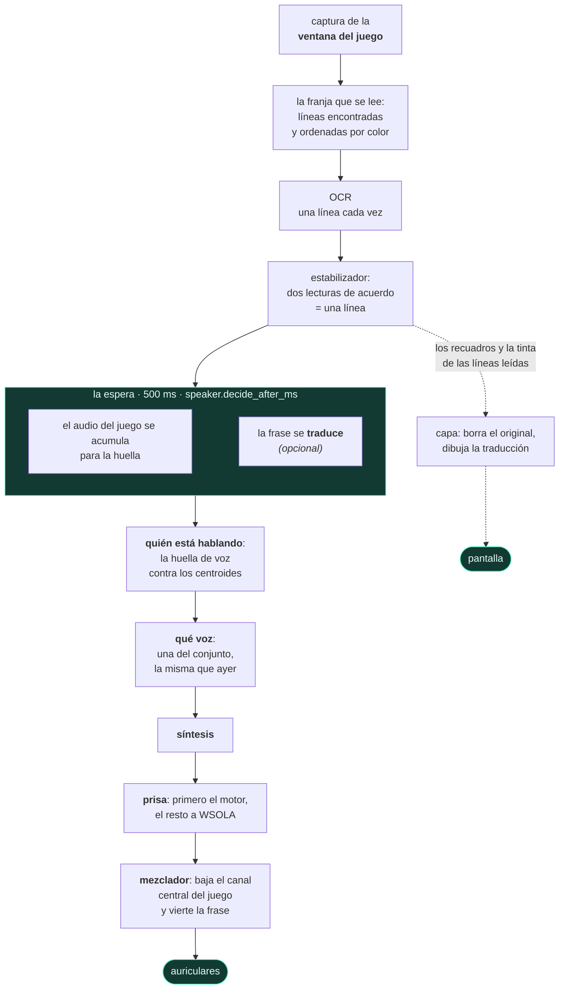

<div align="center">


# livedub

**Doblaje en directo de los subtítulos de un videojuego.**
Lee el texto en pantalla mientras juegas, deduce del audio del juego quién está
hablando, sintetiza la frase con la voz de ese personaje y la mezcla sobre el
juego. Todo en tu propia máquina.

[](https://github.com/pigro141/livedub/actions/workflows/eseguibile.yml)
[](../../LICENSE)


[English](../../README.md) ·
[Italiano](README.it.md) ·
[Deutsch](README.de.md) ·
**Español** ·
[Français](README.fr.md) ·
[日本語](README.ja.md) ·
[中文](README.zh.md)

**[Verlo y oírlo — los vídeos, con sonido](https://pigro141.github.io/livedub/?lang=es)**

</div>

> **En esta cadena no hay ninguna traducción obligatoria.** Si los subtítulos del
> juego ya están en tu idioma, el programa los lee y los *dice*. Traducir es una
> función aparte, **apagada de fábrica**, para un juego escrito en un idioma que
> no es el tuyo.

---

## Verlo

Abajo hay tres vídeos mudos, porque un README no puede sonar: GitHub anima un GIF
pero no le da audio, y este programa **habla** — oírlo es la mitad de lo que hay
que ver. Cada vídeo enlaza con la versión completa, con voz:
**[el escaparate](https://pigro141.github.io/livedub/?lang=es#watch)**.

### El doblaje, en GTA V

La banda negra de arriba es el texto **tal como lo leyó el OCR**, con la voz que
se le asignó. Está ahí para distinguir *mal leído* de *mal pronunciado*, y por eso
cada prueba de escucha de este proyecto se entrega así. Se oye cómo cambia la voz
entre dos personajes: `[nicola]` y `[nicola-2_5]` son la misma voz a dos alturas.

[](https://pigro141.github.io/livedub/?lang=es#watch)

*Reprodúcelo con sonido: mudo se ve que lee, no que dice.*

### La traducción, dibujada sobre el juego

El subtítulo original se **borra reconstruyendo el fondo** que hay detrás — no se
tapa con un rectángulo — y la frase traducida ocupa su lugar, con el tamaño y el
color copiados del juego.

[](https://pigro141.github.io/livedub/?lang=es#watch)

### La ventana, mientras trabaja

Un color por personaje en el registro, y abajo la barra de medida: lecturas por
segundo, frases, latencia, compresión, cortes de audio, área de lectura.

[](https://pigro141.github.io/livedub/?lang=es#watch)

---

## Qué hace, en corto

| | |
|---|---|
| **Lee** los subtítulos | OCR solo sobre la ventana del juego, no sobre la pantalla |
| **Deduce quién está hablando** | una huella de voz sobre el propio audio del juego, sin ninguna etiqueta |
| **Da una voz a cada personaje** | y la recuerda de una sesión a la siguiente |
| **Sigue el ritmo de la escena** | acelera una frase justo lo necesario para que quepa en su tiempo |
| **Mezcla** | baja **solo el canal central** del juego, donde está el diálogo: la música y los efectos se quedan donde están |
| **Traduce** *(apagado de fábrica)* | varios motores, casi todos sin ninguna red |
| **Reescribe el subtítulo en pantalla** *(apagado de fábrica)* | borra el original y dibuja la frase traducida |
| **Dice la frase en 53 idiomas** | 50 con piper, 31 con supertonic, 8 con kokoro; eliges el idioma y el motor lo sigue |
| **Habla 42 idiomas** *(la interfaz)* | sigue el idioma de tu Windows y cambia sin reiniciar |

---

## Cómo se usa, en el orden en que te lo encuentras

No hay nada que configurar antes: lo abres y vas siguiendo.

**1. Lo abres.** La ventana ya está en el idioma en que usas Windows — 42
idiomas, y los 41 catálogos están completos: 258 cadenas de 258. El árabe, el
hebreo, el persa y el urdu además dan la vuelta a la ventana.

**2. Una guía te lleva de la mano**, 7 pasos, y vuelve con `?`. Donde puede,
**comprueba en vez de contar**: cuenta las tarjetas de sonido que tienes de
verdad, le pregunta a ONNX Runtime si CUDA está realmente ahí en lugar de
suponerlo, y mide la altura de tu área de lectura con la regla de verdad.

 

**3. Un banco mide este PC y elige los motores.** No es una comodidad: **un
modelo que falta no da ningún error**. Los programas se instalan una vez, los
modelos no — se descargan al primer uso, y si no llegan la cadena *recurre a algo
más ligero y sigue adelante*. Sin este paso estarías escuchando el recurso de
emergencia sin saberlo. El banco mide, elige, descarga lo que falta y **no
instala ningún programa**: si falta alguno, te entrega la línea exacta para
pegar.


**4. Eliges la ventana del juego.** Captura **una ventana**, no la pantalla, así
que en el fotograma que va al OCR no puede acabar nada más — ni siquiera nuestras
propias ventanas. El juego tiene que ir en ventana o *sin bordes*, no en pantalla
completa exclusiva.

**5. Arrastras un recuadro alrededor de la línea de subtítulo.** Dos segundos con
el ratón. El área es **relativa a la ventana**: si mueves el juego, el área lo
sigue.

**6. Inicio.** A partir de ahí lee, deduce quién habla, sintetiza y mezcla.

La voz llega siempre un poco después del subtítulo, y es a propósito: 500 ms de
audio del juego son lo que hace falta para saber quién habla antes de elegir una
voz.

---

## Qué pasa dentro



**Dos dominios, dos hilos, un único punto de encuentro.** El dominio de vídeo
decide **qué** se va a decir y **cuándo**; el dominio de audio vierte lo que se
ha programado. **El mezclador nunca llama al sintetizador**: si lo hiciera, el
flujo de muestras se pararía en cada frase — y un agujero en el flujo no es una
lentitud, es una frase que no oyes.

**La traducción ocurre *dentro* de la espera, no después.** Son dos esperas
independientes: una necesita el *texto*, que está ahí en cuanto el subtítulo se
confirma; la otra necesita *audio*, que tiene que acumularse. En fila cuestan
`espera + traducción`; solapadas cuestan `max(espera, traducción)`.

El resto está en [`docs/architettura.md`](../architettura.md) *(en italiano, como
el código)*.

---

## Los números, y de qué sesión salen

**Solo sesiones reales, con el juego en marcha.** También hay un banco que hace
pasar exactamente la misma cadena por una grabación — código real, no una
simulación — pero **el banco regala tiempo**: con un reloj virtual la síntesis no
cuesta nada y no se pierde ni un fotograma. De ahí no sale ninguna latencia, y
ninguna de esta tabla.

| | piper, en la CPU | kokoro, en CUDA | kokoro en CUDA, con traducción |
|---|---|---|---|
| frases dobladas | 44 | 146 | **589**, en una sola sesión de 44 minutos |
| **subtítulo → voz**, mediana | **665 ms** | **1290 ms** | **1421 ms** |
| síntesis, mediana | 57 ms | 580 ms | 248 ms |
| compresión del habla, mediana | **1,00** — ninguna | **1,00** — ninguna | **1,00** — ninguna |
| `underrun` — frases que no has oído | **0** | **0** | **0** |
| lecturas de subtítulo por segundo | no registrado | 15,3 | 18,8 |
| la sesión de la que sale | `runs/2026-08-11_18-31-55` | `runs/2026-08-20_00-01-56` | `runs/2026-08-07_01-40-16` |

**La cifra que vale más que cualquier latencia: ni un solo `underrun`, en ninguna
de las 53 sesiones reales** de `runs/` que usaron uno de los tres motores
actuales. Y la columna de Piper no es una pasada con suerte — cuatro sesiones
hermanas de esa misma tarde dieron 664, 669, 687 y 687 ms.

**Adónde se va el tiempo de verdad, una vez que el motor es rápido.** De la
latencia de Kokoro, unos **500 ms son la espera para saber quién habla** — más que
la propia síntesis. Ese es el número que hay que atacar si lo quieres más rápido,
y el precio de bajarlo es equivocarse más a menudo de personaje, cosa que solo tu
oído puede juzgar.

**Cuántos núcleos quiere un motor.** Este viene del banco y no es una latencia: es
el **coste de sintetizar una frase** con todo lo demás igual, cronometrado en el
reloj de pared mientras el proceso está limitado a menos núcleos. Es una **cota
inferior** de cuánto se frenaría un PC más viejo — simula menos núcleos, no
núcleos más lentos.

| núcleos físicos | una frase con Piper, mediana | p95 | frente a 8 núcleos |
|---|---|---|---|
| 8 | **78 ms** | 144 ms | 1,00× |
| 6 | **88 ms** | 236 ms | 1,12× |
| 4 | **302 ms** | 544 ms | **3,85×** |
| 2 | 363 ms | 1050 ms | 4,63× |

**El precipicio está entre 6 y 4 núcleos**, y por eso la tabla de más abajo pide 6
y no 8: el paso de 8 a 6 cuesta un 12 %, el paso de 6 a 4 casi cuatro veces más.
Así solo se midió Piper, de modo que este README no pone ningún número a los
motores más pesados — el banco de la guía los mide en *tu* máquina, que de todas
formas es la respuesta que importa.

---

## Privacidad: todo funciona en tu máquina

No es un eslogan, es la lista de lo que sale del ordenador.

| | ¿sale algo? |
|---|---|
| leer los subtítulos (OCR) | **no** — en tu máquina |
| quién habla (huella de voz) | **no** — en tu máquina |
| sintetizar la voz | **no** — en tu máquina |
| traducir con los motores sin conexión | **no** |
| traducir con el motor en línea | **sí**, y el programa lo dice cada vez |
| descargar los modelos | **una vez**, al primer uso |

La única manera de que salga texto es elegir a propósito el traductor en línea.
Sin telemetría, sin cuenta, sin conexión a ningún servidor nuestro — no hay
ningún servidor nuestro.

---

## Requisitos

| | funciona con | funciona mejor con |
|---|---|---|
| CPU | 6 núcleos físicos | 8 núcleos físicos |
| GPU | **ninguna** — sin ella no se rompe nada | cualquier NVIDIA con unos 2 GB de VRAM libre: lo medido son **1128 MB** |
| RAM | 8 GB | 16 GB |
| disco | **1,6 GB** — el entorno sin las bibliotecas de CUDA, más 225 MB de modelos | **3,5 GB** — con las bibliotecas de CUDA y 543 MB de modelos. La traducción sin conexión añade **3,2 GB** en cualquiera de los dos casos |
| Windows | **10** — la captura pasa por `PrintWindow`, que vive en `user32.dll` y no pide instalar nada | **11** — OneOCR solo existe ahí, y lee muchísimo mejor el texto perfilado de un juego |
| Python | 3.11 | 3.11 |
| **lo que obtienes** | **Piper en la CPU.** 665 ms del subtítulo a la voz, sin cortes de audio, sin acelerar el habla. El lector es PP-OCR, y 50 de los 53 idiomas hablados ya están aquí. | **Kokoro en CUDA**: articula mejor, y trae sus 54 voces en 8 idiomas. 1290 ms. |
| **lo que compra el salto** | por debajo de 6 núcleos la síntesis de Piper pasa de 88 ms a **302 ms** — mira la tabla de arriba | la tarjeta gráfica compra **3,5× en la síntesis** (de 741 ms a 213 ms), y es lo único que permite que un idioma mueva el motor a Kokoro: en la CPU ese motor cuesta 741 ms por frase, y así no se puede vivir |

**Un requisito no se puede leer sin la máquina en la que se midió**, así que aquí
está: un Intel Core i9-11900K (8 núcleos físicos), una **RTX 4060 de 8 GB** —
*con GTA V corriendo encima al mismo tiempo* — 31,8 GB de RAM, Windows 11 Pro
compilación 26200, Python 3.11.9. Todos los números de este README vienen de esa
máquina salvo que se diga otra cosa, y la columna *funciona mejor con* no es una
lista de deseos: es esa máquina.

**También necesitas** una manera de oír el audio del juego sin que tu propio
doblaje vuelva a entrar en él: el bucle de retorno WASAPI que viene con Windows
es suficiente. [Voicemeeter](https://vb-audio.com/Voicemeeter/) es **opcional** —
solo ayuda si quieres tenerlo todo en unos únicos auriculares.

## Descargar

**Instalación desde el código con PowerShell** — el bloque de aquí abajo. Es la
vía recomendada y la que funciona en todas las máquinas, y sigue igual que antes.

**Y también hay un ejecutable, y se ha abierto de verdad.** Cada push lo compila
en GitHub Actions y después lo *ejecuta*: dentro del paquete lee un subtítulo
dibujado, sintetiza una línea y construye la ventana, y el artefacto solo se sube
si todo eso pasa. Es el artefacto `livedub-windows` al pie de la
[compilación verde más reciente](https://github.com/pigro141/livedub/actions/workflows/eseguibile.yml).
Para descargar un artefacto hace falta una cuenta de GitHub, y cada uno se guarda
14 días.

**Dos límites, declarados en vez de escondidos.** Con **Smart App Control**
encendido — y viene encendido de fábrica en una instalación limpia de Windows 11
— el ejecutable **no arranca**: cada compilación es un archivo nuevo, y un
archivo nuevo no tiene reputación por construcción. Ese límite lo mueve una
firma, no otra prueba. Y la máquina de compilación no tiene tarjeta de sonido, ni
tarjeta gráfica, ni un juego en marcha, así que la captura de pantalla, el
loopback de audio, la mezcla y la síntesis en la GPU se quedan **sin comprobar**
— allí Smart App Control también está apagado, de modo que «arranca en el runner»
no quiere decir «arranca en un Windows 11 recién instalado».

## Instalar desde el código

```powershell
git clone https://github.com/pigro141/livedub.git
cd livedub
powershell -ExecutionPolicy Bypass -File installa.ps1
```

El script **comprueba que ha conseguido lo que pedía** en lugar de anunciar
éxito: Python, el entorno virtual, las dependencias, el OCR, el proveedor CUDA de
verdad, los modelos — y termina ejecutando la batería de pruebas. Lo que falte
aparece con su motivo y con lo que te cuesta.

Sin GPU NVIDIA:

```powershell
powershell -ExecutionPolicy Bypass -File installa.ps1 -SenzaGpu
```

Lo que el script ejecuta son dos comandos de pip y no uno, y el segundo no es
opcional: los cuatro paquetes que hay dentro dependen de la versión para CPU de
ONNX Runtime, que junto a `onnxruntime-gpu` apaga CUDA en silencio, y `--no-deps`
es una opción global que no puede vivir en el mismo archivo que el resto:

```powershell
.\.venv\Scripts\python.exe -m pip install -r requirements.txt
.\.venv\Scripts\python.exe -m pip install -r requirements-nodeps.txt --no-deps
```

**La instalación es ligera a propósito, y una cosa se queda fuera a propósito.**
La traducción sin conexión **no se instala**: cuesta **3100 MB**, casi todos de
`torch` — que la traducción no usa nunca, pero sin el cual su separador de frases
ni siquiera se importa. Cobrárselo a todo el que instale el programa, por una
función que está **apagada de fábrica**, es lo contrario de una decisión. Llega
**cuando hace falta**: el banco de la guía mira qué falta, **declara cuánto pesa
antes** de que decidas, y te entrega la línea para pegar. Te la entrega en vez de
ejecutarla porque eso son *paquetes*, y ahí un `pip install` ingenuo es
exactamente lo que vuelve a meter la rueda para CPU. Si no llega, es una
**renuncia declarada**, no un apaño mudo. El par de idiomas en cambio es un
modelo, 98 MB, y ese lo descarga el banco solo.

### Ponerlo en marcha

```powershell
.\.venv\Scripts\python.exe -m tools.ui_qt --profile live
```

En la ventana: **Elegir ventana** → **Seleccionar área** → **Inicio**. En Windows
también basta con hacer doble clic en `livedub.bat`.

> **Si tu Windows tiene Smart App Control encendido.** Viene en modo *evaluación*
> y Windows lo apaga solo en cuanto ve que se usan herramientas de desarrollo — y
> una vez apagado no se puede volver a encender sin reinstalar Windows. Así que
> esto afecta a una minoría de máquinas, no al caso normal. En una donde siga
> encendido, e instalando las versiones fijadas en este repositorio, los paquetes
> bloqueados son exactamente **dos, y son una sola capacidad**: Windows Graphics
> Capture. La captura recurre entonces a `PrintWindow`, que no pide instalar
> nada. **Todo lo demás sigue funcionando** — leer los subtítulos, deducir quién
> habla, los tres motores de síntesis, el mezclador, la capa dibujada encima, la
> traducción sin conexión y la propia ventana. También queda bloqueado cualquier
> ejecutable de PyInstaller, incluido el de este proyecto: cada construcción es un
> archivo nuevo, y un archivo nuevo no tiene reputación por construcción.
>
> **Y donde muerde, el programa dice qué se ha caído y qué usar en su lugar.** Una
> biblioteca bloqueada no te llega como una traza de error: hay un único sitio que
> responde a *¿esta pieza se carga en esta máquina?*, y distingue *nunca la
> instalaste* de *está aquí y Windows no la carga* — porque lo primero se arregla
> con un `pip install` y lo segundo no. Los menús marcan las opciones que
> fallarían, en la casilla cerrada y no solo en la lista, porque el valor que no
> funciona suele ser el que ya está en tu configuración. La opción se **marca, no
> se quita**: quitarla escondería que el programa sabe hacerlo y que el defecto es
> de esta máquina.

---

## La ventana

Seis pestañas. **No hay que tocar ninguna para oír la primera frase**: se abren
cuando las necesitas.

| pestaña | para qué sirve |
|---|---|
| **Preparación** | los pasos en orden — la única pestaña que necesitas antes de darle a Inicio |
| **Sesión** | quién está hablando, ahora mismo, un color por personaje |
| **Voz** | qué motor, cuántas voces hay en el conjunto, cuánto se espera antes de decidir quién habla |
| **Volúmenes** | cuánto baja el juego y cuánto sube nuestra voz, **mientras escuchas** |
| **Traducción** | solo para jugar a un juego cuyos subtítulos no están en tu idioma |
| **Todos los ajustes** | los 170 parámetros, con un buscador |

 

**La pestaña Sesión no es un registro.** Arriba, la frase que se está diciendo
ahora con su voz y su prisa; luego quién ha hablado, una ficha por personaje; el
registro debajo. La pregunta que uno se hace mirándola no es *qué ha dicho* sino
**¿sigue hablando la misma persona?** — y a eso un color responde mucho antes que
una etiqueta.

**Los parámetros.** 170 en total; **131 se aplican al momento**, y los 39 que solo
se leen al arrancar **lo dicen** en vez de fingir. 127 llevan una `?` que explica
qué hacen, qué se midió y qué te juegas al cambiarlos — y es el mismo texto que
está junto al parámetro dentro de [`core/config.py`](../../core/config.py), no una
segunda copia que nadie actualiza.

**Los dos idiomas son dos cosas distintas, y están a dos pestañas de distancia a
propósito.** `ui.lingua`, en Preparación, decide lo que está **escrito en los
botones**; `translate.source` y `translate.target`, en Traducción, deciden lo que
se **dice**. Confundirlos te cuesta una sesión.

---

## ¿Funcionará con mi juego?

Probado en dos: **GTA V** y **Mafia: The Old Country**, los dos en italiano.
Honestamente, eso es lo que se sabe.

**Siempre hace falta**, con cualquier juego: arrastrar el área alrededor de los
subtítulos, y quitar la casilla *ignorar los subtítulos de color* si el juego
colorea el nombre de quien habla.

**Buenas probabilidades de funcionar a la primera** si el juego escribe **texto
claro sobre fondo oscuro**, en una línea cerca de abajo.

**Merece un intento** si escribe texto oscuro sobre fondo claro: en fotogramas
hechos a propósito lee, pero emborrona. Nadie lo ha probado nunca en un juego
real de ese tipo.

**No está previsto**: subtítulos dentro de bocadillos que siguen al personaje, o
posiciones que se mueven de una línea a otra.

**Y no traduce toda la pantalla: lee una línea de subtítulo cada vez**, dentro del
recuadro que arrastras. Es una elección, no una carencia — toda la cadena está
construida sobre esa forma.

**Sobre el área, lo que todo el mundo entiende al revés.** Arrástrala ancha y el
programa **sigue leyendo**: un área grande es menos precisa, no muda. Lo que
empeora de verdad es el dibujo — la frase traducida se dibuja reconstruyendo el
fondo alrededor, y cuanto más alta es el área, más escenario ajeno se lleva por
delante esa reconstrucción. Pasada cierta altura el programa te lo dice, mientras
estás arrastrando el rectángulo y otra vez cuando empiezas.

---

## Los idiomas

Aquí tres cosas distintas se llaman *idioma*, se ajustan en tres sitios distintos,
y mezclarlas es como un programa acaba prometiendo lo que no tiene.

| | cuántos | dónde se ajusta |
|---|---|---|
| el idioma en que están escritos los **botones** | **42** | `ui.lingua`, en la pestaña Preparación |
| a qué idioma puede **traducir un subtítulo** | **133** con el motor en línea — los que van sin conexión no tienen lista cerrada | `translate.target`, en la pestaña Traducción |
| qué puede **decir en voz alta** | **53** — pero no con cualquier motor: 50 con piper, 31 con supertonic, 8 con kokoro | eliges el idioma, y el motor lo sigue |

> **Tres listas, tres preguntas.** La interfaz habla 42 idiomas, el traductor llega
> a 133 y la boca habla 53. Ese último número no es un número solo: **los tres
> motores tienen catálogos distintos**, y elegir un idioma es en realidad elegir un
> motor. Antes del cambio que lo llevó a 53, la boca hablaba **dos** — y eso nunca
> fue un límite de los motores, era lo único que el código declaraba: traducir al
> español y hacérselo leer a una voz italiana no daba **ningún error**.

**Leer**: todo lo que el lector consiga leer.

**Hablar**:

| motor | idiomas | voces | dónde corre | cómo funcionan las voces |
|---|---|---|---|---|
| **piper** *(de fábrica)* | **50** | 175 modelos en el índice oficial | CPU | un modelo por voz, una descarga para cada una (28–114 MB) |
| **supertonic** | **31** | 10 estilos de hablante, válidos en *todos* los idiomas | CPU | un único modelo multilingüe; el idioma elige el fonemizador |
| **kokoro** | **8** | 54, con el idioma y el sexo escritos en el nombre | CUDA | un único modelo, y un archivo de estilo de 510 KB por voz |
| `tone`, `silent` | — | un pitido no tiene idioma | — | — |
| **unión** | **53** | | | |

**Qué motor habla qué idioma lo dice la lista de abajo**, y no está escrita a
mano: la regenera `tools/tabella_lingue.py` leyendo los catálogos de los propios
motores, y la batería de pruebas falla el día en que deje de coincidir. Más allá
del número de voces nativas, los personajes se distinguen desplazando el tono —
es lo que se oye en el primer GIF: `[nicola]` y `[nicola-2_5]` son una sola voz
a dos alturas.

<!-- lingue: inizio -->
<!-- generato da `tools/tabella_lingue.py`, non si scrive a mano -->

<details>
<summary><b>Los 53 idiomas, motor por motor</b> — ✓ significa que ese motor tiene al menos una voz propia en ese idioma.</summary>

| código | idioma | piper | supertonic | kokoro |
|---|---|:---:|:---:|:---:|
| `sq` | Albanian | ✓ |  |  |
| `ar` | Arabic | ✓ | ✓ |  |
| `hy` | Armenian | ✓ |  |  |
| `eu` | Basque | ✓ |  |  |
| `bn` | Bengali | ✓ |  |  |
| `bg` | Bulgarian | ✓ | ✓ |  |
| `ca` | Catalan | ✓ |  |  |
| `zh` | Chinese (Simplified) | ✓ |  | ✓ |
| `hr` | Croatian |  | ✓ |  |
| `cs` | Czech | ✓ | ✓ |  |
| `da` | Danish | ✓ | ✓ |  |
| `nl` | Dutch | ✓ | ✓ |  |
| `en` | English | ✓ | ✓ | ✓ |
| `et` | Estonian | ✓ | ✓ |  |
| `fi` | Finnish | ✓ | ✓ |  |
| `fr` | French | ✓ | ✓ | ✓ |
| `ka` | Georgian | ✓ |  |  |
| `de` | German | ✓ | ✓ |  |
| `el` | Greek | ✓ | ✓ |  |
| `he` | Hebrew | ✓ |  |  |
| `hi` | Hindi | ✓ | ✓ | ✓ |
| `hu` | Hungarian | ✓ | ✓ |  |
| `is` | Icelandic | ✓ |  |  |
| `id` | Indonesian | ✓ | ✓ |  |
| `it` | Italian | ✓ | ✓ | ✓ |
| `ja` | Japanese |  | ✓ | ✓ |
| `kk` | Kazakh | ✓ |  |  |
| `ko` | Korean | ✓ | ✓ |  |
| `ku` | Kurdish (Kurmanji) | ✓ |  |  |
| `lv` | Latvian | ✓ | ✓ |  |
| `lt` | Lithuanian |  | ✓ |  |
| `lb` | Luxembourgish | ✓ |  |  |
| `ml` | Malayalam | ✓ |  |  |
| `mr` | Marathi | ✓ |  |  |
| `ne` | Nepali | ✓ |  |  |
| `no` | Norwegian | ✓ |  |  |
| `fa` | Persian | ✓ |  |  |
| `pl` | Polish | ✓ | ✓ |  |
| `pt` | Portuguese | ✓ | ✓ | ✓ |
| `ro` | Romanian | ✓ | ✓ |  |
| `ru` | Russian | ✓ | ✓ |  |
| `sr` | Serbian | ✓ |  |  |
| `sk` | Slovak | ✓ | ✓ |  |
| `sl` | Slovenian | ✓ | ✓ |  |
| `es` | Spanish | ✓ | ✓ | ✓ |
| `sw` | Swahili | ✓ |  |  |
| `sv` | Swedish | ✓ | ✓ |  |
| `te` | Telugu | ✓ |  |  |
| `tr` | Turkish | ✓ | ✓ |  |
| `uk` | Ukrainian | ✓ | ✓ |  |
| `ur` | Urdu | ✓ |  |  |
| `vi` | Vietnamese | ✓ | ✓ |  |
| `cy` | Welsh | ✓ |  |  |

Leer una columna da el catálogo de ese motor. Habladas por un solo motor: `piper` 21 · `supertonic` 2 (Croatian, Lithuanian) · `kokoro` 0. Habladas por los tres: 6 — English, French, Hindi, Italian, Portuguese, Spanish.

</details>
<!-- lingue: fine -->

*Los nombres de esa lista siguen en inglés en todos los idiomas de este
repositorio: son datos leídos del código, como el nombre de un dispositivo o la
clave de un modelo. Lo que un traductor automático le hace a un nombre de idioma
es lo que convirtió `uk — Ucraino` en «Regno Unito — ucraino» dentro de la
ventana.*

### Qué se afirma, y qué se probó de verdad

Esto importa más que los números.

**Se afirma, y se puede comprobar en el catálogo**: que una voz *existe* y que *es
de ese idioma*. Cada motor lo publica — piper en
`rhasspy/piper-voices/voices.json`, kokoro en la primera letra de cada nombre de
voz, supertonic en su lista de idiomas admitidos. Ahí no hay nada adivinado.

> **No se afirma que la pronunciación sea buena.** Nadie ha escuchado 53 idiomas, y
> decir lo contrario sería una promesa que ninguna medida respalda.

**Lo que sí se ha comprobado a máquina**: para una muestra de idiomas se sintetiza
una frase *en la escritura propia de ese idioma* y se mira si el **ritmo del
habla** es plausible — caracteres por segundo. Una fonemización equivocada no da
error: el modelo responde, sale audio, todos los contadores siguen en verde, y un
ritmo fuera de escala es el único rastro que deja.

| motor | idiomas medidos | resultado |
|---|---|---|
| **supertonic** | **31 de 31** | todos plausibles: de 6,6 a 17,8 caracteres por segundo, con el japonés, el coreano, el chino y el hindi abajo, como cabía esperar de sus escrituras |
| **piper** | **1 de 50** | hebreo, 9,14 car/s. El resto no se pudo medir *en esta máquina*: Smart App Control bloquea `espeakbridge.pyd`, y todos los demás idiomas de piper fonemizan a través de espeak |
| **kokoro** | **0 de 8** | `kokoro-onnx` aquí no se importa siquiera — Smart App Control bloquea el módulo nativo de una de sus dependencias |

Los dos motores que no se pudieron medir están bloqueados por una **propiedad de
esta máquina**, no del código. Sus listas de idiomas se declaran a partir del
catálogo y se **marcan como no medidas**, en vez de presentarse como probadas.

> **Una afirmación que la comprobación quitó.** El índice de piper lista **51**
> idiomas y este programa ofrece **50**. La diferencia es el japonés: esa voz
> necesita un fonemizador que el `piper-tts` instalado no tiene, así que el modelo
> se descarga tan tranquilo y la *primera síntesis* falla. Declarar 51 habría sido
> cierto del índice y falso de este programa. El japonés se sigue hablando — con
> kokoro o con supertonic.

### Elige un idioma, y el motor lo sigue

Hay exactamente tres desenlaces, y la diferencia entre ellos es todo el diseño.

| | qué pasa | qué dice |
|---|---|---|
| **el motor que has elegido ya lo habla** | no cambia nada | **nada** — y tiene que quedarse callado: un aviso que salta en cada cambio de idioma es un aviso que se deja de leer |
| **no lo habla, pero otro motor sí** | se cambia el motor | lo dice, porque tu propia elección acaba de ser pasada por alto — *«piper» no tiene voces en este idioma: paso a «supertonic», que habla 31* |
| **ningún motor utilizable lo habla** | no se cambia nada, porque cambiar no serviría | el hecho se declara en vez de resolverse en silencio — *ningún motor tiene voces en este idioma (y «kokoro» aquí no funciona): la frase saldría con una voz que pronuncia otro* |

El paréntesis del último caso es la clave: **la respuesta depende de la máquina**,
y el mensaje dice qué motores se han descartado. El recambio tiene que ser uno que
esta máquina aguante de verdad — kokoro cuesta 741 ms por frase en la CPU frente a
213 en CUDA, así que una máquina sin CUDA nunca se cambia a él: seguir un idioma
no debe costar el doble de latencia. El japonés enseña todo el mecanismo en una
línea: piper tiene la voz y no la sabe pronunciar, kokoro tiene cinco y quiere
CUDA, supertonic lo hace en la CPU.

**Dos hechos estructurales que conviene saber.** Las diez voces de supertonic son
*hablantes, no idiomas*: los mismos diez estilos hablan los 31, y el idioma solo
elige el fonemizador — por eso es la manera más barata de añadir uno. Piper es lo
contrario, un modelo y una descarga por voz — y su índice **no tiene campo para el
sexo**, así que fuera del italiano el conjunto marca las voces de piper con `?` y
recurre al orden simple en vez de alternar masculina y femenina. Una pérdida
declarada, no escondida.

**Traducción** *(apagada de fábrica)*:

| motor | red | cuántos idiomas | lo que conviene saber |
|---|---|---|---|
| **`locale`**, Argos *(de fábrica)* | **no** | sin lista cerrada: los pares que Argos vaya publicando, descargados al pulsar Inicio | no entiende `auto` — se convierte calladamente en *desde el inglés* |
| `llm`, Gemma 3 1B en este mismo proceso | **no** | depende del modelo al que lo apuntes | la misma pega con `auto` |
| `ollama`, TranslateGemma fuera del entorno | **no**, pero tiene que haber un servidor local en marcha | depende del modelo | el más lento en la práctica: las sesiones reales que lo usan se quedan en 1592–1805 ms de punta a punta |
| `google` | **sí**, y el programa lo dice cada vez | **133** — la única lista cerrada de los cuatro | el único que entiende `auto` |

El menú **los enseña los cuatro y lo declara** en vez de filtrar: tres de ellos no
tienen lista cerrada, así que un filtro escondería opciones que funcionan y
dejaría pasar opciones que no, con aire de saberlo.

> **Algo que ningún contador enseña.** Con lenguaje soez, los modelos locales **lo
> reescriben en silencio**. La traducción sale perfecta: dice otra cosa. Antes de
> preguntarte si un traductor es bueno, pregúntate si dice lo que pone.

**El idioma de la interfaz** es una tercera cosa más: **42** — 41 catálogos más el
italiano, que es el idioma en que está escrito el código fuente. Los 41 están
**completos, 258 cadenas de 258**, ninguna a medio traducir; cuatro van de derecha
a izquierda y dan la vuelta a toda la ventana (árabe, hebreo, persa, urdu). Se
generan una vez y se guardan en el repositorio — no se le piden a la red mientras
la ventana se abre, porque una ventana que le pide a la red su propio texto es una
ventana en blanco cuando no hay red, *y en blanco sin dar ningún error*.

Lo que **no** se traduce, y a propósito: las explicaciones detrás de la `?` de
cada parámetro. Vienen de los comentarios de
[`core/config.py`](../../core/config.py) con las medidas dentro, y pasar una
medida por un traductor automático es la manera en que una medida deja
calladamente de serlo. El registro y la barra de medida se quedan en italiano por
lo mismo — son números y nombres de dispositivo.

---

## Lo que no hace

La manera más rápida de llevarse un chasco con un programa es descubrir esta
lista usándolo. Así que aquí está, antes de instalar.

| | |
|---|---|
| **Nadie ha escuchado los 53 idiomas** | lo verificado es que una voz existe, que es de ese idioma y — donde se pudo medir — que su ritmo de habla es plausible. La pronunciación no está verificada, y el italiano es el idioma en el que este programa se ha construido y se ha escuchado. |
| **Un idioma que tu motor no habla es un cambio, no un error** | el motor se mueve a uno que lo hable y lo dice. Si no lo habla ninguno de los motores que esta máquina puede mover, también se declara — en vez de darte una voz que pronuncia otro idioma. |
| **La primera sesión en un idioma nuevo de piper descarga sus voces** | un modelo por voz, de 28 a 114 MB cada uno, hasta seis, y el banco de la guía todavía no declara ese peso por adelantado como hace con los demás. Inicio puede quedarse parado unos minutos sin decir por qué. |
| **Una línea de subtítulo cada vez** | dentro del recuadro que arrastras: no toda la pantalla, ni varias áreas a la vez. Una versión anterior prometía varias áreas de lectura y se quitó, porque la capa dibuja una línea cada vez y la promesa no se podía cumplir en directo. |
| **El juego tiene que ir en ventana o sin bordes** | la pantalla completa exclusiva no se captura. |
| **Solo Windows** | y el lector que mejor lee el texto perfilado de un juego, OneOCR, solo existe en Windows 11. En Windows 10 te toca PP-OCR. |
| **La voz llega después del subtítulo** | medio segundo de ese retraso es la espera de suficiente audio del juego para decir quién habla — y esa espera, no la síntesis, es la pieza más grande del retraso. |
| **Si hay más personajes que voces, comparten** | más allá del número de voces nativas se distinguen desplazando el tono, y se nota. |
| **Un jugador, una ventana** | no es una herramienta de streaming, ni una cadena de localización, ni algo para multijugador. |

**Dónde puede fallar la captura.** Coge la ventana del juego con Windows Graphics
Capture donde lo hay, y donde no, recurre a `PrintWindow` — **diciéndolo en el
registro**. El recurso no pide instalar nada, pero es síncrono y cuesta más:
**17,5 ms** para una ventana de 1191×958, medidos. Y en un juego que dibuja con
una cadena de intercambio Direct3D de modelo flip, `PrintWindow` puede **tener
éxito y devolver un fotograma negro**; el programa mira los ocho primeros
fotogramas y lo declara en vez de leer negro en silencio. **Ese recurso todavía no
lo ha probado nadie en el propio GTA V.**

> **Y el marco honesto alrededor de cada número de aquí.** Se midieron en una
> máquina, en dos juegos, por una sola persona. Donde una cifra no está medida,
> este README deja el hueco a la vista en vez de rellenarlo.

---

## Cómo está hecho, y por qué se puede confiar en los números

No hay pytest: la batería es un módulo que se ejecuta, **2085 comprobaciones** en
78 grupos.

```powershell
.\.venv\Scripts\python.exe -m tools.selftest
```

Y está el banco, que hace pasar **exactamente la misma cadena** por una grabación,
sin el juego: el mismo código, OCR real, audio real, huella real, síntesis real, y
la causalidad respetada — la cadena nunca ve el futuro.

```powershell
.\.venv\Scripts\python.exe -m tools.dub grabacion.mp4 --profile gtav --mp4
```

**Pero el banco no basta, por construcción**, y aquí eso es una regla escrita con
sangre: con un reloj virtual la síntesis no cuesta nada y no se pierde nunca un
fotograma, así que desde ahí se puede enseñar *todo* menos lo rápido que es. Cada
defecto serio de este proyecto salió haciendo funcionar la cadena de verdad.

Las medidas que cambiaron una decisión están escritas **junto al parámetro que
decidieron**, dentro de [`core/config.py`](../../core/config.py) — el mismo texto
que enseña la ventana cuando pulsas `?`.

*El código, sus comentarios y los documentos de `docs/` están en italiano. El
README en inglés y el [escaparate](https://pigro141.github.io/livedub/) están en
inglés.*

---

## Apoya el proyecto

livedub es gratis, funciona entero en tu propia máquina y no tiene ni cuentas ni
servidores: no hay nada que vender ni datos que recoger. Si te resulta útil:

**[☕ ¡Invítame a un token!](https://ko-fi.com/filippodebenedittis)**

No desbloquea ninguna función ni levanta ningún límite — no los hay.

---

## Licencia

**GPL-3.0-or-later**, y no por gusto: el sintetizador de voz de fábrica y el
motor grafema-fonema que hay detrás de otro de ellos son GPL-3, así que también lo
es todo lo que se distribuye aquí. La contabilidad completa, biblioteca por
biblioteca, está en [`docs/LICENZE.md`](../LICENZE.md) — incluido el porqué de que
el OCR y los pesos de los modelos **no** se redistribuyan.
