<div align="center">

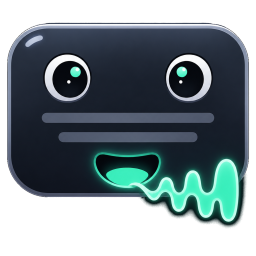

# livedub

**Doublage en direct des sous-titres d'un jeu vidéo.**
Il lit le texte à l'écran pendant que vous jouez, devine à l'audio du jeu qui est
en train de parler, synthétise la réplique avec la voix de ce personnage et la
mixe par-dessus le jeu. Le tout sur votre propre machine.

[](https://github.com/pigro141/livedub/actions/workflows/eseguibile.yml)
[](../../LICENSE)


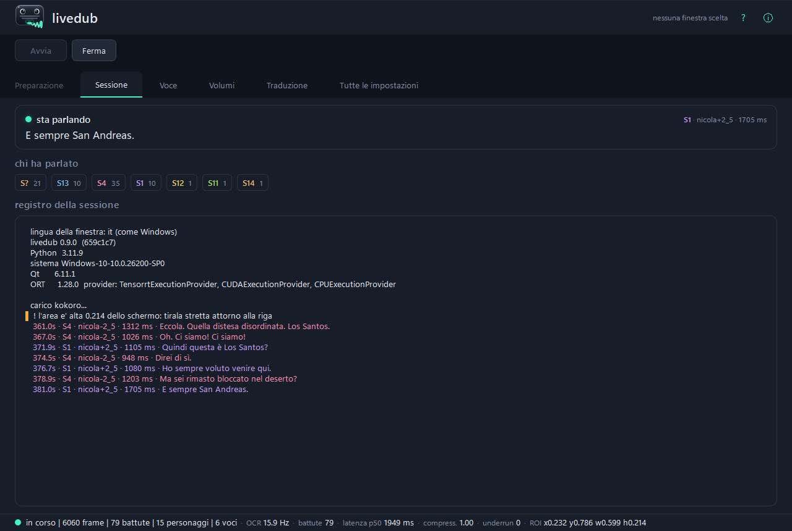

[English](../../README.md) ·
[Italiano](README.it.md) ·
[Deutsch](README.de.md) ·
[Español](README.es.md) ·
**Français** ·
[日本語](README.ja.md) ·
[中文](README.zh.md)

**[Le voir et l'entendre — les vidéos, avec le son](https://pigro141.github.io/livedub/?lang=fr)**

</div>

> **Il n'y a aucune traduction obligatoire dans cette chaîne.** Si les sous-titres
> du jeu sont déjà dans votre langue, le programme les lit et les *dit*. Traduire
> est une fonction à part, **éteinte par défaut**, pour un jeu écrit dans une
> langue qui n'est pas la vôtre.

---

## Le voir

Ci-dessous trois extraits muets, parce qu'un README ne peut pas jouer de son :
GitHub anime un GIF mais ne lui donne pas d'audio, et ce programme **parle** —
l'entendre est la moitié de ce qu'il y a à voir. Chaque extrait mène à la vidéo
entière, avec la voix :
**[la vitrine](https://pigro141.github.io/livedub/?lang=fr#watch)**.

### Le doublage, sur GTA V

Le bandeau noir en haut, c'est le texte **tel que l'OCR l'a lu**, avec la voix qui
lui a été attribuée. Il sert à distinguer *mal lu* de *mal prononcé*, et c'est
pour cela que chaque test d'écoute de ce projet est livré ainsi. On entend la voix
changer entre deux personnages : `[nicola]` et `[nicola-2_5]` sont la même voix à
deux hauteurs.

[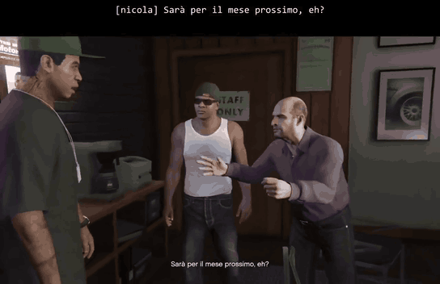](https://pigro141.github.io/livedub/?lang=fr#watch)

*Lisez-le avec le son : muet, on voit qu'il lit, pas qu'il dit.*

### La traduction, dessinée par-dessus le jeu

Le sous-titre d'origine est **effacé en reconstruisant le fond** qui se trouve
derrière — il n'est pas recouvert d'un rectangle — et la réplique traduite prend
sa place, avec la taille et la couleur recopiées du jeu.

[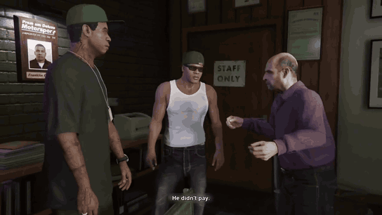](https://pigro141.github.io/livedub/?lang=fr#watch)

### La fenêtre, pendant qu'elle travaille

Une couleur par personnage dans le journal, et en bas la barre de mesure :
lectures par seconde, répliques, latence, compression, ratés de son, zone de
lecture.

[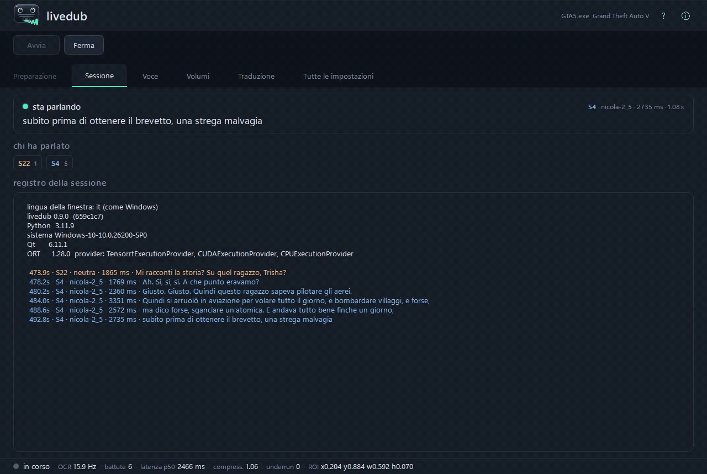](https://pigro141.github.io/livedub/?lang=fr#watch)

---

## Ce qu'il fait, en bref

| | |
|---|---|
| **Lit** les sous-titres | OCR sur la seule fenêtre du jeu, pas sur l'écran |
| **Devine qui parle** | une empreinte vocale sur l'audio même du jeu, sans aucune étiquette |
| **Donne une voix à chaque personnage** | et s'en souvient d'une session à l'autre |
| **Suit le rythme de la scène** | il accélère une réplique juste assez pour qu'elle tienne dans son temps |
| **Mixe** | il baisse **seulement le canal central** du jeu, là où se trouve le dialogue : la musique et les effets restent où ils sont |
| **Traduit** *(éteint par défaut)* | plusieurs moteurs, presque tous sans aucun réseau |
| **Réécrit le sous-titre à l'écran** *(éteint par défaut)* | il efface l'original et dessine la réplique traduite |
| **Dit la réplique en 53 langues** | 50 avec piper, 31 avec supertonic, 8 avec kokoro ; vous choisissez la langue et le moteur la suit |
| **Parle 42 langues** *(l'interface)* | il suit la langue de votre Windows et change sans redémarrage |

---

## Comment on s'en sert, dans l'ordre où on le rencontre

Il n'y a rien à régler d'abord : vous l'ouvrez et vous suivez.

**1. Vous l'ouvrez.** La fenêtre est déjà dans la langue dans laquelle vous
utilisez Windows — 42 langues, et les 41 catalogues sont complets : 258 chaînes
sur 258. L'arabe, l'hébreu, le persan et l'ourdou retournent en plus la fenêtre.

**2. Un guide vous accompagne**, 7 étapes, et il revient avec `?`. Partout où il
le peut, il **vérifie au lieu de raconter** : il compte les cartes son que vous
avez vraiment, il demande à ONNX Runtime si CUDA est réellement là au lieu de le
supposer, et il mesure la hauteur de votre zone de lecture avec la vraie règle.

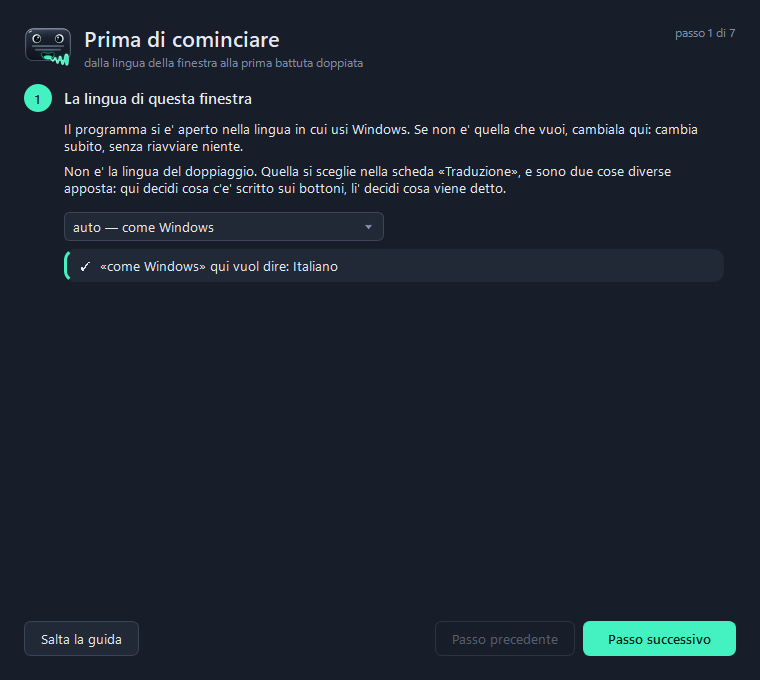 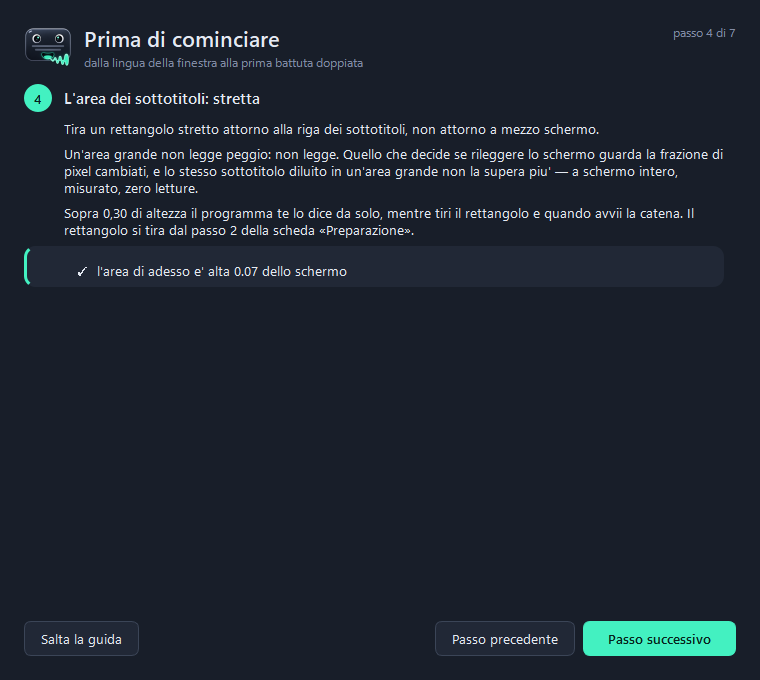

**3. Un banc mesure ce PC et choisit les moteurs.** Ce n'est pas un confort : **un
modèle qui manque ne lève aucune erreur**. Les programmes s'installent une fois,
les modèles non — ils sont récupérés au premier usage, et s'ils n'arrivent pas la
chaîne *se rabat sur quelque chose de plus léger et continue*. Sans cette étape,
vous écouteriez le repli sans le savoir. Le banc mesure, choisit, télécharge ce
qui manque, et **n'installe aucun programme** : s'il en manque un, il vous donne
la ligne exacte à coller.

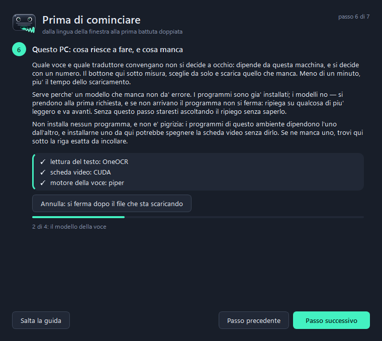

**4. Vous choisissez la fenêtre du jeu.** Il capture **une fenêtre**, pas l'écran,
donc rien d'autre ne peut se retrouver dans l'image envoyée à l'OCR — pas même nos
propres fenêtres. Le jeu doit tourner en fenêtre ou *sans bordure*, pas en plein
écran exclusif.

**5. Vous tracez un cadre autour de la ligne de sous-titre.** Deux secondes à la
souris. La zone est **relative à la fenêtre** : si vous déplacez le jeu, la zone
le suit.

**6. Démarrer.** À partir de là il lit, devine qui parle, synthétise et mixe.

La voix arrive toujours un peu après le sous-titre, et c'est voulu : 500 ms
d'audio du jeu, c'est ce qu'il faut pour savoir qui parle avant de choisir une
voix.

---

## Ce qui se passe à l'intérieur

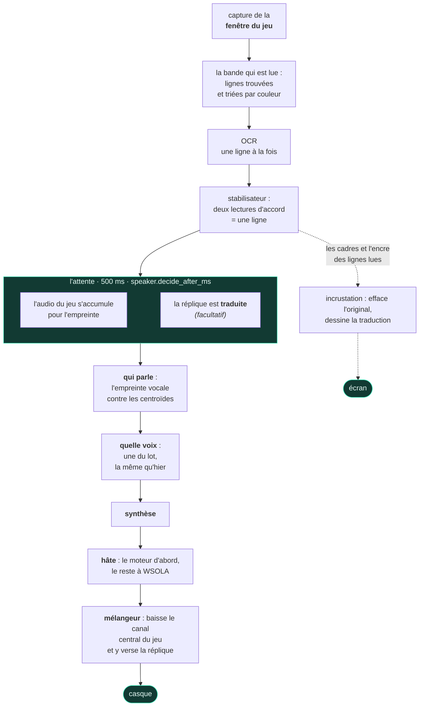

**Deux domaines, deux fils, un seul point de rencontre.** Le domaine vidéo décide
**ce qui** sera dit et **quand** ; le domaine audio verse ce qui a été programmé.
**Le mélangeur n'appelle jamais le synthétiseur** : s'il le faisait, le flux
d'échantillons s'arrêterait à chaque réplique — et un trou dans le flux n'est pas
un ralentissement, c'est une réplique que vous n'entendez pas.

**La traduction se fait *dans* l'attente, pas après.** Ce sont deux attentes
indépendantes : l'une a besoin du *texte*, qui est là dès que le sous-titre est
confirmé ; l'autre a besoin d'*audio*, qui doit s'accumuler. À la file elles
coûtent `attente + traduction` ; superposées elles coûtent
`max(attente, traduction)`.

Le reste est dans [`docs/architettura.md`](../architettura.md) *(en italien, comme
le code)*.

---

## Les chiffres, et de quelle session ils viennent

**Uniquement des sessions réelles, jeu allumé.** Il y a aussi un banc qui fait
passer exactement la même chaîne sur un enregistrement — du vrai code, pas une
simulation — mais **le banc offre le temps** : sur une horloge virtuelle la
synthèse ne coûte rien et aucune image n'est jamais perdue. Aucune latence ne
vient de là, et aucune de ce tableau non plus.

| | piper, sur le processeur | kokoro, sur CUDA | kokoro sur CUDA, traduction allumée |
|---|---|---|---|
| répliques doublées | 44 | 146 | **589**, en une seule session de 44 minutes |
| **sous-titre → voix**, médiane | **665 ms** | **1290 ms** | **1421 ms** |
| synthèse, médiane | 57 ms | 580 ms | 248 ms |
| compression de la parole, médiane | **1,00** — aucune | **1,00** — aucune | **1,00** — aucune |
| `underrun` — répliques que vous n'avez pas entendues | **0** | **0** | **0** |
| lectures de sous-titre par seconde | non enregistré | 15,3 | 18,8 |
| la session dont il vient | `runs/2026-08-11_18-31-55` | `runs/2026-08-20_00-01-56` | `runs/2026-08-07_01-40-16` |

**Le chiffre qui vaut plus que n'importe quelle latence : pas un seul `underrun`,
dans aucune des 53 sessions réelles** de `runs/` qui ont utilisé l'un des trois
moteurs actuels. Et la colonne Piper n'est pas un coup de chance — quatre sessions
sœurs du même soir ont donné 664, 669, 687 et 687 ms.

**Où passe vraiment le temps, une fois le moteur rapide.** Sur la latence de
Kokoro, environ **500 ms sont l'attente pour savoir qui parle** — plus que la
synthèse elle-même. C'est le nombre à attaquer si vous le voulez plus rapide, et
le prix à payer est de se tromper plus souvent de personnage, ce que seule votre
oreille peut juger.

**Combien de cœurs veut un moteur.** Celui-ci vient du banc et n'est pas une
latence : c'est le **coût de la synthèse d'une réplique**, tout le reste étant
égal, chronométré sur l'horloge murale pendant que le processus est limité à moins
de cœurs. C'est une **borne inférieure** du ralentissement d'un PC plus ancien —
cela simule moins de cœurs, pas des cœurs plus lents.

| cœurs physiques | une réplique avec Piper, médiane | p95 | par rapport à 8 cœurs |
|---|---|---|---|
| 8 | **78 ms** | 144 ms | 1,00× |
| 6 | **88 ms** | 236 ms | 1,12× |
| 4 | **302 ms** | 544 ms | **3,85×** |
| 2 | 363 ms | 1050 ms | 4,63× |

**La falaise est entre 6 et 4 cœurs**, et c'est pour cela que le tableau
ci-dessous demande 6 et non 8 : passer de 8 à 6 coûte 12 %, passer de 6 à 4 coûte
près de quatre fois plus. Seul Piper a été mesuré ainsi, ce README ne met donc
aucun chiffre sur les moteurs plus lourds — le banc du guide les mesure sur
*votre* machine, ce qui est de toute façon la réponse qui compte.

---

## Vie privée : tout tourne sur votre machine

Ce n'est pas un slogan, c'est la liste de ce qui sort de l'ordinateur.

| | est-ce que quelque chose sort ? |
|---|---|
| lire les sous-titres (OCR) | **non** — sur votre machine |
| qui parle (empreinte vocale) | **non** — sur votre machine |
| synthétiser la voix | **non** — sur votre machine |
| traduire avec les moteurs hors ligne | **non** |
| traduire avec le moteur en ligne | **oui**, et le programme le dit à chaque fois |
| télécharger les modèles | **une fois**, au premier usage |

La seule façon d'envoyer du texte dehors est de choisir exprès le traducteur en
ligne. Pas de télémétrie, pas de compte, aucune connexion à un serveur à nous — il
n'y a pas de serveur à nous.

---

## Prérequis

| | tourne avec | tourne mieux avec |
|---|---|---|
| processeur | 6 cœurs physiques | 8 cœurs physiques |
| GPU | **aucun** — rien ne casse sans lui | n'importe quelle NVIDIA avec environ 2 Go de VRAM libre : le besoin mesuré est de **1128 Mo** |
| RAM | 8 Go | 16 Go |
| disque | **1,6 Go** — l'environnement sans les bibliothèques CUDA, plus 225 Mo de modèles | **3,5 Go** — avec les bibliothèques CUDA et 543 Mo de modèles. La traduction hors ligne ajoute **3,2 Go** dans les deux cas |
| Windows | **10** — la capture passe par `PrintWindow`, qui vit dans `user32.dll` et ne demande rien à installer | **11** — OneOCR n'existe que là, et il lit bien mieux le texte contouré d'un jeu |
| Python | 3.11 | 3.11 |
| **ce que vous obtenez** | **Piper sur le processeur.** 665 ms du sous-titre à la voix, aucun raté de son, aucune accélération de la parole. Le lecteur est PP-OCR, et 50 des 53 langues parlées sont déjà là. | **Kokoro sur CUDA** : meilleure articulation, et ses 54 voix en 8 langues. 1290 ms. |
| **ce que le pas achète** | en dessous de 6 cœurs, la synthèse de Piper passe de 88 ms à **302 ms** — voir le tableau ci-dessus | la carte graphique achète **3,5× sur la synthèse** (de 741 ms à 213 ms), et elle est la seule chose qui permette à une langue de déplacer le moteur vers Kokoro : sur le processeur ce moteur coûte 741 ms par réplique, ce qui n'est pas vivable |

**Un prérequis ne se lit pas sans la machine sur laquelle il a été mesuré**, la
voici donc : un Intel Core i9-11900K (8 cœurs physiques), une **RTX 4060 de 8 Go**
— *avec GTA V qui tourne dessus en même temps* — 31,8 Go de RAM, Windows 11 Pro
build 26200, Python 3.11.9. Tous les chiffres de ce README viennent de cette
machine sauf mention contraire, et la colonne *tourne mieux avec* n'est pas une
liste de souhaits : c'est cette machine.

**Il vous faut aussi** un moyen d'entendre l'audio du jeu sans que votre propre
doublage y revienne : la boucle de retour WASAPI livrée avec Windows suffit.
[Voicemeeter](https://vb-audio.com/Voicemeeter/) est **facultatif** — il n'aide
que si vous voulez tout avoir dans un seul casque.

## Télécharger

**Installation depuis les sources avec PowerShell** — le bloc juste en dessous.
C'est la voie recommandée et celle qui marche sur toutes les machines, et elle
n'a pas bougé.

**Il y a aussi un exécutable, et il a vraiment été lancé.** Chaque push le
construit sur GitHub Actions puis l'*exécute* : dans le paquet, il lit un
sous-titre dessiné, synthétise une réplique et construit la fenêtre, et
l'artefact n'est publié que si tout cela passe. C'est l'artefact
`livedub-windows` au bas de la
[dernière construction au vert](https://github.com/pigro141/livedub/actions/workflows/eseguibile.yml).
Télécharger un artefact demande un compte GitHub, et chacun reste là 14 jours.

**Deux limites, déclarées plutôt que cachées.** Avec **Smart App Control**
activé — et il l'est par défaut sur une installation propre de Windows 11 —
l'exécutable **ne démarre pas** : chaque construction est un fichier neuf, et un
fichier neuf n'a aucune réputation par construction. Cette limite se lève avec
une signature, pas avec une vérification de plus. Et la machine de construction
n'a ni carte son, ni carte graphique, ni jeu en cours : la capture d'écran, le
loopback audio, le mixage et la synthèse sur GPU restent donc **sans preuve** —
Smart App Control y est éteint lui aussi, donc « ça démarre sur le runner » ne
veut pas dire « ça démarre sur un Windows 11 fraîchement installé ».

## Installer depuis les sources

```powershell
git clone https://github.com/pigro141/livedub.git
cd livedub
powershell -ExecutionPolicy Bypass -File installa.ps1
```

Le script **vérifie qu'il a obtenu ce qu'il a demandé** au lieu d'annoncer un
succès : Python, l'environnement virtuel, les dépendances, l'OCR, le vrai
fournisseur CUDA, les modèles — et il finit en lançant la série de vérifications.
Ce qui manque est listé avec la raison et avec ce que cela vous coûte.

Sans GPU NVIDIA :

```powershell
powershell -ExecutionPolicy Bypass -File installa.ps1 -SenzaGpu
```

Ce que le script exécute, ce sont deux commandes pip et non une, et la seconde
n'est pas facultative : les quatre paquets qu'elle contient dépendent de la
version processeur d'ONNX Runtime, qui à côté d'`onnxruntime-gpu` éteint CUDA en
silence, et `--no-deps` est une option globale qui ne peut pas vivre dans le même
fichier que le reste :

```powershell
.\.venv\Scripts\python.exe -m pip install -r requirements.txt
.\.venv\Scripts\python.exe -m pip install -r requirements-nodeps.txt --no-deps
```

**L'installation est légère exprès, et une chose en reste dehors exprès.** La
traduction hors ligne **n'est pas installée** : elle coûte **3100 Mo**, presque
entièrement `torch` — que la traduction n'utilise jamais, mais sans lequel son
découpeur de phrases ne s'importe même pas. La faire payer à tous ceux qui
installent le programme, pour une fonction **éteinte par défaut**, c'est le
contraire d'un choix. Elle arrive **quand elle sert** : le banc du guide regarde
ce qui manque, **déclare son poids avant** que vous ne décidiez, et vous donne la
ligne à coller. Il la donne au lieu de l'exécuter parce que ce sont des *paquets*,
et qu'un `pip install` naïf est là exactement ce qui fait revenir la roue
processeur. Si elle n'arrive pas, c'est un **renoncement déclaré**, pas un repli
muet. La paire de langues, elle, est un modèle de 98 Mo, et celui-là le banc le
télécharge tout seul.

### Le lancer

```powershell
.\.venv\Scripts\python.exe -m tools.ui_qt --profile live
```

Dans la fenêtre : **Choisir la fenêtre** → **Sélectionner la zone** →
**Démarrer**. Sous Windows, un double-clic sur `livedub.bat` suffit aussi.

> **Si votre Windows a Smart App Control allumé.** Il arrive en mode *évaluation*
> et Windows l'éteint de lui-même dès qu'il voit tourner des outils de
> développement — et une fois éteint, il ne peut être rallumé sans réinstaller
> Windows. Cela concerne donc une minorité de machines, pas le cas normal. Sur une
> machine où il est encore allumé, et en installant les versions figées dans ce
> dépôt, les paquets bloqués sont exactement **deux, et ils font une seule
> fonction** : Windows Graphics Capture. La capture se rabat alors sur
> `PrintWindow`, qui ne demande rien à installer. **Tout le reste continue de
> marcher** — lire les sous-titres, deviner qui parle, les trois moteurs de
> synthèse, le mélangeur, l'incrustation, la traduction hors ligne et la fenêtre
> elle-même. Tout exécutable produit par PyInstaller est bloqué lui aussi, celui de
> ce projet compris : chaque construction est un fichier neuf, et un fichier neuf
> n'a aucune réputation, par construction.
>
> **Et là où ça mord, le programme dit ce qui est tombé et quoi utiliser à la
> place.** Une bibliothèque bloquée ne vous arrive pas sous forme de trace
> d'erreur : un seul endroit répond à la question *ce morceau se charge-t-il sur
> cette machine ?*, et il distingue *vous ne l'avez jamais installé* de *il est là
> et Windows refuse de le charger* — parce que le premier se soigne avec un `pip
> install` et le second non. Les menus marquent les choix qui échoueraient, sur la
> case fermée et pas seulement dans la liste, car la valeur qui ne marche pas est
> presque toujours celle déjà écrite dans votre configuration. Le choix est
> **marqué, pas retiré** : le retirer cacherait que le programme sait le faire et
> que le défaut appartient à cette machine.

---

## La fenêtre

Six onglets. **Aucun n'a besoin d'être touché pour entendre la première
réplique** : ils s'ouvrent quand vous en avez besoin.

| onglet | à quoi il sert |
|---|---|
| **Préparation** | les étapes dans l'ordre — le seul onglet nécessaire avant de démarrer |
| **Session** | qui parle, à l'instant, une couleur par personnage |
| **Voix** | quel moteur, combien de voix dans le lot, combien de temps attendre avant de décider qui parle |
| **Niveaux** | de combien le jeu baisse et de combien notre voix monte, **pendant que vous écoutez** |
| **Traduction** | uniquement pour jouer à un jeu dont les sous-titres ne sont pas dans votre langue |
| **Tous les réglages** | les 170 paramètres, avec une zone de recherche |

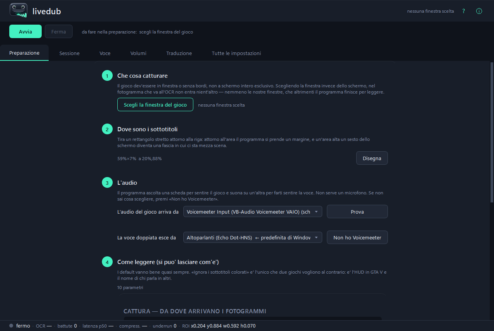 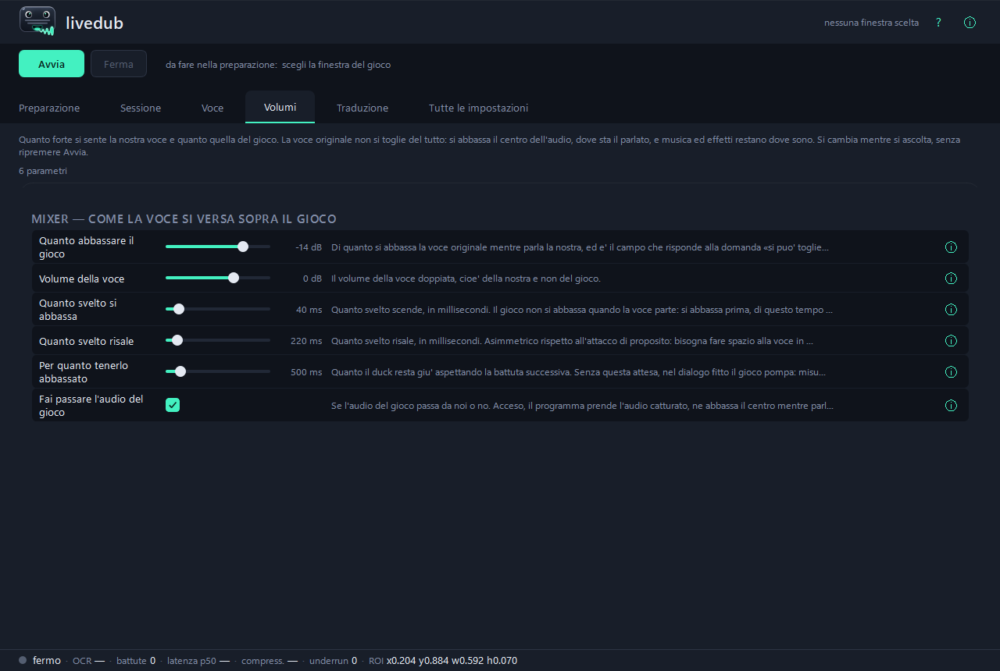

**L'onglet Session n'est pas un journal.** En haut, la réplique qui est dite à
l'instant avec sa voix et sa hâte ; puis qui a parlé, une fiche par personnage ;
le journal en dessous. La question qu'on se pose en la regardant n'est pas *qu'a-t-il
dit* mais **est-ce toujours la même personne qui parle ?** — et une couleur y
répond bien avant une étiquette.

**Les paramètres.** 170 en tout ; **131 s'appliquent tout de suite**, et les 39
qui ne sont lus qu'au démarrage **le disent** au lieu de faire semblant. 127
portent un `?` qui explique ce qu'ils font, ce qui a été mesuré et ce que vous
risquez en les changeant — et c'est le même texte que celui posé à côté du
paramètre dans [`core/config.py`](../../core/config.py), pas une seconde copie que
personne ne met à jour.

**Les deux langues sont deux choses différentes, et elles sont à deux onglets
l'une de l'autre exprès.** `ui.lingua`, dans Préparation, décide ce qui est
**écrit sur les boutons** ; `translate.source` et `translate.target`, dans
Traduction, décident ce qui est **dit**. Les confondre vous coûte une session.

---

## Est-ce que ça marchera avec mon jeu ?

Essayé sur deux : **GTA V** et **Mafia: The Old Country**, tous les deux en
italien. Honnêtement, c'est tout ce qu'on sait.

**Toujours nécessaire**, quel que soit le jeu : tracer la zone autour des
sous-titres, et décocher *ignorer les sous-titres colorés* si le jeu colore le nom
de celui qui parle.

**Bonnes chances de marcher tout de suite** si le jeu écrit **du texte clair sur
fond sombre**, sur une ligne proche du bas.

**Ça vaut un essai** s'il écrit du texte sombre sur fond clair : sur des images
faites exprès il lit, mais il bave. Personne ne l'a jamais essayé sur un vrai jeu
de ce genre.

**Non prévu** : des sous-titres dans des bulles qui suivent le personnage, ou des
positions qui bougent d'une ligne à l'autre.

**Et il ne traduit pas tout l'écran : il lit une ligne de sous-titre à la fois**,
dans le cadre que vous tracez. C'est un choix, pas un manque — toute la chaîne est
bâtie sur cette forme.

**À propos de la zone, la chose que tout le monde comprend à l'envers.** Tracez-la
large et le programme **lit quand même** : une grande zone est moins précise, pas
muette. Ce qui empire vraiment, c'est le dessin — la réplique traduite est
dessinée en reconstruisant le fond autour d'elle, et plus la zone est haute, plus
cette reconstruction ramasse de décor étranger. Au-delà d'une certaine hauteur le
programme vous le dit, pendant que vous tracez le rectangle et de nouveau au
démarrage.

---

## Les langues

Ici trois choses différentes s'appellent *langue*, elles se règlent à trois
endroits différents, et les mélanger est la façon dont un programme finit par
promettre ce qu'il n'a pas.

| | combien | où ça se règle |
|---|---|---|
| la langue dans laquelle les **boutons** sont écrits | **42** | `ui.lingua`, dans l'onglet Préparation |
| la langue vers laquelle il peut **traduire un sous-titre** | **133** avec le moteur en ligne — ceux qui travaillent hors ligne n'ont pas de liste fermée | `translate.target`, dans l'onglet Traduction |
| ce qu'il peut **dire à voix haute** | **53** — mais pas avec n'importe quel moteur : 50 avec piper, 31 avec supertonic, 8 avec kokoro | vous choisissez la langue, et le moteur la suit |

> **Trois listes, trois questions.** L'interface parle 42 langues, le traducteur en
> atteint 133, et la bouche en parle 53. Ce dernier nombre n'est pas un nombre
> unique : **les trois moteurs ont des catalogues différents**, et choisir une
> langue revient en réalité à choisir un moteur. Avant le changement qui l'a porté
> à 53, la bouche en parlait **deux** — et ce n'a jamais été une limite des
> moteurs, c'était la seule chose que le code déclarait : traduire vers l'espagnol
> puis le faire lire par une voix italienne ne donnait **aucune erreur**.

**Lire** : tout ce que le lecteur arrive à lire.

**Parler** :

| moteur | langues | voix | tourne sur | comment fonctionnent les voix |
|---|---|---|---|---|
| **piper** *(par défaut)* | **50** | 175 modèles dans l'index officiel | processeur | un modèle par voix, un téléchargement chacune (28–114 Mo) |
| **supertonic** | **31** | 10 styles de locuteur, valables dans *toutes* les langues | processeur | un seul modèle multilingue ; la langue choisit le phonémiseur |
| **kokoro** | **8** | 54, la langue et le genre étant écrits dans le nom | CUDA | un seul modèle, un fichier de style de 510 Ko par voix |
| `tone`, `silent` | — | un bip n'a pas de langue | — | — |
| **union** | **53** | | | |

**Quel moteur parle quelle langue, c'est la liste ci-dessous qui le dit**, et
elle n'est pas écrite à la main : `tools/tabella_lingue.py` la régénère à partir
des catalogues des moteurs eux-mêmes, et la série de tests échoue le jour où
elle cesse de correspondre. Au-delà du nombre de voix natives, les personnages
sont distingués en décalant la hauteur — c'est ce qu'on entend dans le premier
GIF : `[nicola]` et `[nicola-2_5]` sont une seule voix à deux hauteurs.

<!-- lingue: inizio -->
<!-- generato da `tools/tabella_lingue.py`, non si scrive a mano -->

<details>
<summary><b>Les 53 langues, moteur par moteur</b> — ✓ signifie que ce moteur a au moins une voix à lui dans cette langue.</summary>

| code | langue | piper | supertonic | kokoro |
|---|---|:---:|:---:|:---:|
| `sq` | Albanian | ✓ |  |  |
| `ar` | Arabic | ✓ | ✓ |  |
| `hy` | Armenian | ✓ |  |  |
| `eu` | Basque | ✓ |  |  |
| `bn` | Bengali | ✓ |  |  |
| `bg` | Bulgarian | ✓ | ✓ |  |
| `ca` | Catalan | ✓ |  |  |
| `zh` | Chinese (Simplified) | ✓ |  | ✓ |
| `hr` | Croatian |  | ✓ |  |
| `cs` | Czech | ✓ | ✓ |  |
| `da` | Danish | ✓ | ✓ |  |
| `nl` | Dutch | ✓ | ✓ |  |
| `en` | English | ✓ | ✓ | ✓ |
| `et` | Estonian | ✓ | ✓ |  |
| `fi` | Finnish | ✓ | ✓ |  |
| `fr` | French | ✓ | ✓ | ✓ |
| `ka` | Georgian | ✓ |  |  |
| `de` | German | ✓ | ✓ |  |
| `el` | Greek | ✓ | ✓ |  |
| `he` | Hebrew | ✓ |  |  |
| `hi` | Hindi | ✓ | ✓ | ✓ |
| `hu` | Hungarian | ✓ | ✓ |  |
| `is` | Icelandic | ✓ |  |  |
| `id` | Indonesian | ✓ | ✓ |  |
| `it` | Italian | ✓ | ✓ | ✓ |
| `ja` | Japanese |  | ✓ | ✓ |
| `kk` | Kazakh | ✓ |  |  |
| `ko` | Korean | ✓ | ✓ |  |
| `ku` | Kurdish (Kurmanji) | ✓ |  |  |
| `lv` | Latvian | ✓ | ✓ |  |
| `lt` | Lithuanian |  | ✓ |  |
| `lb` | Luxembourgish | ✓ |  |  |
| `ml` | Malayalam | ✓ |  |  |
| `mr` | Marathi | ✓ |  |  |
| `ne` | Nepali | ✓ |  |  |
| `no` | Norwegian | ✓ |  |  |
| `fa` | Persian | ✓ |  |  |
| `pl` | Polish | ✓ | ✓ |  |
| `pt` | Portuguese | ✓ | ✓ | ✓ |
| `ro` | Romanian | ✓ | ✓ |  |
| `ru` | Russian | ✓ | ✓ |  |
| `sr` | Serbian | ✓ |  |  |
| `sk` | Slovak | ✓ | ✓ |  |
| `sl` | Slovenian | ✓ | ✓ |  |
| `es` | Spanish | ✓ | ✓ | ✓ |
| `sw` | Swahili | ✓ |  |  |
| `sv` | Swedish | ✓ | ✓ |  |
| `te` | Telugu | ✓ |  |  |
| `tr` | Turkish | ✓ | ✓ |  |
| `uk` | Ukrainian | ✓ | ✓ |  |
| `ur` | Urdu | ✓ |  |  |
| `vi` | Vietnamese | ✓ | ✓ |  |
| `cy` | Welsh | ✓ |  |  |

Lire une colonne donne le catalogue de ce moteur. Parlées par un seul moteur : `piper` 21 · `supertonic` 2 (Croatian, Lithuanian) · `kokoro` 0. Parlées par les trois : 6 — English, French, Hindi, Italian, Portuguese, Spanish.

</details>
<!-- lingue: fine -->

*Les noms de cette liste restent en anglais dans toutes les langues de ce
dépôt : ce sont des données lues dans le code, comme un nom de périphérique ou
une clé de modèle. Ce qu'un traducteur automatique fait d'un nom de langue,
c'est `uk — Ucraino` devenu « Regno Unito — ucraino » dans la fenêtre.*

### Ce qui est affirmé, et ce qui a vraiment été vérifié

Cela compte plus que les chiffres.

**Affirmé, et vérifiable dans le catalogue** : qu'une voix *existe* et qu'elle
*appartient à cette langue*. Chaque moteur le publie — piper dans
`rhasspy/piper-voices/voices.json`, kokoro dans la première lettre de chaque nom
de voix, supertonic dans sa liste de langues prises en charge. Rien là-dedans
n'est deviné.

> **Non affirmé : que la prononciation soit bonne.** Personne n'a écouté 53
> langues, et dire le contraire serait une promesse qu'aucune mesure ne soutient.

**Vérifié mécaniquement, en revanche** : pour un échantillon de langues, une
phrase est synthétisée *dans l'écriture propre de cette langue* et le résultat est
examiné pour voir si le **débit de parole** est plausible — caractères par
seconde. Une phonémisation fausse ne lève rien : le modèle répond, du son sort,
tous les compteurs restent verts, et un débit hors échelle est la seule trace
qu'elle laisse.

| moteur | langues mesurées | résultat |
|---|---|---|
| **supertonic** | **31 sur 31** | toutes plausibles : de 6,6 à 17,8 caractères par seconde, le bas de la fourchette étant le japonais, le coréen, le chinois et le hindi, comme leurs écritures le laissent attendre |
| **piper** | **1 sur 50** | l'hébreu, 9,14 car/s. Le reste n'a pas pu être mesuré *sur cette machine* : Smart App Control bloque `espeakbridge.pyd`, et toutes les autres langues de piper passent par espeak pour la phonémisation |
| **kokoro** | **0 sur 8** | `kokoro-onnx` ne s'importe même pas ici — Smart App Control bloque le module natif de l'une de ses dépendances |

Les deux moteurs qui n'ont pas pu être mesurés sont bloqués par une **propriété de
cette machine**, pas du code. Leurs listes de langues sont déclarées d'après le
catalogue et **marquées comme non mesurées**, au lieu d'être présentées comme
vérifiées.

> **Une affirmation que la vérification a retirée.** L'index de piper liste **51**
> langues et ce programme en propose **50**. La différence, c'est le japonais :
> cette voix demande un phonémiseur que le `piper-tts` installé n'a pas, le modèle
> se télécharge donc sans broncher et la *première synthèse* échoue. Annoncer 51
> aurait été vrai de l'index et faux de ce programme. Le japonais est quand même
> parlé — par kokoro, ou par supertonic.

### Choisissez une langue, et le moteur la suit

Il y a exactement trois issues, et la différence entre elles est tout le dessin.

| | ce qui se passe | ce qu'il dit |
|---|---|---|
| **le moteur que vous avez choisi la parle déjà** | rien ne change | **rien** — et il doit rester muet : un avertissement qui se déclenche à chaque changement de langue est un avertissement qu'on cesse de lire |
| **il ne la parle pas, mais un autre moteur, si** | le moteur est changé | il le dit, parce que votre propre choix vient d'être outrepassé — *« piper » n'a pas de voix dans cette langue : je passe à « supertonic », qui en parle 31* |
| **aucun moteur utilisable ne la parle** | rien n'est changé, parce que changer n'aiderait pas | le fait est déclaré au lieu d'être réglé en silence — *aucun moteur n'a de voix dans cette langue (et « kokoro » ne tournera pas ici) : la réplique sortirait avec une voix qui en prononce une autre* |

La parenthèse du dernier cas est l'essentiel : **la réponse dépend de la
machine**, et le message dit quels moteurs ont été écartés. Le remplaçant doit
être un moteur que cette machine tient vraiment — kokoro coûte 741 ms par réplique
sur le processeur contre 213 sur CUDA, une machine sans CUDA n'y est donc jamais
basculée : suivre une langue ne doit pas coûter le double de latence. Le japonais
montre tout le mécanisme en une ligne : piper a la voix et ne sait pas la
prononcer, kokoro en a cinq et veut CUDA, supertonic le fait sur le processeur.

**Deux faits de structure qu'il vaut mieux connaître.** Les dix voix de supertonic
sont des *locuteurs, pas des langues* : les mêmes dix styles parlent les 31, et la
langue ne fait que choisir le phonémiseur — c'est pourquoi c'est la façon la moins
chère d'en ajouter une. Piper est l'inverse, un modèle et un téléchargement par
voix — et son index **n'a pas de champ pour le genre** : en dehors de l'italien,
le lot marque donc les voix de piper d'un `?` et se rabat sur l'ordre simple au
lieu d'alterner masculin et féminin. Un recul déclaré, pas un recul caché.

**Traduction** *(éteinte par défaut)* :

| moteur | réseau | combien de langues | bon à savoir |
|---|---|---|---|
| **`locale`**, Argos *(par défaut)* | **non** | pas de liste fermée : les paires qu'Argos publie, téléchargées quand vous appuyez sur Démarrer | ne comprend pas `auto` — cela devient discrètement *depuis l'anglais* |
| `llm`, Gemma 3 1B dans ce même processus | **non** | dépend du modèle que vous lui indiquez | même réserve sur `auto` |
| `ollama`, TranslateGemma hors de l'environnement | **non**, mais un serveur local doit tourner | dépend du modèle | le plus lent en pratique : les sessions réelles qui l'utilisent se situent entre 1592 et 1805 ms de bout en bout |
| `google` | **oui**, et le programme le dit à chaque fois | **133** — la seule liste fermée des quatre | le seul qui comprenne `auto` |

Le menu **les montre tous les quatre et le déclare** au lieu de filtrer : trois
d'entre eux n'ont pas de liste fermée, un filtre cacherait donc des choix qui
marchent et laisserait passer des choix qui ne marchent pas, avec l'air de savoir.

> **Quelque chose qu'aucun compteur ne montre.** Sur un langage grossier, les
> modèles locaux **le réécrivent en silence**. La traduction réussit
> magnifiquement : elle dit autre chose. Avant de demander si un traducteur est
> bon, demandez s'il dit ce qui est écrit.

**La langue de l'interface** est encore une troisième chose : **42** — 41
catalogues plus l'italien, la langue dans laquelle le code source est écrit. Les
41 sont **complets, 258 chaînes sur 258**, aucune traduite à moitié ; quatre se
lisent de droite à gauche et retournent toute la fenêtre (arabe, hébreu, persan,
ourdou). Ils sont produits une fois et déposés dans le dépôt — pas demandés au
réseau pendant que la fenêtre s'ouvre, car une fenêtre qui demande son propre
texte au réseau est une fenêtre blanche quand le réseau n'est pas là, *et blanche
sans la moindre erreur*.

Ce qui n'est **pas** traduit, et exprès : les explications derrière le `?` de
chaque paramètre. Elles viennent des commentaires de
[`core/config.py`](../../core/config.py) avec les mesures dedans, et faire passer
une mesure par un traducteur automatique est la façon dont une mesure cesse
discrètement d'en être une. Le journal et la barre de mesure restent en italien
pour la même raison — ce sont des nombres et des noms de périphériques.

---

## Ce qu'il ne fait pas

La façon la plus rapide d'être déçu par un programme est de découvrir cette liste
en s'en servant. La voici donc, avant l'installation.

| | |
|---|---|
| **Personne n'a écouté les 53 langues** | ce qui est vérifié, c'est qu'une voix existe, qu'elle appartient à cette langue et — là où c'était mesurable — que son débit de parole est plausible. La prononciation, non, et l'italien est la langue dans laquelle ce programme a été construit et écouté. |
| **Une langue que votre moteur ne parle pas est un changement, pas une erreur** | le moteur passe à un moteur qui la parle et le dit. Si aucun des moteurs que cette machine peut faire tourner ne la parle, cela aussi est déclaré — au lieu de vous donner une voix qui en prononce une autre. |
| **La première session dans une nouvelle langue de piper télécharge ses voix** | un modèle par voix, de 28 à 114 Mo chacun, jusqu'à six, et le banc du guide n'annonce pas encore ce poids à l'avance comme il le fait pour les autres. Démarrer peut rester bloqué quelques minutes sans dire pourquoi. |
| **Une ligne de sous-titre à la fois** | dans le cadre que vous tracez : pas tout l'écran, pas plusieurs zones à la fois. Une version antérieure promettait plusieurs zones de lecture et elle a été retirée, parce que l'incrustation dessine une ligne à la fois et que la promesse ne tenait pas en direct. |
| **Le jeu doit tourner en fenêtre ou sans bordure** | le plein écran exclusif n'est pas capturé. |
| **Windows uniquement** | et le lecteur qui lit le mieux le texte contouré d'un jeu, OneOCR, n'existe que sous Windows 11. Sous Windows 10 vous aurez PP-OCR. |
| **La voix arrive après le sous-titre** | une demi-seconde environ, c'est l'attente d'assez d'audio du jeu pour dire qui parle — et c'est cette attente, pas la synthèse, qui est le plus gros morceau du retard. |
| **Plus de personnages que de voix : ils en partagent une** | au-delà du nombre de voix natives, on les distingue en décalant la hauteur, et cela s'entend. |
| **Un joueur, une fenêtre** | ce n'est pas un outil de diffusion, pas une chaîne de localisation et pas du multijoueur. |

**Là où la capture peut échouer.** Il attrape la fenêtre du jeu par Windows
Graphics Capture là où il existe, et se rabat sur `PrintWindow` — **en le disant
dans le journal** — là où il n'existe pas. Le repli ne demande rien à installer,
mais il est synchrone et coûte plus cher : **17,5 ms** pour une fenêtre de
1191×958, mesurés. Et sur un jeu qui dessine via une chaîne d'échange Direct3D en
modèle flip, `PrintWindow` peut **réussir et rendre une image noire** ; le
programme examine les huit premières images et le déclare au lieu de lire du noir
en silence. **Ce repli, personne ne l'a encore essayé sur GTA V lui-même.**

> **Et le cadre honnête autour de chaque chiffre ici.** Ils ont été mesurés sur une
> machine, sur deux jeux, par une seule personne. Là où un chiffre n'a pas été
> mesuré, ce README laisse le trou visible au lieu de le combler.

---

## Comment c'est fait, et pourquoi on peut croire les chiffres

Il n'y a pas de pytest : la série est un module qu'on exécute, **2085
vérifications** en 78 groupes.

```powershell
.\.venv\Scripts\python.exe -m tools.selftest
```

Et il y a le banc, qui fait passer **exactement la même chaîne** sur un
enregistrement, sans le jeu : même code, vraie OCR, vrai audio, vraie empreinte,
vraie synthèse, et la causalité respectée — la chaîne ne voit jamais l'avenir.

```powershell
.\.venv\Scripts\python.exe -m tools.dub enregistrement.mp4 --profile gtav --mp4
```

**Mais le banc ne suffit pas, par construction**, et ici c'est une règle écrite
avec du sang : sur une horloge virtuelle la synthèse ne coûte rien et aucune image
n'est jamais perdue, on peut donc montrer de là *tout* sauf sa vitesse. Chaque
défaut sérieux de ce projet est sorti en faisant tourner la chaîne pour de vrai.

Les mesures qui ont changé une décision sont écrites **à côté du paramètre qu'elles
ont décidé**, dans [`core/config.py`](../../core/config.py) — le texte même que la
fenêtre affiche quand vous appuyez sur `?`.

*Le code, ses commentaires et les documents sous `docs/` sont en italien. Le README
anglais et la [vitrine](https://pigro141.github.io/livedub/) sont en anglais.*

---

## Soutenir le projet

livedub est gratuit, tourne entièrement sur votre propre machine et n'a ni compte
ni serveur : il n'y a rien à vendre et aucune donnée à collecter. Si vous le
trouvez utile :

**[☕ Offrez-moi un token !](https://ko-fi.com/filippodebenedittis)**

Cela ne débloque aucune fonction et ne lève aucune limite — il n'y en a pas.

---

## Licence

**GPL-3.0-or-later**, et pas par goût : le synthétiseur vocal par défaut et le
moteur graphème-phonème derrière l'un des autres sont en GPL-3, donc tout ce qui
est distribué ici l'est aussi. La comptabilité complète, bibliothèque par
bibliothèque, est dans [`docs/LICENZE.md`](../LICENZE.md) — y compris pourquoi
l'OCR et les poids des modèles ne sont **pas** redistribués.
