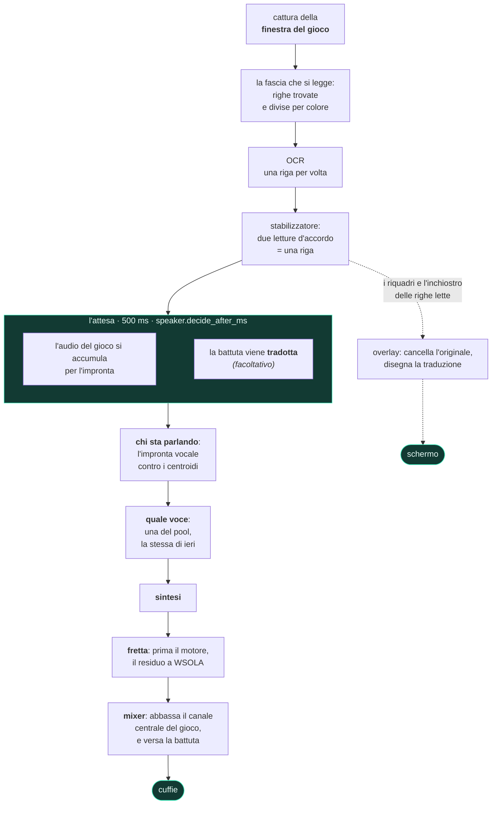

<div align="center">


# livedub

**Doppiaggio dal vivo dei sottotitoli di un videogioco.**
Legge il testo a schermo mentre giochi, capisce dall'audio del gioco chi sta
parlando, sintetizza la battuta con la voce di quel personaggio e la mixa sopra
il gioco. Tutto sulla tua macchina.


[English](../../README.md) ·
**Italiano** ·
[Deutsch](README.de.md) ·
[Español](README.es.md) ·
[Français](README.fr.md) ·
[日本語](README.ja.md) ·
[中文](README.zh.md)

**[Guardalo e ascoltalo — i video, con l'audio](https://pigro141.github.io/livedub/?lang=it)**

</div>

> **In questa catena non c'è nessuna traduzione obbligatoria.** Se i sottotitoli
> del gioco sono già nella tua lingua, il programma li legge e li *dice*.
> Tradurre è una funzione a parte, **spenta di serie**, per un gioco scritto in
> una lingua che non è la tua.

---

## Guardalo

Qui sotto tre spezzoni muti, perché un README non può suonare: GitHub anima una
GIF ma non le dà audio, e questo programma **parla** — sentirlo è metà di quello
che c'è da vedere. Ogni spezzone porta al video intero, con la voce:
**[la vetrina](https://pigro141.github.io/livedub/?lang=it#watch)**.

### Il doppiaggio, su GTA V

La banda nera in alto è il testo **così come l'ha letto l'OCR**, con la voce che
gli è stata assegnata. Serve a distinguere *letto male* da *detto male*, ed è per
questo che ogni prova d'ascolto di questo progetto si consegna così. Si sente la
voce cambiare fra due personaggi: `[nicola]` e `[nicola-2_5]` sono la stessa voce
a due altezze.

[](https://pigro141.github.io/livedub/?lang=it#watch)

*Riproducilo con l'audio: muto si vede che legge, non che dice.*

### La traduzione, disegnata sopra il gioco

Il sottotitolo originale viene **cancellato ricostruendo lo sfondo** che ci sta
dietro — non coperto con un rettangolo — e la battuta tradotta ne prende il
posto, con la misura e il colore copiati dal gioco.

[](https://pigro141.github.io/livedub/?lang=it#watch)

### La finestra, mentre lavora

Un colore per personaggio nel registro, e in fondo la barra della misura:
letture al secondo, battute, latenza, compressione, underrun, area di lettura.

[](https://pigro141.github.io/livedub/?lang=it#watch)

---

## Cosa fa, in breve

| | |
|---|---|
| **Legge** i sottotitoli | OCR sulla sola finestra del gioco, non sullo schermo |
| **Capisce chi sta parlando** | un'impronta vocale sull'audio del gioco, senza nessuna etichetta |
| **Dà una voce a ogni personaggio** | e se la ricorda da una sessione all'altra |
| **Sta dietro alla scena** | accelera la battuta quel tanto che basta a starci dentro |
| **Mixa** | abbassa **solo il canale centrale** del gioco, dove sta il dialogo: musica ed effetti restano dove sono |
| **Traduce** *(spento di serie)* | vari backend, quasi tutti senza nessuna rete |
| **Riscrive il sottotitolo a schermo** *(spento di serie)* | cancella l'originale e disegna la battuta tradotta |
| **Dice la battuta in 53 lingue** | 50 con piper, 31 con supertonic, 8 con kokoro; scegli la lingua e il motore la segue |
| **Parla 42 lingue** *(l'interfaccia)* | segue la lingua di Windows, e cambia senza riavviare |

---

## Come si usa, nell'ordine in cui lo incontri

Non c'è niente da configurare prima: lo apri e segui.

**1. Lo apri.** La finestra è già nella lingua in cui usi Windows — 42 lingue, e
tutti e 41 i cataloghi sono completi: 258 stringhe su 258. Arabo, ebraico,
persiano e urdu girano anche la finestra dall'altra parte.

**2. Una guida ti accompagna**, 7 passi, e si rivede con `?`. Dove può,
**controlla invece di raccontare**: conta le schede audio che hai davvero, chiede
a ONNX Runtime se la CUDA c'è per davvero invece di darlo per scontato, e misura
l'altezza della tua area di lettura con la regola vera.

 

**3. Un banco misura questo PC e sceglie i motori.** Non è una comodità: **un
modello che manca non dà nessun errore**. I programmi si installano una volta, i
modelli no — arrivano alla prima richiesta, e se non arrivano la catena *ripiega
su qualcosa di più leggero e continua*. Senza questo passo ascolteresti il
ripiego senza saperlo. Il banco misura, sceglie, scarica quello che manca, e
**non installa nessun programma**: se ne manca uno, ti consegna la riga esatta da
incollare.


**4. Scegli la finestra del gioco.** Cattura **una finestra**, non lo schermo,
quindi nel fotogramma che va all'OCR non può finire nient'altro — nemmeno le
nostre finestre. Il gioco deve girare in finestra o *borderless*, non a schermo
intero esclusivo.

**5. Tiri un rettangolo attorno alla riga del sottotitolo.** Due secondi col
mouse. L'area è **relativa alla finestra**: se sposti il gioco, l'area lo segue.

**6. Avvia.** Da lì legge, capisce chi parla, sintetizza e mixa.

La voce arriva sempre un po' dopo il sottotitolo, ed è voluto: 500 ms di audio
del gioco sono quello che serve a sapere chi sta parlando prima di scegliere una
voce.

---

## Cosa succede dentro



**Due domini, due thread, un solo punto di incontro.** Il dominio video decide
**cosa** si dirà e **quando**; il dominio audio versa ciò che è stato
programmato. **Il mixer non chiama mai il sintetizzatore**: se lo facesse, il
flusso di campioni si fermerebbe a ogni battuta — e un buco nel flusso non è un
rallentamento, è una battuta che non si sente.

**La traduzione avviene *dentro* l'attesa, non dopo.** Sono due attese
indipendenti: una ha bisogno del *testo*, che c'è già da quando il sottotitolo è
confermato; l'altra ha bisogno dell'*audio*, che deve accumularsi. In fila
costano `attesa + traduzione`; sovrapposte costano `max(attesa, traduzione)`.

Il resto sta in [`docs/architettura.md`](../architettura.md) *(in italiano, come
il codice)*.

---

## I numeri, e da quale sessione vengono

**Solo sessioni dal vivo, col gioco acceso.** C'è anche un banco che fa girare la
stessa identica catena su una registrazione — codice vero, non una simulazione —
ma **il banco regala il tempo**: con l'orologio virtuale la sintesi costa zero e
non si perde nemmeno un fotogramma. Da lì non viene nessuna latenza, e nessuna di
questa tabella.

| | piper, su CPU | kokoro, su CUDA | kokoro su CUDA, con traduzione |
|---|---|---|---|
| battute doppiate | 44 | 146 | **589**, in una sola sessione di 44 minuti |
| **sottotitolo → voce**, mediana | **665 ms** | **1290 ms** | **1421 ms** |
| sintesi, mediana | 57 ms | 580 ms | 248 ms |
| compressione del parlato, mediana | **1,00** — nessuna | **1,00** — nessuna | **1,00** — nessuna |
| `underrun` — battute che non hai sentito | **0** | **0** | **0** |
| letture di sottotitolo al secondo | non registrato | 15,3 | 18,8 |
| la sessione da cui viene | `runs/2026-08-11_18-31-55` | `runs/2026-08-20_00-01-56` | `runs/2026-08-07_01-40-16` |

**Il numero che vale più di qualunque latenza: nemmeno un `underrun`, in nessuna
delle 53 sessioni dal vivo** in `runs/` che hanno usato uno dei tre motori di
adesso. E la colonna di Piper non è una passata fortunata — quattro sessioni
sorelle della stessa sera hanno dato 664, 669, 687 e 687 ms.

**Dove va davvero il tempo, una volta che il motore è veloce.** Della latenza di
Kokoro, circa **500 ms sono l'attesa per sapere chi sta parlando** — più della
sintesi stessa. È quello il numero da attaccare se lo vuoi più svelto, e il
prezzo di abbassarlo è sbagliare più spesso chi parla, cosa che può giudicare
solo il tuo orecchio.

**Quanti core vuole un motore.** Questo viene dal banco e non è una latenza: è il
**costo di sintetizzare una battuta** con tutto il resto uguale, cronometrato
sull'orologio a muro mentre il processo è limitato a meno core. È un **limite
inferiore** di quanto rallenterebbe un PC più vecchio — simula meno core, non
core più lenti.

| core fisici | una battuta di Piper, mediana | p95 | rispetto a 8 core |
|---|---|---|---|
| 8 | **78 ms** | 144 ms | 1,00× |
| 6 | **88 ms** | 236 ms | 1,12× |
| 4 | **302 ms** | 544 ms | **3,85×** |
| 2 | 363 ms | 1050 ms | 4,63× |

**Il precipizio sta fra 6 e 4 core**, ed è per questo che la tabella qui sotto
chiede 6 e non 8: il gradino da 8 a 6 costa il 12%, quello da 6 a 4 costa quasi
quattro volte tanto. Così è stato misurato solo Piper, quindi questo README non
mette nessun numero sui motori più pesanti — il banco della guida li misura sulla
*tua* macchina, che è comunque la risposta che conta.

---

## Privacy: gira tutto sulla tua macchina

Non è uno slogan, è l'elenco di ciò che esce dal computer.

| | esce qualcosa? |
|---|---|
| leggere i sottotitoli (OCR) | **no** — sulla tua macchina |
| chi sta parlando (impronta vocale) | **no** — sulla tua macchina |
| sintetizzare la voce | **no** — sulla tua macchina |
| tradurre con i backend offline | **no** |
| tradurre con il backend online | **sì**, e il programma lo dice ogni volta |
| scaricare i modelli | **una volta**, alla prima richiesta |

L'unico modo per far uscire del testo è scegliere apposta il traduttore online.
Nessuna telemetria, nessun account, nessuna connessione a un nostro server — un
nostro server non esiste.

---

## Requisiti

| | ci gira | ci gira meglio |
|---|---|---|
| CPU | 6 core fisici | 8 core fisici |
| GPU | **nessuna** — senza non si rompe niente | una NVIDIA qualunque con circa 2 GB di VRAM libera: il bisogno misurato è **1128 MB** |
| RAM | 8 GB | 16 GB |
| disco | **1,6 GB** — l'ambiente senza le librerie CUDA, più 225 MB di modelli | **3,5 GB** — con le librerie CUDA e 543 MB di modelli. La traduzione offline aggiunge **3,2 GB** in entrambi i casi |
| Windows | **10** — la cattura passa da `PrintWindow`, che sta in `user32.dll` e non chiede di installare niente | **11** — OneOCR esiste solo lì, e legge molto meglio il testo contornato di un gioco |
| Python | 3.11 | 3.11 |
| **cosa ottieni** | **Piper su CPU.** 665 ms dal sottotitolo alla voce, nessun underrun, nessuna fretta sul parlato. Il lettore è PP-OCR, e 50 delle 53 lingue parlate sono già qui. | **Kokoro su CUDA**: articola meglio, e ha 54 voci in 8 lingue. 1290 ms. |
| **cosa compra il gradino** | sotto i 6 core la sintesi di Piper passa da 88 ms a **302 ms** — vedi la tabella qui sopra | la scheda video compra **3,5× sulla sintesi** (da 741 ms a 213) ed è l'unica cosa che permette a una lingua di spostare il motore su Kokoro: su CPU quel motore costa 741 ms a battuta, che non è vivibile |

**Un requisito non si può leggere senza la macchina su cui è stato misurato**,
quindi eccola: un Intel Core i9-11900K (8 core fisici), una **RTX 4060 da 8 GB**
— *con GTA V acceso sopra nello stesso momento* — 31,8 GB di RAM, Windows 11 Pro
build 26200, Python 3.11.9. Ogni numero di questo README viene da quella macchina
se non è detto altrimenti, e la colonna *ci gira meglio* non è una lista di
desideri: è quella macchina.

**Ti serve anche** un modo per sentire l'audio del gioco senza che il tuo
doppiaggio ci rientri dentro: il loopback WASAPI che c'è in Windows basta.
[Voicemeeter](https://vb-audio.com/Voicemeeter/) è **facoltativo** — serve solo
se vuoi tutto in un paio di cuffie sole.

## Scaricare

**Non e' pubblicato nessun eseguibile.** livedub si installa dal sorgente, come descritto sopra. Un eseguibile finisce qui solo quando una macchina di costruzione lo ha davvero aperto e verificato.

## Installare dal sorgente

```powershell
git clone https://github.com/pigro141/livedub.git
cd livedub
powershell -ExecutionPolicy Bypass -File installa.ps1
```

Lo script **verifica di aver ottenuto quello che ha chiesto** invece di
dichiarare successo: Python, l'ambiente virtuale, le dipendenze, l'OCR, il
provider CUDA vero, i modelli — e finisce facendo girare la suite. Quello che
manca viene elencato col motivo e con quanto ti costa.

Senza una GPU NVIDIA:

```powershell
powershell -ExecutionPolicy Bypass -File installa.ps1 -SenzaGpu
```

Quello che lo script esegue sono due comandi pip e non uno, e il secondo non è
facoltativo: i quattro pacchetti che ci stanno dentro dipendono dalla versione
CPU di ONNX Runtime, che accanto a `onnxruntime-gpu` spegne la CUDA in silenzio,
e `--no-deps` è un'opzione globale che non può stare nello stesso file del resto:

```powershell
.\.venv\Scripts\python.exe -m pip install -r requirements.txt
.\.venv\Scripts\python.exe -m pip install -r requirements-nodeps.txt --no-deps
```

**L'installazione è leggera apposta, e una cosa ne resta fuori apposta.** La
traduzione offline **non si installa**: costa **3100 MB**, quasi tutti di
`torch` — che la traduzione non usa mai, ma senza il quale il suo divisore di
frasi non si importa nemmeno. Farli pagare a chiunque installi il programma, per
una funzione **spenta di serie**, è il contrario di una scelta. Arriva **quando
serve**: il banco della guida guarda cosa manca, **dichiara quanto pesa prima**
che tu decida, e ti consegna la riga da incollare. La consegna invece di
eseguirla perché quelli sono *pacchetti*, e lì un `pip install` ingenuo è
esattamente ciò che rimette dentro la ruota CPU. Se non arriva è una **rinuncia
dichiarata**, non un ripiego muto. La coppia di lingue invece è un modello, 98
MB, e quella il banco la scarica da solo.

### Avviarlo

```powershell
.\.venv\Scripts\python.exe -m tools.ui_qt --profile live
```

Nella finestra: **Scegli finestra** → **Seleziona area** → **Avvia**. Su Windows
basta anche il doppio clic su `livedub.bat`.

> **Se il tuo Windows ha Smart App Control acceso.** Arriva in modalità
> *valutazione* e Windows lo spegne da solo appena vede girare degli strumenti da
> sviluppatore — e una volta spento non si riaccende senza reinstallare Windows.
> Quindi è una minoranza di macchine, non il caso normale. Su una dove è ancora
> acceso, e installando le versioni fissate in questo repo, i pacchetti bloccati
> sono esattamente **due, e sono una funzione sola**: Windows Graphics Capture.
> La cattura ripiega allora su `PrintWindow`, che non chiede di installare
> niente. **Tutto il resto continua a funzionare** — leggere i sottotitoli,
> capire chi parla, tutti e tre i motori di sintesi, il mixer, l'overlay, la
> traduzione offline e la finestra stessa. Anche qualunque eseguibile PyInstaller
> è bloccato, compreso quello di questo progetto: ogni costruzione è un file
> nuovo, e un file nuovo non ha reputazione per costruzione.
>
> **E dove morde, il programma dice cosa è caduto e cosa usare al posto suo.**
> Una libreria bloccata non ti arriva come una traccia di errore: c'è un posto
> solo che risponde alla domanda *questo pezzo si carica su questa macchina?*, e
> distingue *non l'hai mai installato* da *c'è e Windows non lo carica* — perché
> il primo si cura con un `pip install` e il secondo no. I menu marcano le scelte
> che darebbero errore, sulla casella chiusa e non solo nell'elenco, perché il
> valore che non funziona è quasi sempre quello già scritto in configurazione. La
> scelta si **marca, non si toglie**: toglierla nasconderebbe che il programma la
> sa fare e che il difetto è di questa macchina.

---

## La finestra

Sei schede. **Nessuna di loro va toccata per sentire la prima battuta**: si
aprono quando servono.

| scheda | a cosa serve |
|---|---|
| **Preparazione** | i passi in ordine — l'unica scheda che serve prima di Avvia |
| **Sessione** | chi sta parlando, adesso, un colore per personaggio |
| **Voce** | quale motore, quante voci nel pool, quanto aspettare prima di decidere chi parla |
| **Volumi** | quanto si abbassa il gioco e quanto sale la nostra voce, **mentre ascolti** |
| **Traduzione** | solo per giocare a un gioco i cui sottotitoli non sono nella tua lingua |
| **Tutte le impostazioni** | i 170 parametri, con una casella di ricerca |

 

**La scheda Sessione non è un registro.** In cima la battuta che si sta dicendo
adesso con la sua voce e la sua fretta; poi chi ha parlato, una tessera per
personaggio; il registro sotto. La domanda che ci si fa guardandola non è *cosa
ha detto* ma **è ancora la stessa persona che parla?** — e a quella un colore
risponde molto prima di un'etichetta.

**I parametri.** 170 in tutto; **131 si applicano subito**, e i 39 che vengono
letti solo all'avvio **lo dichiarano** invece di fingere. 127 portano un `?` che
spiega cosa fanno, cosa è stato misurato e cosa rischi cambiandoli — ed è lo
stesso testo che sta accanto al parametro dentro
[`core/config.py`](../../core/config.py), non una seconda copia che non aggiorna
nessuno.

**Le due lingue sono due cose diverse, e stanno a due schede di distanza
apposta.** `ui.lingua`, in Preparazione, decide cosa c'è **scritto sui bottoni**;
`translate.source` e `translate.target`, in Traduzione, decidono cosa viene
**detto**. Confonderle costa una sessione.

---

## Funzionerà col mio gioco?

Provato su due: **GTA V** e **Mafia: The Old Country**, tutti e due in italiano.
Onestamente, è quello che si sa.

**Serve sempre**, con qualunque gioco: tirare l'area attorno ai sottotitoli, e
togliere la spunta *ignora i sottotitoli colorati* se il gioco colora il nome di
chi parla.

**Buone probabilità che funzioni subito** se il gioco scrive **testo chiaro su
fondo scuro**, su una riga vicina al fondo.

**Vale un tentativo** se scrive testo scuro su fondo chiaro: su fotogrammi fatti
apposta legge, ma sporca. Su un gioco vero di quel tipo non l'ha mai provato
nessuno.

**Non è previsto**: sottotitoli dentro fumetti che seguono il personaggio, o
posizioni che si spostano da una riga all'altra.

**E non traduce tutto lo schermo: legge una riga di sottotitolo per volta**,
dentro il rettangolo che tiri. È una scelta, non una mancanza — tutta la catena è
costruita su quella forma.

**Sull'area, la cosa che tutti capiscono al rovescio.** Tirala larga e il
programma **legge lo stesso**: un'area grande è meno precisa, non muta. Quello
che peggiora davvero è il disegno — la battuta tradotta si disegna ricostruendo
lo sfondo attorno, e più l'area è alta, più scenario estraneo quella ricostruzione
si porta dentro. Oltre una certa altezza il programma te lo dice, mentre stai
tirando il rettangolo e di nuovo quando avvii.

---

## Le lingue

Qui tre cose diverse si chiamano *lingua*, si impostano in tre posti diversi, ed
è confondendole che un programma finisce col promettere quello che non ha.

| | quante | dove si imposta |
|---|---|---|
| in che lingua sono scritti i **bottoni** | **42** | `ui.lingua`, nella scheda Preparazione |
| in che lingua può **tradurre un sottotitolo** | **133** col backend online — quelli offline non hanno un elenco chiuso | `translate.target`, nella scheda Traduzione |
| cosa può **dire ad alta voce** | **53** — ma non con ogni motore: 50 con piper, 31 con supertonic, 8 con kokoro | scegli la lingua, e il motore la segue |

> **Tre elenchi, tre domande.** L'interfaccia parla 42 lingue, il traduttore ne
> raggiunge 133, e la bocca ne parla 53. Quell'ultimo numero non è un numero
> solo: **i tre motori hanno cataloghi diversi**, e scegliere una lingua vuol dire
> in realtà scegliere un motore. Prima del cambiamento che l'ha portato a 53, la
> bocca ne parlava **due** — e non era un limite dei motori, era l'unica cosa che
> il codice dichiarava: tradurre in spagnolo e poi farlo leggere a una voce
> italiana non dava **nessun errore**.

**Leggere**: tutto quello che il lettore riesce a leggere.

**Parlare**:

| motore | lingue | voci | dove gira | come funzionano le voci |
|---|---|---|---|---|
| **piper** *(di serie)* | **50** | 175 modelli nell'indice ufficiale | CPU | un modello per voce, uno scarico per ciascuna (28-114 MB) |
| **supertonic** | **31** | 10 stili di parlante, validi in *tutte* le lingue | CPU | un modello solo, multilingue; la lingua sceglie il fonemizzatore |
| **kokoro** | **8** | 54, con lingua e sesso scritti nel nome | CUDA | un modello solo, e un file di stile da 510 KB per voce |
| `tone`, `silent` | — | un bip non ha lingua | — | — |
| **unione** | **53** | | | |

Solo due lingue sono esclusive di un motore — croato e lituano, tutte e due su
supertonic; sei sono coperte da tutti e tre; ventuno sono solo di piper. Oltre il
numero di voci native i personaggi si distinguono spostando i semitoni — è quello
che si sente nella prima GIF: `[nicola]` e `[nicola-2_5]` sono una voce sola a
due altezze.

### Cosa si dichiara, e cosa è stato davvero provato

Questo conta più dei numeri.

**Si dichiara, ed è verificabile dal catalogo**: che una voce *esiste* e che *è
di quella lingua*. Ogni motore lo pubblica — piper in
`rhasspy/piper-voices/voices.json`, kokoro nella prima lettera di ogni nome di
voce, supertonic nel suo elenco di lingue supportate. Lì non c'è niente di
indovinato.

> **Non si dichiara che la pronuncia sia buona.** Nessuno ha ascoltato 53 lingue,
> e dire il contrario sarebbe una promessa che nessuna misura regge.

**Quello che si è controllato meccanicamente**: per un campione di lingue si
sintetizza una frase *nella scrittura di quella lingua* e si guarda se il **passo
del parlato** è plausibile — caratteri al secondo. Una fonemizzazione sbagliata
non solleva: il modello risponde, l'audio esce, tutti i contatori restano verdi,
e un passo fuori scala è l'unica traccia che lascia.

| motore | lingue misurate | esito |
|---|---|---|
| **supertonic** | **31 su 31** | tutte plausibili: da 6,6 a 17,8 caratteri al secondo, con in fondo giapponese, coreano, cinese e hindi, come le loro scritture lasciano prevedere |
| **piper** | **1 su 50** | ebraico, 9,14 car/s. Le altre non si sono potute misurare *su questa macchina*: Smart App Control blocca `espeakbridge.pyd`, e ogni altra lingua di piper fonemizza attraverso espeak |
| **kokoro** | **0 su 8** | `kokoro-onnx` qui non si importa affatto — Smart App Control blocca il modulo nativo di una delle sue dipendenze |

I due motori che non si sono potuti misurare sono bloccati da una **proprietà di
questa macchina**, non del codice. I loro elenchi di lingue sono dichiarati dal
catalogo e **marcati come non misurati**, invece di essere presentati come
provati.

> **Una dichiarazione che il controllo ha tolto.** L'indice di piper elenca **51**
> lingue e questo programma ne offre **50**. La differenza è il giapponese: quella
> voce vuole un fonemizzatore che il `piper-tts` installato non ha, quindi il
> modello si scarica tranquillamente e la *prima sintesi* solleva. Dichiarare 51
> sarebbe stato vero dell'indice e falso di questo programma. Il giapponese lo si
> parla lo stesso — con kokoro, o con supertonic.

### Scegli una lingua, e il motore la segue

Gli esiti sono esattamente tre, e la differenza fra loro è tutto il disegno.

| | cosa succede | cosa dice |
|---|---|---|
| **il motore che hai scelto la parla già** | non cambia niente | **niente** — e deve restare zitto: un avviso che compare a ogni cambio di lingua è un avviso che nessuno legge più |
| **non la parla, ma un altro motore sì** | il motore viene cambiato | lo dice, perché la tua scelta è appena stata scavalcata — *«piper» non ha voci in questa lingua: passo a «supertonic», che ne parla 31* |
| **nessun motore utilizzabile la parla** | non si cambia niente, perché cambiare non servirebbe | il fatto viene dichiarato invece di essere risolto in silenzio — *nessun motore ha voci in questa lingua (e «kokoro» qui non gira): la battuta uscirebbe con una voce che ne pronuncia un'altra* |

La parentesi nell'ultimo caso è il punto: **la risposta dipende dalla macchina**,
e il messaggio dice quali motori sono stati esclusi. Il motore di ricambio
dev'essere uno che questa macchina regge davvero — kokoro costa 741 ms a battuta
su CPU contro 213 su CUDA, quindi una macchina senza CUDA non ci finisce mai
sopra: seguire una lingua non deve costare il doppio della latenza. Il giapponese
fa vedere tutto il meccanismo in una riga: piper ha la voce e non la sa
pronunciare, kokoro ne ha cinque e vuole la CUDA, supertonic lo fa su CPU.

**Due fatti di struttura che vale la pena sapere.** Le dieci voci di supertonic
sono *parlanti, non lingue*: gli stessi dieci stili parlano tutte e 31, e la
lingua sceglie solo il fonemizzatore — ed è per questo che è il modo più
economico di aggiungerne una. Piper è l'opposto, un modello e uno scarico per
ogni voce — e il suo indice **non ha un campo per il sesso**, quindi fuori
dall'italiano il pool marca le voci di piper con `?` e ripiega sull'ordine invece
di alternare maschile e femminile. Una perdita dichiarata, non nascosta.

**Traduzione** *(spenta di serie)*:

| backend | rete | quante lingue | da sapere |
|---|---|---|---|
| **`locale`**, Argos *(di serie)* | **no** | nessun elenco chiuso: le coppie che Argos pubblica, scaricate quando premi Avvia | non capisce `auto` — diventa in silenzio *dall'inglese* |
| `llm`, Gemma 3 1B in questo stesso processo | **no** | dipende dal modello a cui lo punti | stessa riserva su `auto` |
| `ollama`, TranslateGemma fuori dall'ambiente | **no**, ma deve girare un server locale | dipende dal modello | il più lento in pratica: le sessioni dal vivo che lo usano stanno fra 1592 e 1805 ms da un capo all'altro |
| `google` | **sì**, e il programma lo dice ogni volta | **133** — l'unico elenco chiuso dei quattro | l'unico che capisce `auto` |

Il menu **li mostra tutti e quattro e dichiara** invece di filtrare: tre di loro
non hanno un elenco chiuso, quindi un filtro nasconderebbe scelte che funzionano
e lascerebbe passare scelte che non funzionano, con l'aria di sapere.

> **Una cosa che nessun contatore mostra.** Sul linguaggio volgare, i modelli
> locali **lo riscrivono in silenzio**. La traduzione riesce benissimo: dice
> un'altra cosa. Prima di chiedersi se un traduttore è buono, chiedersi se dice
> quello che c'è scritto.

**La lingua dell'interfaccia** è una terza cosa ancora: **42** — 41 cataloghi più
l'italiano, che è la lingua in cui è scritto il sorgente. Tutti e 41 sono
**completi, 258 stringhe su 258**, nessuna tradotta a metà; quattro girano da
destra a sinistra e voltano tutta la finestra (arabo, ebraico, persiano, urdu).
Si generano una volta e si committano nel repo — non si chiedono alla rete mentre
la finestra si apre, perché una finestra che chiede alla rete il proprio testo è
una finestra in bianco quando la rete non c'è, *e in bianco senza un errore*.

Quello che **non** si traduce, apposta: le spiegazioni dietro il `?` di ogni
parametro. Vengono dai commenti di [`core/config.py`](../../core/config.py) con
dentro le misure, e far passare una misura da un traduttore automatico è il modo
in cui una misura smette in silenzio di esserlo. Il registro e la barra della
misura restano in italiano per la stessa ragione — sono numeri e nomi di
dispositivo.

---

## Cosa non fa

Il modo più veloce di restare delusi da un programma è scoprire questo elenco
usandolo. Quindi eccolo, prima di installare.

| | |
|---|---|
| **Nessuno ha ascoltato le 53 lingue** | quello che è verificato è che una voce esiste, che è di quella lingua e — dove si è potuto misurare — che il suo passo di parlato è plausibile. La pronuncia no, e l'italiano è la lingua in cui questo programma è stato scritto e ascoltato. |
| **Una lingua che il tuo motore non parla è un cambio, non un errore** | il motore si sposta su uno che la parla e lo dice. Se nessuno dei motori che questa macchina regge la parla, viene dichiarato anche quello — invece di consegnarti una voce che ne pronuncia un'altra. |
| **La prima sessione in una lingua nuova di piper scarica le sue voci** | un modello per voce, 28-114 MB ciascuno, fino a sei, e il banco della guida non dichiara ancora quel peso in anticipo come fa con gli altri. L'Avvia può restare fermo qualche minuto senza dire perché. |
| **Una riga di sottotitolo per volta** | dentro il rettangolo che tiri: non tutto lo schermo, non più aree insieme. Una versione precedente prometteva più aree di lettura ed è stata tolta, perché l'overlay disegna una riga per volta e la promessa non si poteva mantenere dal vivo. |
| **Il gioco dev'essere in finestra o borderless** | lo schermo intero esclusivo non si cattura. |
| **Solo Windows** | e il lettore che legge meglio il testo contornato di un gioco, OneOCR, esiste solo su Windows 11. Su Windows 10 ti tocca PP-OCR. |
| **La voce arriva dopo il sottotitolo** | circa mezzo secondo è l'attesa di abbastanza audio del gioco per dire chi sta parlando — e quell'attesa, non la sintesi, è il pezzo più grosso del ritardo. |
| **Se i personaggi sono più delle voci, se ne dividono una** | oltre il numero di voci native si distinguono spostando i semitoni, e si sente. |
| **Un giocatore, una finestra** | non è uno strumento per lo streaming, non è una catena di localizzazione e non è multigiocatore. |

**Dove la cattura può fallire.** Prende la finestra del gioco con Windows
Graphics Capture dove c'è, e dove non c'è ripiega su `PrintWindow` —
**dichiarandolo nel registro**. Il ripiego non chiede di installare niente, ma è
sincrono e costa di più: **17,5 ms** per una finestra 1191×958, misurati. E su un
gioco che disegna con una swap chain Direct3D a flip-model, `PrintWindow` può
**riuscire e consegnare un fotogramma nero**; il programma guarda i primi otto
fotogrammi e lo dichiara invece di leggere il nero in silenzio. **Quel ripiego
non l'ha ancora provato nessuno proprio su GTA V.**

> **E la cornice onesta attorno a ogni numero che c'è qui.** Sono misurati su una
> macchina, su due giochi, da una persona sola. Dove una misura non c'è, questo
> README lascia il buco a vista invece di riempirlo.

---

## Com'è fatto, e perché ai numeri si può credere

Non c'è pytest: la suite è un modulo che si esegue, **1833 verifiche** in 76
gruppi.

```powershell
.\.venv\Scripts\python.exe -m tools.selftest
```

E c'è il banco, che fa girare **la stessa identica catena** su una registrazione,
senza il gioco: stesso codice, OCR vero, audio vero, impronta vera, sintesi vera,
e la causalità rispettata — la catena non vede mai il futuro.

```powershell
.\.venv\Scripts\python.exe -m tools.dub registrazione.mp4 --profile gtav --mp4
```

**Ma il banco non basta, per costruzione**, e qui questa è una regola scritta col
sangue: con l'orologio virtuale la sintesi costa zero e non si salta mai un
fotogramma, quindi da lì si può mostrare *tutto* tranne quanto è veloce. Ogni
difetto serio di questo progetto è uscito facendo girare la catena per davvero.

Le misure che hanno cambiato una decisione stanno scritte **accanto al parametro
che hanno deciso**, dentro [`core/config.py`](../../core/config.py) — lo stesso
testo che la finestra mostra quando premi `?`.

*Il codice, i suoi commenti e i documenti sotto `docs/` sono in italiano. Il
README inglese e la [vetrina](https://pigro141.github.io/livedub/) sono in
inglese.*

---

## Sostieni il progetto

livedub è gratis, gira tutto sulla tua macchina e non ha né account né server:
non c'è niente da vendere e nessun dato da raccogliere. Se ti è utile:

**[☕ Offrimi un token!](https://ko-fi.com/filippodebenedittis)**

Non sblocca nessuna funzione e non toglie nessun limite — non ce ne sono.

---

## Licenza

**GPL-3.0-or-later**, e non per gusto: il sintetizzatore di serie e il motore
grafema-fonema che sta dietro a un altro sono GPL-3, quindi lo è anche tutto ciò
che si distribuisce qui. La contabilità per esteso, libreria per libreria, sta in
[`docs/LICENZE.md`](../LICENZE.md) — compreso il perché l'OCR e i pesi dei
modelli **non** vengono ridistribuiti.
