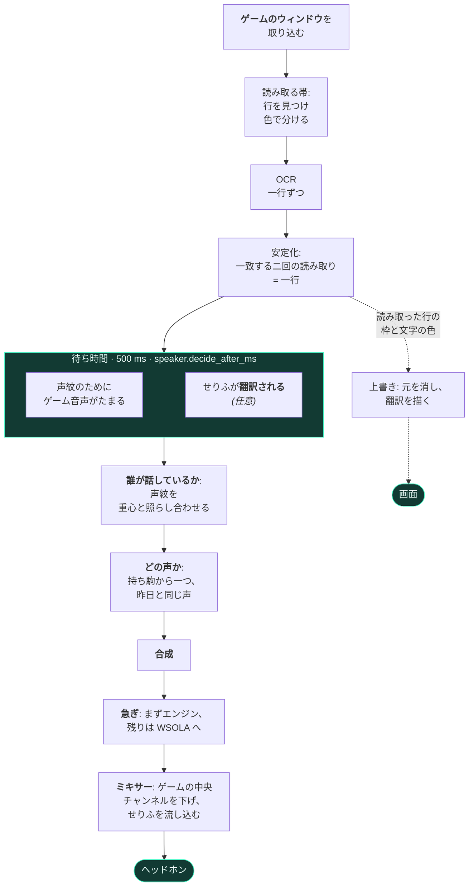

<div align="center">


# livedub

**ゲーム字幕のライブ吹き替え。**
プレイ中に画面の文字を読み、ゲームの音声から誰が話しているかを判断し、その人物の
声でせりふを合成してゲームに重ねて流します。すべて自分のパソコンの中で。


[English](../../README.md) ·
[Italiano](README.it.md) ·
[Deutsch](README.de.md) ·
[Español](README.es.md) ·
[Français](README.fr.md) ·
**日本語** ·
[中文](README.zh.md)

**[見て、聴く — 音つきの動画](https://pigro141.github.io/livedub/?lang=ja)**

</div>

> **この処理の流れに、必須の翻訳はありません。** ゲームの字幕がすでにあなたの言語
> なら、プログラムはそれを読んで、そのまま*言い*ます。翻訳は独立した機能で
> **既定では切**、自分の言語で書かれていないゲームのためのものです。

---

## 見る

下にあるのは音のない三つのクリップです。README は音を鳴らせません。GitHub は GIF
を動かしますが音は付けず、そしてこのプログラムは**しゃべります** — 聴くことが、
見るべきものの半分です。どのクリップも、声つきの完全版へつながります:
**[ショーケース](https://pigro141.github.io/livedub/?lang=ja#watch)**。

### GTA V での吹き替え

上の黒い帯は **OCR が読み取ったままの文字**で、そこに割り当てられた声が添えて
あります。*読み違い*と*言い違い*を区別するためにあり、このプロジェクトの試聴が
すべてこの形で渡されるのはそのためです。二人の登場人物で声が変わるのが聞こえます:
`[nicola]` と `[nicola-2_5]` は同じ声を二つの高さで使ったものです。

[](https://pigro141.github.io/livedub/?lang=ja#watch)

*音つきで再生してください。無音では、読んでいることは分かっても、言っていることは
分かりません。*

### ゲームの上に描かれた翻訳

元の字幕は長方形で覆うのではなく、**背景を作り直して消して**あり、訳されたせりふ
がその場所に入ります。文字の大きさと色はゲームから写し取ったものです。

[](https://pigro141.github.io/livedub/?lang=ja#watch)

### 働いている最中のウィンドウ

ログでは登場人物ごとに色が変わり、下端には計測バーがあります。毎秒の読み取り回数、
せりふ数、遅延、圧縮、音切れ、読み取り領域。

[](https://pigro141.github.io/livedub/?lang=ja#watch)

---

## 何をするか、手短に

| | |
|---|---|
| 字幕を**読む** | 画面全体ではなく、ゲームのウィンドウだけに対する OCR |
| **誰が話しているかを判断する** | ゲーム自身の音声にかけた声紋で、ラベルは一切なし |
| **登場人物ごとに声を割り当てる** | そしてその割り当てをセッションをまたいで覚えている |
| **場面についていく** | 与えられた時間に収まるぶんだけ、せりふを速める |
| **混ぜる** | ゲームの**中央チャンネルだけ**を下げる。台詞はそこにあり、音楽と効果音はそのまま残る |
| **翻訳する** *(既定では切)* | いくつかのバックエンド。ほとんどはネットワークなしで動く |
| **画面の字幕を書き換える** *(既定では切)* | 元の字幕を消し、訳したせりふを描く |
| **せりふを 53 言語で言う** | piper で 50、supertonic で 31、kokoro で 8。言語を選べばエンジンがついてくる |
| **42 言語を話す** *(画面表示)* | Windows の言語に従い、再起動なしで切り替わる |

---

## 使い方、出会う順に

先に設定するものはありません。開いて、そのまま進めます。

**1. 開きます。** ウィンドウは最初から、あなたが Windows を使っている言語で出ます
— 42 言語、41 のカタログはどれも完成しており、258 個中 258 個です。アラビア語・
ヘブライ語・ペルシア語・ウルドゥー語では、ウィンドウ全体が左右反転します。

**2. 案内が連れて行ってくれます。** 7 段階で、`?` でいつでも見直せます。できる
ところでは**語らずに確かめます**。実際にあるオーディオ機器を数え、CUDA が本当に
あるかを推測せず ONNX Runtime に尋ね、読み取り領域の高さを本物の規則で測ります。

 

**3. 試験台がこの PC を測り、エンジンを選びます。** これは便利機能ではありません。
**モデルが足りなくてもエラーは出ない**からです。プログラムは一度入れれば済みます
が、モデルはそうではなく、初回に取りに行きます。届かなければ、処理の流れは*より
軽いものに退いてそのまま進みます*。この段階がなければ、退いた先の音を、それと
知らずに聴くことになります。試験台は測り、選び、足りないものを取ってきますが、
**プログラムは一つも入れません**。足りなければ、貼り付ける行をそのまま渡します。


**4. ゲームのウィンドウを選びます。** 取り込むのは**ウィンドウ一つ**で、画面全体
ではありません。ですから OCR に渡る画に、ほかのものが紛れ込むことはありません —
私たち自身のウィンドウもです。ゲームはウィンドウ表示か*枠なし*表示で動かす必要が
あり、排他的な全画面表示では取り込めません。

**5. 字幕の行を四角で囲みます。** マウスで二秒。領域は**ウィンドウを基準**にして
いるので、ゲームを動かせば領域もついていきます。

**6. 開始。** そこからは、読み、誰が話しているかを判断し、合成し、混ぜます。

声はいつも字幕より少し遅れて届きますが、それは意図したものです。声を選ぶ前に誰が
話しているかを知るには、ゲーム音声が 500 ミリ秒必要だからです。

---

## 中で何が起きているか



**二つの領域、二つのスレッド、出会う点は一つだけ。** 映像側が**何を**言うか、
**いつ**言うかを決め、音声側が予定されたものを流し込みます。**ミキサーが合成器を
呼ぶことは決してありません**。呼べば、せりふのたびに標本の流れが止まってしまう
からです。流れの穴は遅くなることではなく、聞こえないせりふのことです。

**翻訳は待ち時間の*中*で行われ、あとではありません。** これは互いに独立した二つの
待ちです。一方は*文字*を必要とし、それは字幕が確定した時点ですでにあります。もう
一方は*音声*を必要とし、それはたまるのを待つしかありません。順に並べれば
`待ち + 翻訳` ですが、重ねれば `max(待ち, 翻訳)` です。

残りは [`docs/architettura.md`](../architettura.md) に書いてあります
*(コードと同じくイタリア語です)*。

---

## 数字と、その出どころのセッション

**ゲームを動かした実セッションだけです。** 録画に対してまったく同じ処理の流れを
走らせる試験台もあります — シミュレーションではなく本物のコードです — が、
**試験台は時間をただでくれます**。仮想の時計の上では合成の費用はゼロで、フレームが
落ちることもありません。そこからは遅延の数字を一つも取っておらず、この表にも一つも
ありません。

| | piper、CPU で | kokoro、CUDA で | kokoro、CUDA、翻訳あり |
|---|---|---|---|
| 吹き替えたせりふ | 44 | 146 | **589**、44 分の一セッションで |
| **字幕 → 声**、中央値 | **665 ms** | **1290 ms** | **1421 ms** |
| 合成、中央値 | 57 ms | 580 ms | 248 ms |
| 話速の圧縮、中央値 | **1.00** — まったくなし | **1.00** — まったくなし | **1.00** — まったくなし |
| `underrun` — 聞こえなかったせりふ | **0** | **0** | **0** |
| 毎秒の字幕読み取り回数 | 記録なし | 15.3 | 18.8 |
| 出どころのセッション | `runs/2026-08-11_18-31-55` | `runs/2026-08-20_00-01-56` | `runs/2026-08-07_01-40-16` |

**どんな遅延の数字よりも重い事実。現行の三つのエンジンを使った `runs/` の実
セッション 53 回で、`underrun` は一度もありません。** そして Piper の列はまぐれ
当たりではありません — 同じ晩の姉妹セッション四回が 664、669、687、687 ミリ秒
でした。

**エンジンが速くなったあと、時間が本当に消えている場所。** Kokoro の遅延のうち
**およそ 500 ミリ秒は、誰が話しているかを知るための待ち時間**で、合成そのものより
長いのです。速くしたいなら攻めるべきはその数字で、下げる代償は話者をより頻繁に
取り違えること。これを判定できるのはあなたの耳だけです。

**エンジンに必要なコア数。** これは試験台から来た数字で、遅延ではありません。
ほかをすべて同じにしたまま、**せりふ一つを合成する費用**を、プロセスを少ないコアに
制限しながら実時間で測ったものです。古い PC がどれだけ遅くなるかの**下限**です —
コアを少なくする模擬であって、遅いコアの模擬ではありません。

| 物理コア | Piper のせりふ一つ、中央値 | p95 | 8 コアとの比 |
|---|---|---|---|
| 8 | **78 ms** | 144 ms | 1.00× |
| 6 | **88 ms** | 236 ms | 1.12× |
| 4 | **302 ms** | 544 ms | **3.85×** |
| 2 | 363 ms | 1050 ms | 4.63× |

**崖は 6 コアと 4 コアのあいだにあります。** 下の表が 8 ではなく 6 を求めるのは
そのためです。8 から 6 への一段は 12 パーセントですが、6 から 4 への一段は四倍
近くかかります。この方法で測ったのは Piper だけなので、この README は重いエンジンに
ついて数字を出しません — 案内の試験台が*あなたの*マシンで測ります。どのみち意味が
あるのはその答えです。

---

## プライバシー: すべてあなたのマシンの中で動きます

これは標語ではなく、パソコンから出ていくものの一覧です。

| | 何かが外に出るか |
|---|---|
| 字幕を読む（OCR） | **いいえ** — あなたのマシンの中で |
| 誰が話しているか（声紋） | **いいえ** — あなたのマシンの中で |
| 声を合成する | **いいえ** — あなたのマシンの中で |
| オフラインの翻訳を使う | **いいえ** |
| オンラインの翻訳を使う | **はい**。そしてプログラムは毎回そう言います |
| モデルを取ってくる | **一度だけ**、初回に |

文字が外に出る唯一の道は、自分でオンライン翻訳を選ぶことです。計測の送信も
アカウントもなく、こちらのサーバーへの接続もありません — こちらのサーバー自体が
存在しません。

---

## 必要なもの

| | 動く条件 | より快適に動く条件 |
|---|---|---|
| CPU | 物理コア 6 個 | 物理コア 8 個 |
| GPU | **不要** — なくても壊れません | 空き VRAM が 2 GB ほどある NVIDIA なら何でも。実測で必要なのは **1128 MB** |
| RAM | 8 GB | 16 GB |
| ディスク | **1.6 GB** — CUDA のライブラリなしの環境に、モデル 225 MB | **3.5 GB** — CUDA のライブラリとモデル 543 MB。オフライン翻訳はどちらの場合も**さらに 3.2 GB** |
| Windows | **10** — 取り込みは `user32.dll` にある `PrintWindow` を通り、何も入れる必要はありません | **11** — OneOCR はここにしかなく、ゲームの縁取り文字をはるかによく読みます |
| Python | 3.11 | 3.11 |
| **得られるもの** | **CPU の Piper。** 字幕から声まで 665 ミリ秒、音切れなし、話速の詰めもなし。読み取りは PP-OCR で、話せる 53 言語のうち 50 はすでにここにあります。 | **CUDA の Kokoro**。発音がよく、8 言語 54 の声を持ちます。1290 ミリ秒。 |
| **その一段で買えるもの** | 6 コアを下回ると Piper の合成は 88 ミリ秒から **302 ミリ秒**になります — 上の表を参照 | グラフィックカードは**合成を 3.5 倍**速くし（741 ミリ秒から 213 ミリ秒へ）、言語に合わせてエンジンを Kokoro へ移せる唯一の条件でもあります。CPU ではそのエンジンはせりふ一つに 741 ミリ秒かかり、実用になりません |

**必要条件は、それが測られたマシンなしには読めません。** ですからここに書きます:
Intel Core i9-11900K（物理コア 8 個）、**8 GB の RTX 4060** — *その上で同時に
GTA V が動いている状態で* — RAM 31.8 GB、Windows 11 Pro ビルド 26200、Python
3.11.9。断りがない限り、この README の数字はすべてこのマシンのものです。
*より快適に動く条件*の列は願望の一覧ではなく、まさにこのマシンです。

**もう一つ必要なもの**は、自分の吹き替えが混ざり戻らないままゲームの音を聞く手段
です。Windows に付属する WASAPI のループバックで足ります。
[Voicemeeter](https://vb-audio.com/Voicemeeter/) は**任意**で、すべてを一つの
ヘッドホンにまとめたい場合にだけ役に立ちます。

## ダウンロード

**実行ファイルはまだ公開されていません。** livedub は上記のとおりソースからインストールします。実行ファイルは、ビルドマシンが実際に起動して確認できた時点で初めてここに並びます。

## ソースからインストールする

```powershell
git clone https://github.com/pigro141/livedub.git
cd livedub
powershell -ExecutionPolicy Bypass -File installa.ps1
```

このスクリプトは、成功を報告するのではなく**頼んだものが手に入ったかを確かめます**。
Python、仮想環境、依存関係、OCR、本物の CUDA プロバイダ、モデル — 最後にテスト
一式を走らせます。足りないものは理由と代償つきで並べられます。

NVIDIA の GPU がない場合:

```powershell
powershell -ExecutionPolicy Bypass -File installa.ps1 -SenzaGpu
```

このスクリプトが実行するのは pip コマンド一つではなく二つで、二つ目は任意では
ありません。そこに入っている四つのパッケージは CPU 版の ONNX Runtime に依存して
おり、それは `onnxruntime-gpu` の隣にあると CUDA を黙って止めてしまいます。そして
`--no-deps` はファイル全体にかかる指定なので、ほかと同じファイルには置けません:

```powershell
.\.venv\Scripts\python.exe -m pip install -r requirements.txt
.\.venv\Scripts\python.exe -m pip install -r requirements-nodeps.txt --no-deps
```

**インストールはわざと軽くしてあり、わざと外してあるものが一つあります。**
オフライン翻訳は**入れません**。**3100 MB** かかり、そのほとんどが `torch` です。
翻訳はそれを一度も使いませんが、それがないと文の区切り器すら読み込めません。
**既定では切**の機能のために、これを入れる人全員に払わせるのは、選択の反対です。
**必要になったとき**に来ます: 案内の試験台が足りないものを見て、あなたが決める
**前に重さを申告し**、貼り付ける行を渡します。実行せずに渡すのは、これが
*パッケージ*だからで、そこで素朴に `pip install` をすることこそ、CPU 版の車輪を
呼び戻す行為だからです。届かなければ、それは黙った代替ではなく**申告された断念**
です。言語対のほうは 98 MB のモデルで、これは試験台がひとりで取ってきます。

### 起動する

```powershell
.\.venv\Scripts\python.exe -m tools.ui_qt --profile live
```

ウィンドウの中で **ウィンドウを選ぶ** → **領域を選ぶ** → **開始**。Windows では
`livedub.bat` をダブルクリックするだけでもかまいません。

> **お使いの Windows で Smart App Control が入になっている場合。** これは*評価*
> モードで出荷され、開発用の道具が動くのを見ると Windows は自分で切ります。そして
> 一度切れると、Windows を入れ直さない限り入に戻せません。ですからこれは少数の
> マシンの話で、普通の場合ではありません。まだ入になっているマシンで、この repo で
> 固定したバージョンを入れた場合、止まるパッケージはちょうど**二つ、そしてそれは
> 一つの機能**です: Windows Graphics Capture。取り込みはそのとき `PrintWindow` に
> 退きますが、これは何も入れる必要がありません。**それ以外はすべて動き続けます** —
> 字幕を読むこと、誰が話しているかを判断すること、三つの合成エンジンすべて、
> ミキサー、画面への上書き、オフライン翻訳、そしてウィンドウそのもの。PyInstaller
> で作った実行ファイルもすべて止まります。このプロジェクトのものも含めてです。
> ビルドはどれも新しいファイルであり、新しいファイルは仕組み上まったく評判を
> 持たないからです。
>
> **そして噛みつかれた場所では、何が落ちて何を代わりに使うのかをプログラムが
> 言います。** 止まったライブラリは、エラーの山として渡されはしません。*この部品は
> このマシンで読み込めるか*という問いに答える場所が一つだけあり、そこは*そもそも
> 入れていない*と*あるのに Windows が読み込まない*を区別します。前者は
> `pip install` 一回で治り、後者は治らないからです。メニューは失敗する選択肢に印を
> 付けます。一覧の中だけでなく、閉じた選択欄の上にも付けます。うまくいかない値は、
> たいていすでにあなたの設定に書かれている値だからです。選択肢は**印を付けるだけで、
> 消しません**。消せば、プログラムにはその能力があること、そして欠陥はこのマシンの
> ものであることを隠すことになります。

---

## ウィンドウ

タブは六つ。**最初のせりふを聞くのに触る必要のあるタブは一つもありません。**
必要になったときに開きます。

| タブ | 何のためのものか |
|---|---|
| **準備** | 手順を順番に — 開始の前に必要な唯一のタブ |
| **セッション** | いま誰が話しているか。登場人物ごとに一色 |
| **声** | どのエンジンか、声の持ち駒はいくつか、誰が話しているかを決めるまでどれだけ待つか |
| **音量** | ゲームをどこまで下げ、こちらの声をどこまで上げるか。**聴きながら** |
| **翻訳** | 字幕が自分の言語でないゲームを遊ぶときだけ |
| **すべての設定** | 170 個のパラメータ。検索欄つき |

 

**「セッション」タブはログではありません。** 一番上にいま話しているせりふが、その
声と急ぎ具合とともに出ます。次に話した人物が一人一枚のカードで並び、その下にログが
あります。見ながら自分に問うのは*何と言ったか*ではなく**まだ同じ人が話しているか**
で、それには文字より色のほうがずっと早く答えます。

**パラメータ。** 全部で 170 個。**131 個はその場で効き**、起動時にしか読まれない
39 個は、そのふりをせず**そう書いてあります**。127 個には `?` があり、何をするのか、
何が測られたのか、変えると何を失うのかを説明します。それは
[`core/config.py`](../../core/config.py) の中でパラメータの隣に置かれているのと
同じ文章で、誰も更新しない二つ目の写しではありません。

**二つの「言語」は別物で、わざと二つ離れたタブに置いてあります。**「準備」の
`ui.lingua` は**ボタンに書かれる言葉**を決め、「翻訳」の `translate.source` と
`translate.target` は**声に出して言われる言葉**を決めます。取り違えると
セッション一つ分の損です。

---

## 私のゲームで動きますか

試したのは二つ、**GTA V** と **Mafia: The Old Country**、どちらもイタリア語です。
正直なところ、分かっているのはそれだけです。

**どのゲームでも必ず必要なこと**: 字幕のまわりに領域を引くこと、そしてゲームが
話者の名前に色を付けるなら*色付きの字幕を無視する*のチェックを外すことです。

**そのまま動く見込みが高い**のは、ゲームが下寄りの行に**暗い背景の上の明るい文字**
で書く場合です。

**試す価値がある**のは、明るい背景に暗い文字で書く場合です。専用に作った画像では
読めますが、にじみます。そういう本物のゲームで試した人はまだ誰もいません。

**予定にないこと**: 人物についていく吹き出しの中の字幕や、行ごとに位置が変わるもの。

**そして画面全体を訳すのではありません。あなたが引いた四角の中で、字幕を一行ずつ
読みます。** これは欠落ではなく選択で、処理の流れ全体がその形の上に建っています。

**領域について、みんなが逆に理解していること。** 広く引いてもプログラムは
**ちゃんと読みます**。大きな領域は精度が落ちるだけで、無言になるわけではありません。
本当に悪くなるのは描画のほうです — 訳したせりふは周りの背景を作り直して描くので、
領域が高いほど、その作り直しは関係のない風景を巻き込みます。ある高さを超えると
プログラムがそう言います。四角を引いている最中にも、開始したときにもう一度。

---

## 言語

ここでは三つの別々のものが*言語*と呼ばれ、三つの別々の場所で設定されます。そして
それらを混ぜることこそ、プログラムが持っていないものを約束してしまう道筋です。

| | いくつ | どこで設定するか |
|---|---|---|
| **ボタン**に書かれる言葉 | **42** | `ui.lingua`、「準備」タブ |
| **字幕を訳せる**言語 | オンラインの翻訳で **133** — オフラインのものには閉じた一覧がありません | `translate.target`、「翻訳」タブ |
| **声に出して言える**言語 | **53** — ただしどのエンジンでもというわけではありません: piper で 50、supertonic で 31、kokoro で 8 | あなたが言語を選ぶと、エンジンがそれに従います |

> **三つの一覧、三つの問い。** 画面表示は 42 言語、翻訳は 133 言語に届き、口は 53
> 言語を話します。この最後の数字は一つの数字ではありません: **三つのエンジンは
> それぞれ別のカタログを持ち**、言語を選ぶことは実のところエンジンを選ぶことなの
> です。53 になる変更の前、口が話せたのは**二つ**でした — それはエンジンの限界では
> なく、コードがそう申告していただけです。スペイン語に訳してイタリア語の声に読ま
> せても、**エラーは一つも出ませんでした**。

**読む**: 読み取り器が読めるものすべて。

**話す**:

| エンジン | 言語 | 声 | 動く条件 | 声のしくみ |
|---|---|---|---|---|
| **piper** *(既定)* | **50** | 公式の索引に 175 のモデル | CPU | 声ごとに一つのモデル、それぞれ個別にダウンロード（28〜114 MB） |
| **supertonic** | **31** | 話者の型が 10 種類、*どの*言語でも有効 | CPU | 多言語のモデルが一つ。言語は音素化器を選ぶだけ |
| **kokoro** | **8** | 54。言語と性別は名前の中に書かれている | CUDA | モデルは一つ、声ごとに 510 KB のスタイルファイルが一つ |
| `tone`, `silent` | — | ビープ音に言語はありません | — | — |
| **合計** | **53** | | | |

一つのエンジンだけが持つ言語は二つだけです — クロアチア語とリトアニア語で、どちらも
supertonic。六つは三つすべてが持ち、二十一は piper だけが持ちます。生の声の数を
超えた登場人物は音の高さをずらして区別され、それが最初の GIF で聞こえるものです:
`[nicola]` と `[nicola-2_5]` は一つの声を二つの高さで使ったものです。

### 何を主張し、実際に何を試したか

これは数字より大事です。

**主張していて、カタログから確かめられること**: 声が*存在する*ことと、その声が
*その言語のものである*こと。どのエンジンもそれを公開しています — piper は
`rhasspy/piper-voices/voices.json` に、kokoro は声の名前の頭文字に、supertonic は
対応言語の一覧に。ここに当て推量は一つもありません。

> **主張していないこと。発音がよい、とは言っていません。** 53 言語を聴いた人は誰も
> おらず、そうでないと言えば、どの計測も裏づけない約束になります。

**代わりに機械的に確かめたこと**: いくつかの言語について、*その言語自身の文字で*
一文を合成し、**話す速さ**がもっともらしいかを見ます。単位は一秒あたりの文字数です。
音素化が間違っていてもエラーにはなりません。モデルは答え、音は出て、どの計数器も
緑のままで、桁外れの速さだけが唯一残る痕跡です。

| エンジン | 測った言語 | 結果 |
|---|---|---|
| **supertonic** | **31 のうち 31** | すべてもっともらしい: 毎秒 6.6〜17.8 文字で、下端は日本語・韓国語・中国語・ヒンディー語。それぞれの文字体系から予想されるとおり |
| **piper** | **50 のうち 1** | ヘブライ語、毎秒 9.14 文字。残りは*このマシンでは*測れませんでした: Smart App Control が `espeakbridge.pyd` を止めており、piper のほかの言語はすべて espeak を通して音素化されるからです |
| **kokoro** | **8 のうち 0** | `kokoro-onnx` はここではそもそも読み込めません — Smart App Control がその依存関係の一つのネイティブモジュールを止めています |

測れなかった二つのエンジンは、コードではなく**このマシンの性質**によって止められて
います。その言語一覧はカタログから申告され、試験済みとして見せるのではなく
**未計測と明記**してあります。

> **検査が取り下げさせた主張が一つ。** piper の索引は **51** 言語を挙げ、この
> プログラムは **50** を提供します。差は日本語です: その声は、入っている
> `piper-tts` が持たない音素化器を必要とするため、モデルは平然と落ちてきて*最初の
> 合成*で失敗します。51 と申告すれば索引については真、このプログラムについては偽
> でした。日本語はそれでも話せます — kokoro か supertonic で。

### 言語を選べば、エンジンがついてきます

結末はちょうど三つで、その違いが設計のすべてです。

| | 何が起きるか | 何と言うか |
|---|---|---|
| **選んだエンジンがすでにその言語を話す** | 何も変わりません | **何も言いません** — そして黙ったままでなければなりません: 言語を変えるたびに出る通知は、やがて読まれなくなる通知です |
| **そのエンジンは話さないが、別のエンジンが話す** | エンジンが切り替わります | そう言います。あなた自身の選択が今まさに上書きされたからです — *「piper」にはこの言語の声がありません。31 言語を話す「supertonic」に切り替えます* |
| **使えるエンジンのどれもその言語を話さない** | 何も切り替えません。切り替えても助けにならないからです | 黙って片づけるのではなく、事実がそのまま告げられます — *この言語の声を持つエンジンはありません（そして「kokoro」はここでは動きません）。せりふは別の言語を発音する声で出てしまいます* |

最後の場合の括弧が要点です: **答えはマシンによって変わり**、メッセージはどの
エンジンが除外されたかを言います。代わりのエンジンは、このマシンが本当に動かせる
ものでなければなりません — kokoro は CPU でせりふ一つに 741 ミリ秒、CUDA では 213
ミリ秒。ですから CUDA のないマシンがそこへ移されることは決してありません。言語に
従うことが、遅延を倍にしてよい理由にはならないからです。日本語はこの仕組み全体を
一行で見せます: piper は声を持っていて発音できず、kokoro は五つ持っていて CUDA を
欲しがり、supertonic は CPU でやってのけます。

**知っておく価値のある、造りの上の事実が二つ。** supertonic の十の声は*言語では
なく話者*です: 同じ十の型が 31 言語すべてを話し、言語は音素化器を選ぶだけ。だから
これは言語を一つ足すのに最も安い道です。piper は逆で、声ごとにモデル一つ、
ダウンロード一つ。そしてその索引には**性別の欄がありません**。ですからイタリア語
以外では、持ち駒は piper の声に `?` を付け、男女を交互にする代わりに単純な順番に
退きます。隠された後退ではなく、申告された後退です。

**翻訳** *(既定では切)*:

| バックエンド | ネットワーク | 何言語 | 知っておくとよいこと |
|---|---|---|---|
| **`locale`**、Argos *(既定)* | **不要** | 閉じた一覧はありません: Argos が公開している言語対を、開始を押したときに取ってきます | `auto` を理解しません — 黙って*英語から*になります |
| `llm`、同じプロセスの中の Gemma 3 1B | **不要** | 指し示したモデル次第 | `auto` について同じ注意 |
| `ollama`、環境の外の TranslateGemma | **不要**。ただしローカルのサーバーが動いている必要があります | モデル次第 | 実際にはいちばん遅い: これを使った実セッションは端から端で 1592〜1805 ミリ秒 |
| `google` | **必要**。そしてプログラムは毎回そう言います | **133** — 四つの中で唯一の閉じた一覧 | `auto` を理解する唯一のもの |

メニューは絞り込まずに**四つすべてを見せて申告します**。そのうち三つには閉じた
一覧がないので、絞り込めば動く選択肢を隠し、動かない選択肢を通してしまいます。
分かっているような顔をして。

> **どの計数器も見せてくれないこと。** 粗い言葉づかいに対して、ローカルのモデルは
> **黙って書き換えます**。翻訳は見事に成功します。ただ、別のことを言うのです。
> 翻訳器が良いかを問う前に、書いてあることを言っているかを問うてください。

**画面表示の言語**はまた別の三つ目です: **42** — 41 のカタログに、原文が書かれて
いる言語であるイタリア語を足したものです。41 はどれも**完成しており、258 個中 258
個**で、半分だけ訳されたものはありません。四つは右から左へ進み、ウィンドウ全体を
反転させます（アラビア語、ヘブライ語、ペルシア語、ウルドゥー語）。カタログは一度
作って repo に収めてあります — ウィンドウが開くときにネットワークへ取りに行くこと
はしません。自分の文字をネットワークに頼むウィンドウは、ネットワークがないとき何も
書かれていないウィンドウになり、*しかもエラーも出ません*。

**訳さない**ものと、その理由: 各パラメータの `?` の裏にある説明です。これは計測を
含んだ [`core/config.py`](../../core/config.py) のコメントから来ており、計測を機械
翻訳に通すことは、計測が黙って計測でなくなる道です。ログと計測バーが同じ理由で
イタリア語のままなのも同じで、あれは数字と機器の名前だからです。

---

## できないこと

プログラムに失望する最も早い道は、この一覧を使いながら自分で見つけることです。
ですからインストールの前に置いておきます。

| | |
|---|---|
| **53 言語を聴いた人は誰もいません** | 確かめてあるのは、声が存在すること、その声がその言語のものであること、そして測れたところでは話す速さがもっともらしいことです。発音は確かめていません。そしてイタリア語が、このプログラムが作られ、聴かれてきた言語です。 |
| **あなたのエンジンが話さない言語は、エラーではなく切り替えです** | エンジンはその言語を話すものへ移り、そう言います。このマシンが動かせるエンジンのどれも話さないなら、それも告げられます — 別の言語を発音する声を渡す代わりに。 |
| **piper の新しい言語での最初のセッションは、その声を落としてきます** | 声ごとにモデル一つ、それぞれ 28〜114 MB、多いときは六つ。そして案内の試験台は、ほかの場合のようにその重さを前もって申告することがまだできません。開始が数分間、理由を言わずに止まって見えることがあります。 |
| **字幕は一行ずつ** | あなたが引いた四角の中で。画面全体でも、複数の領域を同時にでもありません。以前の版は複数の読み取り領域を約束していましたが、取り除かれました。上書きの描画は一行ずつであり、実時間ではその約束を守れなかったからです。 |
| **ゲームはウィンドウ表示か枠なし表示で** | 排他的な全画面表示は取り込めません。 |
| **Windows 専用** | そしてゲームの縁取り文字を最もよく読む OneOCR は、Windows 11 にしかありません。Windows 10 では PP-OCR になります。 |
| **声は字幕より遅れて届きます** | そのうち半秒ほどは、誰が話しているかを言えるだけのゲーム音声がたまるのを待つ時間です。そして遅れの最大の一片は、合成ではなくその待ち時間です。 |
| **声より登場人物が多ければ、声を共有します** | 生の声の数を超えると、音の高さをずらして区別され、それは耳で分かります。 |
| **プレイヤー一人、ウィンドウ一つ** | 配信の道具でも、翻訳の製造ラインでも、多人数向けでもありません。 |

**取り込みが失敗しうる場所。** Windows Graphics Capture が使えるところではそれで
ゲームのウィンドウを取り、使えないところでは `PrintWindow` に退きます —
**そのことをログに書いて**。この退き先は何も入れる必要がありませんが、同期的で
費用がかさみます: 1191×958 のウィンドウで実測 **17.5 ミリ秒**。そして Direct3D の
フリップモデルのスワップチェーンで描くゲームでは、`PrintWindow` が**成功して真っ黒
な画を返す**ことがあります。プログラムは最初の八フレームを調べ、黙って黒を読む
代わりにそれを申告します。**この退き先を GTA V そのもので試した人は、まだ誰も
いません。**

> **そしてここにあるすべての数字を囲む、正直な枠。** 一台のマシンで、二つのゲーム
> で、一人の人間が測ったものです。測られていない数字については、この README は穴を
> 埋めずに見えるまま残します。

---

## どう作られているか、そしてなぜ数字を信じてよいか

pytest はありません。テスト一式は実行できるモジュールで、76 グループに **1833 個の
検査**があります。

```powershell
.\.venv\Scripts\python.exe -m tools.selftest
```

そして試験台があります。ゲームなしで、録画に対して**まったく同じ処理の流れ**を
走らせます: 同じコード、本物の OCR、本物の音声、本物の声紋、本物の合成、そして
守られた因果 — この流れが未来を見ることはありません。

```powershell
.\.venv\Scripts\python.exe -m tools.dub 録画.mp4 --profile gtav --mp4
```

**しかし試験台だけでは足りません。それは仕組み上そうなのです。** そしてここでは、
これは血で書かれた規則です: 仮想の時計の上では合成の費用はゼロで、フレームが落ちる
こともないので、そこからは*速さ以外の*すべてを見せられます。このプロジェクトの
深刻な欠陥は、どれも本物で流れを走らせて出てきました。

決定を変えた計測は、**それが決めたパラメータの隣に**、
[`core/config.py`](../../core/config.py) の中に書かれています — ウィンドウで `?` を
押したときに出るのと同じ文章です。

*コード、そのコメント、`docs/` の下の文書はイタリア語です。英語の README と
[ショーケース](https://pigro141.github.io/livedub/)は英語です。*

---

## このプロジェクトを支援する

livedub は無料で、すべてあなた自身のマシンで動き、アカウントもサーバーもありません。
売るものはなく、集めるデータもありません。役に立つと思ったら:

**[☕ トークンを一杯おごる！](https://ko-fi.com/filippodebenedittis)**

機能が解放されることも、制限が外れることもありません — そもそも制限がありません。

---

## ライセンス

**GPL-3.0-or-later**。好みではなく必然です: 既定の音声合成器と、別の一つの裏にある
書記素・音素変換器が GPL-3 なので、ここで配られるものもすべてそうなります。
ライブラリごとの明細は [`docs/LICENZE.md`](../LICENZE.md) にあります — OCR と
モデルの重みを**再配布しない**理由も含めて。
