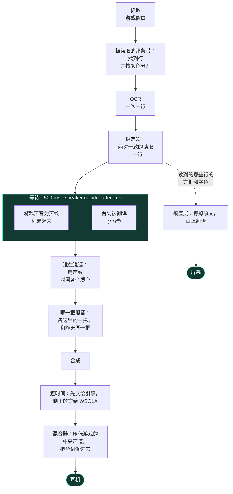

<div align="center">


# livedub

**游戏字幕的实时配音。**
它在你玩的时候读取屏幕上的文字，从游戏的声音判断是谁在说话，用那个角色的嗓音
合成这句台词，再混到游戏上面。全部在你自己的电脑上。

[](https://github.com/pigro141/livedub/actions/workflows/eseguibile.yml)
[](https://github.com/pigro141/livedub/releases/latest)
[](../../LICENSE)


[English](../../README.md) ·
[Italiano](README.it.md) ·
[Deutsch](README.de.md) ·
[Español](README.es.md) ·
[Français](README.fr.md) ·
[日本語](README.ja.md) ·
**中文**

**[看一看，听一听 —— 带声音的视频](https://pigro141.github.io/livedub/?lang=zh)**

</div>

> **这条链路里没有任何强制的翻译。** 如果游戏的字幕已经是你的语言，程序就读它们、
> 并把它们*说*出来。翻译是一项单独的功能，**默认关闭**，是给那些用别的语言写的
> 游戏准备的。

---

## 看一看

下面是四段无声的片段，因为 README 不能出声：GitHub 会让 GIF 动起来，却不给它音频，
而这个程序**会说话** —— 听见它，是可看之处的一半。每一段都通向带声音的完整视频：
**[展示页](https://pigro141.github.io/livedub/?lang=zh#watch)**。

### GTA V 上的配音

上方的黑条是 **OCR 读到的原文**，旁边是分配给它的嗓音。它存在的意义是把*读错了*
和*念错了*分开，本项目的每一次试听都是这样交付的。你能听见两个角色之间嗓音的
变化：`[nicola]` 和 `[nicola-2_5]` 是同一把嗓音的两个音高。

[](https://pigro141.github.io/livedub/?lang=zh#watch)

*请带声音播放：静音时你只能看到它在读，看不到它在说。*

### 四种语言，同一场戏

GTA VI 预告片中同样的十三秒，配了四遍。官方字幕按 GTA V 写字幕的样子**烧进了
画面** —— 字号和位置是在游戏真实的一帧上量出来的，不是猜的 —— 然后这条链条
又把它们从像素里读了回来。这里什么都没有翻译：每一遍读的都是本来就用那种语言
写好的字幕，再用**那种语言的** Kokoro 嗓音说出来。黑条里出现名字 ——
`[nicola-2_5]`、`[es_santa]` —— 就表示声纹已经确认了**是谁**在说话。这一段
特意选了一通电话：声纹需要有人连着说下去，而在台词只有一秒的地方，诚实的
回答仍然是 `[neutra]`，*还不知道是谁在说话*。

[](https://pigro141.github.io/livedub/?lang=zh#watch)

### 画在游戏上面的翻译

原来的字幕不是拿一个矩形盖住，而是**通过重建背景把它擦掉**，译好的台词接替它的
位置，字号和颜色都是照着游戏抄下来的。

[](https://pigro141.github.io/livedub/?lang=zh#watch)

### 工作中的窗口

日志里每个角色一种颜色，底部是测量条：每秒读取次数、台词数、延迟、压缩、断音、
读取区域。

[](https://pigro141.github.io/livedub/?lang=zh#watch)

---

## 它做什么，简短地说

| | |
|---|---|
| **读**字幕 | 只对游戏窗口做 OCR，而不是整个屏幕 |
| **判断谁在说话** | 在游戏自己的声音上做声纹，不用任何标签 |
| **给每个角色一把嗓音** | 并且从一次会话记到下一次 |
| **跟得上场面** | 把一句台词加速到刚好能装进它拥有的时间 |
| **混音** | 只压低游戏的**中央声道**，对白就在那里：音乐和音效原样不动 |
| **翻译** *(默认关闭)* | 好几个后端，其中大多数完全不联网 |
| **重写屏幕上的字幕** *(默认关闭)* | 擦掉原文，画上译好的台词 |
| **用 53 种语言说出台词** | piper 50 种，supertonic 31 种，kokoro 8 种；你选语言，引擎跟着走 |
| **会说 42 种语言** *(界面)* | 跟随你的 Windows 语言，切换时不用重启 |

---

## 怎么用，按你遇到它的顺序

事先没有什么要配置的：打开它，跟着走就行。

**1. 你打开它。** 窗口一开始就用你使用 Windows 的那种语言 —— 一共 42 种，41 份
词表每一份都是完整的：258 条中的 258 条。阿拉伯语、希伯来语、波斯语和乌尔都语还会
把整个窗口翻转过来。

**2. 一份向导带你走一遍**，共 7 步，用 `?` 随时唤回。凡是能做到的地方，它都
**去核实，而不是讲述**：它数你真正拥有的声卡，它去问 ONNX Runtime CUDA 是不是真的
在，而不是假定，它用真正的规则量你读取区域的高度。

 

**3. 一台试验台测量这台电脑，并挑选引擎。** 这不是为了方便：**缺一个模型并不会
报错**。程序装一次就够了，模型不是 —— 它们在第一次用到时才去取，如果没取到，链路
就*退到更轻的东西上继续跑*。没有这一步，你会在不知情的情况下听着那个退而求其次的
结果。试验台测量、挑选、下载缺的东西，并且**不安装任何程序**：缺哪个，它就把要
粘贴的那一行原样交给你。


**4. 你选择游戏的窗口。** 它抓取**一个窗口**，而不是屏幕，所以送去 OCR 的画面里
不可能混进别的东西 —— 连我们自己的窗口也不行。游戏必须以窗口或*无边框*方式运行，
不能是独占全屏。

**5. 你用鼠标框住字幕那一行。** 两秒钟的事。这个区域是**相对于窗口**的：你移动
游戏，区域就跟着走。

**6. 开始。** 从这里起，它读、判断谁在说话、合成、混音。

嗓音总是比字幕晚到一点，这是有意的：要在选嗓音之前知道是谁在说话，需要 500 毫秒的
游戏声音。

---

## 里面发生了什么



**两个域，两个线程，只有一个交汇点。** 视频域决定**要说什么**以及**什么时候**说；
音频域把排好的东西倒进去。**混音器从不调用合成器**：一旦调用，样本流就会在每一句
台词上停住 —— 而流里的一个洞不是变慢，是一句你听不到的台词。

**翻译发生在等待*之内*，而不是之后。** 这是两段互不相干的等待：一段需要*文字*，
而文字在字幕确认时就已经有了；另一段需要*声音*，那得慢慢积累。排成一列它们的代价
是 `等待 + 翻译`；叠在一起就是 `max(等待, 翻译)`。

其余的写在 [`docs/architettura.md`](../architettura.md) 里
*（和代码一样是意大利语）*。

---

## 数字，以及它们来自哪一次会话

**只取游戏开着的真实会话。** 也有一台试验台，让完全相同的那条链路跑过一段录像 ——
真的代码，不是模拟 —— 但**试验台会白送时间**：在虚拟时钟上合成不花任何代价，也从
不丢帧。那里不产生任何延迟数字，这张表里也没有一个来自那里。

| | piper，在 CPU 上 | kokoro，在 CUDA 上 | kokoro 在 CUDA 上，并开着翻译 |
|---|---|---|---|
| 配音的台词数 | 44 | 146 | **589**，在一次 44 分钟的会话里 |
| **字幕 → 嗓音**，中位数 | **665 ms** | **1290 ms** | **1421 ms** |
| 合成，中位数 | 57 ms | 580 ms | 248 ms |
| 语速压缩，中位数 | **1.00** —— 完全没有 | **1.00** —— 完全没有 | **1.00** —— 完全没有 |
| `underrun` —— 你没有听到的台词 | **0** | **0** | **0** |
| 每秒的字幕读取次数 | 未记录 | 15.3 | 18.8 |
| 它来自哪一次会话 | `runs/2026-08-11_18-31-55` | `runs/2026-08-20_00-01-56` | `runs/2026-08-07_01-40-16` |

**比任何延迟数字都更有分量的一条：在 `runs/` 里用过现今三种引擎的 53 次真实会话中，
`underrun` 一次都没有出现。** 而 Piper 那一列不是运气好的一次 —— 同一晚的四次
姊妹会话给出了 664、669、687 和 687 毫秒。

**引擎变快之后，时间到底花在了哪里。** 在 Kokoro 的延迟里，大约 **500 毫秒是在等着
弄清谁在说话** —— 比合成本身还长。想要更快，该攻的是这个数字，而把它调低的代价是
更常把说话人认错，这只有你的耳朵能评判。

**一个引擎需要多少核心。** 这个数字来自试验台，不是延迟：它是在其他条件不变、进程
被限制在更少核心上时，用挂钟计时测出的**合成一句台词的开销**。它是一台更旧的电脑
会慢多少的**下界** —— 它模拟的是核心更少，不是核心更慢。

| 物理核心 | Piper 的一句台词，中位数 | p95 | 相对 8 核 |
|---|---|---|---|
| 8 | **78 ms** | 144 ms | 1.00× |
| 6 | **88 ms** | 236 ms | 1.12× |
| 4 | **302 ms** | 544 ms | **3.85×** |
| 2 | 363 ms | 1050 ms | 4.63× |

**悬崖在 6 核和 4 核之间**，这也是下面那张表写 6 而不是 8 的原因：从 8 到 6 只贵
12%，从 6 到 4 却贵将近四倍。只有 Piper 是这样测过的，所以本 README 不给更重的引擎
标任何数字 —— 向导里的试验台会在*你的*机器上测，而那本来就是真正算数的答案。

---

## 隐私：一切都在你的机器上运行

这不是口号，这是离开这台电脑的东西的清单。

| | 有东西出去吗？ |
|---|---|
| 读字幕（OCR） | **没有** —— 在你的机器上 |
| 谁在说话（声纹） | **没有** —— 在你的机器上 |
| 合成嗓音 | **没有** —— 在你的机器上 |
| 用离线后端翻译 | **没有** |
| 用在线后端翻译 | **有**，而且程序每次都会说明 |
| 下载模型 | **一次**，在第一次用到时 |

唯一会把文字送出去的方式，是你自己特意选了在线翻译。没有遥测，没有账号，也没有
连向我们服务器的连接 —— 我们根本没有服务器。

---

## 需要什么

| | 可以跑 | 跑得更好 |
|---|---|---|
| CPU | 6 个物理核心 | 8 个物理核心 |
| GPU | **不需要** —— 没有它也不会坏 | 任何有大约 2 GB 空闲显存的 NVIDIA：实测需要 **1128 MB** |
| 内存 | 8 GB | 16 GB |
| 磁盘 | **1.6 GB** —— 不含 CUDA 库的环境，加上 225 MB 的模型 | **3.5 GB** —— 含 CUDA 库和 543 MB 的模型。离线翻译在两者之上再加 **3.2 GB** |
| Windows | **10** —— 抓取走的是 `PrintWindow`，它就在 `user32.dll` 里，什么都不用装 | **11** —— OneOCR 只存在于这里，而它读游戏那种描边文字要好得多 |
| Python | 3.11 | 3.11 |
| **你得到什么** | **CPU 上的 Piper。** 从字幕到嗓音 665 毫秒，没有断音，也不用把话说快。读取用的是 PP-OCR，而 53 种可说语言里已经有 50 种在这里了。 | **CUDA 上的 Kokoro**：咬字更清楚，带着它 8 种语言里的 54 把嗓音。1290 毫秒。 |
| **这一步买到什么** | 低于 6 核时 Piper 的合成从 88 毫秒变成 **302 毫秒** —— 见上面的表 | 显卡买到的是**合成快 3.5 倍**（从 741 毫秒到 213 毫秒），而且它是唯一能让一种语言把引擎挪到 Kokoro 上的条件：在 CPU 上那个引擎每句要 741 毫秒，没法用 |

**一条要求，离开它被测量的那台机器就读不懂**，所以这里写出来：一颗 Intel Core
i9-11900K（8 个物理核心），一块 **8 GB 的 RTX 4060** —— *而且同时还在上面跑着
GTA V* —— 31.8 GB 内存，Windows 11 Pro 版本号 26200，Python 3.11.9。除非另有说明，
本 README 的每个数字都出自这台机器，而*跑得更好*那一列不是愿望清单：它就是这台
机器。

**你还需要**一种听到游戏声音、又不让自己的配音绕回去的办法：Windows 自带的 WASAPI
环回就够了。[Voicemeeter](https://vb-audio.com/Voicemeeter/) 是**可选的** —— 只有
当你想把一切都收进同一副耳机时才有用。

## 下载

**用 PowerShell 从源码安装** —— 就是下面那段。这是推荐的路，也是在每一台机器上都能走通的
路，而且一如从前。

**也有一个可执行文件，而且它真的被打开过。**每次 push 都会在 GitHub Actions 上构建它，
然后*运行*它：在包内读取一条画出来的字幕、合成一句台词、搭出窗口；这十二项检查只要有一项
不过，就什么都不发布。通过检查的包在[发布页](https://github.com/pigro141/livedub/releases/latest)上 ——
一个约 400 MB 的 zip，旁边放着它的 SHA256，不需要 GitHub 账号，也没有有效期。

**两条界限，说明白而不藏着。** 打开 **Smart App Control** 时 —— 在全新安装的 Windows 11
上它默认就是打开的 —— 可执行文件**起不来**：每次构建都是一个新文件，而新文件按其构成本就
没有信誉。挪动这条界限的是签名，不是再做一次验证。而构建机器没有声卡、没有显卡，也没有
正在运行的游戏，所以屏幕捕获、音频回环、混音和 GPU 上的合成都**没有被验证**；而且那里的
Smart App Control 也是关着的，所以「在 runner 上能起来」并不等于「在刚装好的 Windows 11
上能起来」。

## 从源码安装

```powershell
git clone https://github.com/pigro141/livedub.git
cd livedub
powershell -ExecutionPolicy Bypass -File installa.ps1
```

这个脚本**会核实自己是不是拿到了所要的东西**，而不是报告成功：Python、虚拟环境、
依赖、OCR、真正的 CUDA 提供者、模型 —— 最后它会跑一遍测试。缺什么都会列出来，附上
原因和它让你付出的代价。

没有 NVIDIA 显卡：

```powershell
powershell -ExecutionPolicy Bypass -File installa.ps1 -SenzaGpu
```

脚本执行的是两条 pip 命令而不是一条，而第二条不是可选的：里面那四个包依赖 CPU 版
的 ONNX Runtime，它和 `onnxruntime-gpu` 放在一起会悄悄关掉 CUDA；而 `--no-deps` 是
一个全局选项，没法和其余内容待在同一个文件里：

```powershell
.\.venv\Scripts\python.exe -m pip install -r requirements.txt
.\.venv\Scripts\python.exe -m pip install -r requirements-nodeps.txt --no-deps
```

**安装故意很轻，现在里面有离线翻译。**它曾经花费**3100 MB**并且被排除在外 - 几乎所有这些都是`torch`，翻译从未使用过。这 3 GB 是通过 `stanza` 带来的，而 Argos 只需要 *拆分句子*：对于 MiniSBD，该工作成本 **178 KB**，整个引擎的重量测量为 **66 MB**。所以现在它带着上面的两个命令到达，并且它在**内部可执行文件**中传播 - 同一个句子从源代码和包中一个字符一个字符地出现。该语言对仍然是一个模型，98 MB，当您按“开始”时，工作台会自行下载该模型。

### 运行它

```powershell
.\.venv\Scripts\python.exe -m tools.ui_qt --profile live
```

在窗口里：**选择窗口** → **选择区域** → **开始**。在 Windows 上，双击
`livedub.bat` 也可以。

> **如果你的 Windows 开着 Smart App Control。** 它出厂时处于*评估*模式，而 Windows
> 一看到开发工具在跑，就会自己把它关掉 —— 一旦关掉，不重装 Windows 就再也开不
> 回来。所以这属于少数机器，不是常态。在仍然开着它的机器上，并且安装本仓库里固定的
> 版本时，被拦下的软件包正好是**两个，而且它们合起来只是一项能力**：Windows
> Graphics Capture。抓取于是退到 `PrintWindow`，它什么都不用装。**其余一切照常
> 运转** —— 读字幕、判断谁在说话、三个合成引擎、混音器、屏幕上的覆盖层、离线翻译，
> 以及窗口本身。任何用 PyInstaller 打出来的可执行文件同样被拦，包括本项目的：
> 每一次构建都是一个新文件，而一个新文件在原理上没有任何信誉。
>
> **而在它真咬人的地方，程序会说出什么倒下了、该拿什么顶上。** 一个被拦下的库不会
> 以一堆报错的形式丢给你：有且只有一个地方回答*这块东西能在这台机器上加载吗*，而且
> 它把*你从来没装过它*和*它在这儿而 Windows 不肯加载*分开 —— 因为前者一条
> `pip install` 就治好了，后者治不好。菜单会给那些会失败的选项做标记，标在合上的
> 选择框上，而不只是在列表里，因为那个用不了的值，往往正是你配置里已经写着的那个。
> 选项是**被标记，而不是被拿掉**：拿掉它就等于藏起两件事 —— 程序其实会做，以及这个
> 毛病属于这台机器。

---

## 窗口

六个标签页。**听到第一句台词，一个都不用碰**：需要它们的时候它们才打开。

| 标签页 | 它是做什么的 |
|---|---|
| **准备** | 按顺序排列的步骤 —— 开始之前唯一需要的标签页 |
| **会话** | 此刻是谁在说话，每个角色一种颜色 |
| **嗓音** | 用哪个引擎，备选嗓音有几把，判断谁在说话之前要等多久 |
| **音量** | 游戏压低多少、我们的嗓音抬高多少，**就在你听着的时候** |
| **翻译** | 只在玩字幕不是你母语的游戏时才用 |
| **全部设置** | 170 个参数，带一个搜索框 |

 

**「会话」标签页不是日志。** 最上面是此刻正在说的那句台词，带着它的嗓音和它的赶
时间程度；接着是说过话的人，每个角色一张卡片；日志在下面。看着它时你问自己的不是
*它说了什么*，而是**还是同一个人在说话吗** —— 而颜色回答这个问题，比任何标签都
早得多。

**参数。** 一共 170 个；**131 个立刻生效**，只在启动时读取的那 39 个会**如实说明**，
而不是假装。127 个带一个 `?`，说明它做什么、量到了什么、改动它你要担什么风险 ——
而这段文字和 [`core/config.py`](../../core/config.py) 里参数旁边写的是同一段，不是
一份没人更新的副本。

**这两种「语言」是两回事，而且是有意隔了两个标签页的。**「准备」里的 `ui.lingua`
决定**按钮上写什么**；「翻译」里的 `translate.source` 和 `translate.target` 决定
**嘴里说什么**。弄混要赔上一次会话。

---

## 它能用在我的游戏上吗？

试过两个：**GTA V** 和 **Mafia: The Old Country**，都是意大利语。老实说，已知的
就这些。

**任何游戏都少不了的**：把区域框在字幕周围；如果游戏给说话人的名字上了色，就把
*忽略彩色字幕*那个勾去掉。

**很有希望直接就能用**，如果游戏是在靠近底部的一行上写**深色背景上的浅色文字**。

**值得一试**，如果它写的是浅色背景上的深色文字：在特意做出来的画面上它读得出来，
但会糊。真有这样的游戏，还没人试过。

**不在计划内**：跟着角色跑的气泡框里的字幕，或者每一行位置都在变的字幕。

**而且它不翻译整个屏幕：它一次读一行字幕**，就在你框出来的方框里。这是一种选择，
不是欠缺 —— 整条链路都建立在这个形状上。

**关于区域，一件大家常常想反了的事。** 框得宽，程序**照样读得出来**：大的区域只是
不那么精确，而不是变哑。真正变糟的是绘制 —— 译好的台词是靠重建它周围的背景画出来
的，区域越高，那次重建就卷进越多不相干的景物。超过某个高度程序就会告诉你，在你拖
方框的时候说一次，开始的时候再说一次。

---

## 语言

这里有三样不同的东西都叫*语言*，它们在三个不同的地方设置，而把它们混在一起，正是
一个程序最终承诺了它没有的东西的方式。

| | 有多少 | 在哪里设置 |
|---|---|---|
| **按钮**上用哪种语言写 | **42** | `ui.lingua`，在「准备」标签页 |
| 它能把字幕**翻译成**哪些语言 | 用在线后端是 **133** —— 离线的那几个没有封闭的清单 | `translate.target`，在「翻译」标签页 |
| 它能**开口说**哪些语言 | **53** —— 但不是每个引擎都行：piper 50 种，supertonic 31 种，kokoro 8 种 | 你选语言，引擎跟着走 |

> **三份清单，三个问题。** 界面会说 42 种语言，翻译能到 133 种，而这张嘴能说 53
> 种。最后这个数字并不是一个数字：**三个引擎各有各的目录**，选一种语言其实就是在选
> 一个引擎。在变成 53 之前，这张嘴只会说**两种** —— 那从来不是引擎的极限，而是代码
> 只声明了这么多：翻成西班牙语再让一把意大利语嗓音去念，**一个错误都不会报**。

**读**：识别器能读到的一切。

**说**：

| 引擎 | 语言 | 嗓音 | 在哪儿跑 | 嗓音是怎么来的 |
|---|---|---|---|---|
| **piper** *(默认)* | **50** | 官方索引里有 175 个模型 | CPU | 一把嗓音一个模型，各下各的（28–114 MB） |
| **supertonic** | **31** | 10 种说话人风格，在*每一种*语言里都有效 | CPU | 一个多语言模型；语言只负责挑音素转换器 |
| **kokoro** | **8** | 54 把，语言和性别都写在名字里 | CUDA | 一个模型，每把嗓音一个 510 KB 的风格文件 |
| `tone`, `silent` | — | 一声哔响没有语言 | — | — |
| **合计** | **53** | | | |

**哪个引擎会说哪种语言，由下面的列表回答**，而且它不是手写的：`tools/tabella_lingue.py` 从各引擎自己的目录重新生成，一旦对不上，测试套件就会失败。超出原生嗓音数量的角色，靠移动音高来区分 —— 这正是你在第一段 GIF 里听到的：`[nicola]` 和 `[nicola-2_5]` 是同一把嗓音的两个音高。

<!-- lingue: inizio -->
<!-- generato da `tools/tabella_lingue.py`, non si scrive a mano -->

<details>
<summary><b>全部 53 种语言，逐个引擎</b> — ✓ 表示该引擎在这种语言里至少有一把自己的嗓音。</summary>

| 代码 | 语言 | piper | supertonic | kokoro |
|---|---|:---:|:---:|:---:|
| `sq` | Albanian | ✓ |  |  |
| `ar` | Arabic | ✓ | ✓ |  |
| `hy` | Armenian | ✓ |  |  |
| `eu` | Basque | ✓ |  |  |
| `bn` | Bengali | ✓ |  |  |
| `bg` | Bulgarian | ✓ | ✓ |  |
| `ca` | Catalan | ✓ |  |  |
| `zh` | Chinese (Simplified) | ✓ |  | ✓ |
| `hr` | Croatian |  | ✓ |  |
| `cs` | Czech | ✓ | ✓ |  |
| `da` | Danish | ✓ | ✓ |  |
| `nl` | Dutch | ✓ | ✓ |  |
| `en` | English | ✓ | ✓ | ✓ |
| `et` | Estonian | ✓ | ✓ |  |
| `fi` | Finnish | ✓ | ✓ |  |
| `fr` | French | ✓ | ✓ | ✓ |
| `ka` | Georgian | ✓ |  |  |
| `de` | German | ✓ | ✓ |  |
| `el` | Greek | ✓ | ✓ |  |
| `he` | Hebrew | ✓ |  |  |
| `hi` | Hindi | ✓ | ✓ | ✓ |
| `hu` | Hungarian | ✓ | ✓ |  |
| `is` | Icelandic | ✓ |  |  |
| `id` | Indonesian | ✓ | ✓ |  |
| `it` | Italian | ✓ | ✓ | ✓ |
| `ja` | Japanese |  | ✓ | ✓ |
| `kk` | Kazakh | ✓ |  |  |
| `ko` | Korean | ✓ | ✓ |  |
| `ku` | Kurdish (Kurmanji) | ✓ |  |  |
| `lv` | Latvian | ✓ | ✓ |  |
| `lt` | Lithuanian |  | ✓ |  |
| `lb` | Luxembourgish | ✓ |  |  |
| `ml` | Malayalam | ✓ |  |  |
| `mr` | Marathi | ✓ |  |  |
| `ne` | Nepali | ✓ |  |  |
| `no` | Norwegian | ✓ |  |  |
| `fa` | Persian | ✓ |  |  |
| `pl` | Polish | ✓ | ✓ |  |
| `pt` | Portuguese | ✓ | ✓ | ✓ |
| `ro` | Romanian | ✓ | ✓ |  |
| `ru` | Russian | ✓ | ✓ |  |
| `sr` | Serbian | ✓ |  |  |
| `sk` | Slovak | ✓ | ✓ |  |
| `sl` | Slovenian | ✓ | ✓ |  |
| `es` | Spanish | ✓ | ✓ | ✓ |
| `sw` | Swahili | ✓ |  |  |
| `sv` | Swedish | ✓ | ✓ |  |
| `te` | Telugu | ✓ |  |  |
| `tr` | Turkish | ✓ | ✓ |  |
| `uk` | Ukrainian | ✓ | ✓ |  |
| `ur` | Urdu | ✓ |  |  |
| `vi` | Vietnamese | ✓ | ✓ |  |
| `cy` | Welsh | ✓ |  |  |

竖着读一列，就是那个引擎的目录。只有一个引擎会说的：`piper` 21 · `supertonic` 2 (Croatian, Lithuanian) · `kokoro` 0。三个引擎都会说的：6 — English, French, Hindi, Italian, Portuguese, Spanish。

</details>
<!-- lingue: fine -->

*那份列表里的名称在本仓库的所有语言中都保持英文：它们是从代码读出的数据，和设备名或模型键一样。把语言名交给机器翻译会发生什么，看窗口里 `uk — Ucraino` 变成 «Regno Unito — ucraino» 就知道了。*

### 声称的是什么，真正验过的又是什么

这件事比数字更重要。

**声称的、并且能从目录里核实的**：一把嗓音*存在*，而且它*属于那种语言*。每个引擎
都公开了这一点 —— piper 在 `rhasspy/piper-voices/voices.json` 里，kokoro 在每个
嗓音名字的首字母里，supertonic 在它的受支持语言清单里。这里没有一处是猜的。

> **没有声称的：发音好不好。** 没有人听过 53 种语言，说别的话，就是一句没有任何
> 测量支撑的承诺。

**作为替代，用机器验过的是**：对一部分语言，用*那种语言自己的文字*合成一个句子，
再看**语速**是否合理 —— 单位是每秒说出的字符数。音素转换错了并不会报错：模型照样
回答，声音照样出来，每个计数器都是绿的，而一个离谱的语速是它留下的唯一痕迹。

| 引擎 | 测过的语言 | 结果 |
|---|---|---|
| **supertonic** | **31 中的 31** | 全部合理：每秒 6.6–17.8 个字符，靠下的那一端是日语、韩语、汉语和印地语，正如它们的文字所预示的 |
| **piper** | **50 中的 1** | 希伯来语，每秒 9.14 个字符。其余的*在这台机器上*测不了：Smart App Control 拦住了 `espeakbridge.pyd`，而 piper 的其他每一种语言都要经过 espeak 做音素转换 |
| **kokoro** | **8 中的 0** | `kokoro-onnx` 在这里根本导入不了 —— Smart App Control 拦住了它某个依赖的原生模块 |

这两个测不了的引擎，是被**这台机器的一个属性**拦住的，不是被代码。它们的语言清单
来自目录的声明，并且**标注为未测量**，而不是当作已验证来呈现。

> **检查拿走的一条声称。** piper 的索引列出 **51** 种语言，而这个程序提供 **50**
> 种。差的那一种是日语：那把嗓音需要一个已安装的 `piper-tts` 并不具备的音素转换器，
> 所以模型下载得很顺利，而*第一次合成*就报错。声称 51 对索引来说是真的，对这个程序
> 来说是假的。日语照样能说 —— 由 kokoro 或 supertonic 来说。

### 选一种语言，引擎就跟着走

结果正好有三种，而它们之间的差别就是整个设计。

| | 会发生什么 | 它会说什么 |
|---|---|---|
| **你选的引擎本来就会说这种语言** | 什么都不变 | **什么都不说** —— 而且必须保持沉默：每换一次语言就跳出来的提示，就是一条不再被人读的提示 |
| **它不会说，但另一个引擎会** | 引擎被换掉 | 它会说明，因为你自己的选择刚刚被推翻了 —— *「piper」在这种语言里没有嗓音：改用「supertonic」，它会说 31 种* |
| **没有一个能用的引擎会说这种语言** | 什么都不换，因为换了也没用 | 事实会被直说出来，而不是被悄悄处理掉 —— *没有引擎在这种语言里有嗓音（而且「kokoro」在这里跑不起来）：这句台词会用一把念着另一种语言的嗓音说出来* |

最后那一条里的括号才是重点：**答案取决于这台机器**，而消息会说明哪些引擎被排除了。
顶上来的那个引擎必须是这台机器真的带得动的 —— kokoro 在 CPU 上每句要 741 毫秒，在
CUDA 上是 213 毫秒，所以没有 CUDA 的机器绝不会被换到它上面：跟随一种语言，不该赔上
双倍的延迟。日语一行就把整套机制展示完了：piper 有那把嗓音却念不出来，kokoro 有五把
却要 CUDA，supertonic 在 CPU 上就能做。

**两个值得知道的结构性事实。** supertonic 的十把嗓音是*说话人，不是语言*：同样的十
种风格说全部 31 种语言，语言只负责挑音素转换器 —— 这也是它成为添加一种语言最便宜的
路子的原因。piper 正相反，一把嗓音一个模型、一次下载 —— 而它的索引里**没有性别这一
栏**，所以在意大利语之外，备选池给 piper 的嗓音标上 `?`，并退回到单纯的顺序，而不是
男女交替。这是一次被声明的退步，不是被藏起来的。

**翻译** *(默认关闭)*：

| 后端 | 联网 | 多少种语言 | 值得知道的 |
|---|---|---|---|
| **`locale`**，Argos *(默认)* | **不用** | 没有封闭清单：Argos 发布了哪些语言对就用哪些，在你按下开始时下载 | 它不懂 `auto` —— 那会悄悄变成*从英语出发* |
| `llm`，同一个进程里的 Gemma 3 1B | **不用** | 取决于你指给它的模型 | 关于 `auto` 的同一条注意事项 |
| `ollama`，环境之外的 TranslateGemma | **不用**，但得有一个本地服务在跑 | 取决于模型 | 实际用起来最慢：用它的真实会话，端到端在 1592–1805 毫秒之间 |
| `google` | **要**，而且程序每次都会说明 | **133** —— 四个里唯一有封闭清单的 | 唯一懂 `auto` 的 |

菜单**把四个都摆出来并加以说明**，而不是过滤：其中三个没有封闭清单，过滤会藏起能用
的选项、放过不能用的选项，还摆出一副胸有成竹的样子。

> **没有任何计数器会显示的一件事。** 遇到粗话，本地模型会**悄悄改写**。翻译做得
> 漂亮极了：它说的是另一回事。在问一个翻译器好不好之前，先问它说的是不是写着的
> 那句。

**界面语言**又是第三样东西：**42** —— 41 份词表，加上意大利语，源代码就是用它写的。
41 份全都**完整，258 条中的 258 条**，没有一份只翻了一半；其中四种从右往左读，会把
整个窗口翻过来（阿拉伯语、希伯来语、波斯语、乌尔都语）。它们生成一次，然后提交进
仓库 —— 不是在窗口打开时向网络索取，因为一个向网络索要自己文字的窗口，在没有网络时
就是一个空白的窗口，*而且空白得连个错误都不报*。

**不**翻译的东西，而且是有意不翻：每个参数 `?` 背后的说明。它们来自
[`core/config.py`](../../core/config.py) 的注释，里面带着测量结果，而把一个测量结果
送进机器翻译，正是一个测量结果悄悄不再成其为测量的方式。日志和测量条出于同样的理由
保持意大利语 —— 它们是数字和设备名。

---

## 它不做什么

对一个程序失望的最快途径，就是一边用一边自己发现这份清单。所以它放在安装之前。

| | |
|---|---|
| **没有人听过这 53 种语言** | 已验证的是：一把嗓音存在、它属于那种语言，以及在能测的地方它的语速是合理的。发音没有验证，而意大利语是这个程序被造出来、也被反复听过的那种语言。 |
| **你的引擎不会说的语言，是一次切换，不是一个错误** | 引擎会挪到一个会说它的引擎上，并且说明。如果这台机器带得动的引擎里没有一个会说，那也会被说出来 —— 而不是塞给你一把念着另一种语言的嗓音。 |
| **在 piper 的新语言里第一次开工，会下载它的嗓音** | 一把嗓音一个模型，每个 28–114 MB，最多六个，而向导里的试验台还不能像对待别的东西那样，事先声明这个重量。开始有可能停上几分钟，也不说为什么。 |
| **一次一行字幕** | 就在你框出来的方框里：不是整个屏幕，也不是同时几个区域。更早的一个版本承诺过多个读取区域，它被移除了，因为覆盖层一次只画一行，那个承诺在实时下守不住。 |
| **游戏必须是窗口或无边框** | 独占全屏抓不到。 |
| **只支持 Windows** | 而且把游戏描边文字读得最好的那个识别器 OneOCR，只在 Windows 11 上存在。在 Windows 10 上你用的是 PP-OCR。 |
| **嗓音比字幕晚到** | 其中大约半秒，是在等足够多的游戏声音好说出谁在说话 —— 而延迟里最大的那一块是这段等待，不是合成。 |
| **角色比嗓音多时，会共用一把** | 超出原生嗓音的数量之后，靠移动音高来区分，而这是听得出来的。 |
| **一个玩家，一个窗口** | 它不是直播工具，不是本地化流水线，也不是给多人游戏用的。 |

**抓取可能失败的地方。** 有 Windows Graphics Capture 的地方它用它来抓游戏窗口，没有
的地方就退到 `PrintWindow` —— **并在日志里说明**。这个退路什么都不用装，但它是同步
的，代价更高：一个 1191×958 的窗口实测 **17.5 毫秒**。而在一个用 Direct3D 翻转模型
交换链绘制的游戏上，`PrintWindow` 可能**成功，却交回一张全黑的画面**；程序会检查
最初的八帧并把这件事说出来，而不是默默读一片黑。**这条退路还没有人在 GTA V 上真正
试过。**

> **还有围绕这里每一个数字的诚实框架。** 它们是在一台机器上、两个游戏上、由一个人
> 测出来的。凡是没有测过的数字，本 README 宁可让缺口露在外面，也不去填。

---

## 它是怎么造的，以及为什么这些数字可信

没有 pytest：测试套件是一个可以直接运行的模块，83 组里共 **2392 项检查**。

```powershell
.\.venv\Scripts\python.exe -m tools.selftest
```

还有试验台，它在没有游戏的情况下，让**完全相同的那条链路**跑过一段录像：同样的
代码，真实的 OCR，真实的音频，真实的声纹，真实的合成，而且遵守因果 —— 这条链路
从不看见未来。

```powershell
.\.venv\Scripts\python.exe -m tools.dub 录像.mp4 --profile gtav --mp4
```

**但试验台不够用，这是构造上的必然**，而在这里，这是一条用血写下的规则：在虚拟时钟
上合成不花任何代价，也从不丢帧，所以从那里你能展示*一切*，除了它有多快。这个项目
每一个严重的毛病，都是靠真刀真枪地跑链路才浮出来的。

那些改变过决定的测量，就写在**它们所决定的那个参数旁边**，在
[`core/config.py`](../../core/config.py) 里 —— 也就是你按下 `?` 时窗口显示的同一段
文字。

*代码、它的注释以及 `docs/` 下的文档都是意大利语。英文 README 和
[展示页](https://pigro141.github.io/livedub/)是英语。*

---

## 支持这个项目

livedub 是免费的，完全在你自己的机器上运行，既没有账号也没有服务器：没有东西可卖，
也没有数据可收。如果你觉得它有用：

**[☕ 请我喝一个 token！](https://ko-fi.com/filippodebenedittis)**

它不会解锁任何功能，也不会解除任何限制 —— 本来就没有限制。

---

## 许可证

**GPL-3.0-or-later**，而且不是出于喜好：默认的语音合成器，以及另一个引擎背后的
字素—音素转换引擎都是 GPL-3，所以这里分发的一切也都是。逐个库的完整明细在
[`docs/LICENZE.md`](../LICENZE.md) 里 —— 也包括为什么 OCR 和模型权重**不**被
再分发。
